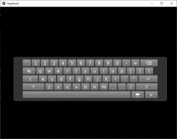

# Python | Vkeyboard(虚拟键盘)中的 kivy

> 原文:[https://www . geesforgeks . org/python-v keyboard-virtual-keyboard-in-kivy/](https://www.geeksforgeeks.org/python-vkeyboard-virtual-keyboard-in-kivy/)

Kivy 是 Python 中独立于平台的 GUI 工具。因为它可以在安卓、IOS、linux 和 Windows 等平台上运行。它基本上是用来开发安卓应用程序的，但并不意味着它不能在桌面应用程序上使用。

### v 键盘:

VKeyboard 是 Kivy 的屏幕键盘。其操作对用户来说是透明的。不建议直接使用小部件。首先阅读“请求键盘”一节。

**Vkeyboard 中的模式:**

该虚拟键盘具有停靠和自由模式:

*   对接模式:`(VKeyboard.docked = True)`一般在只有一个人使用电脑时使用，如平板电脑或个人电脑等。
*   **自由模式:** `(VKeyboard.docked = False)`多用于多点触控表面。该模式允许在屏幕上使用多个虚拟键盘。

如果对接模式发生变化，需要手动调用`VKeyboard.setup_mode()`，否则变化不会有影响。

在该调用过程中，在散点之上实现的虚拟键盘将改变散点的行为，并将键盘定位在目标附近(如果设置了目标和停靠模式)。

```
Basic Approach:
1) import kivy
2) import kivyApp
3) import vkeyboard
4) set kivy version (optional)
5) Create the Vkeyboard class
6) Create the App class
7) return the vkeyboard class
8) Run the App

```

**#实施方法:**

```
# import kivy module  
import kivy  

# this restricts the kivy version i.e  
# below this kivy version you cannot  
# use the app or software  
kivy.require("1.9.1")  

# base Class of your App inherits from the App class.  
# app:always refers to the instance of your application  
from kivy.app import App

# VKeyboard is an onscreen keyboard
# for Kivy. Its operation is intended
# to be transparent to the user. 
from kivy.uix.vkeyboard import VKeyboard

# Create the vkeyboard
class Test(VKeyboard):
    player = VKeyboard()

# Create the App class
class VkeyboardApp(App):
    def build(self):
        return Test()

# run the App
if __name__ == '__main__':
    VkeyboardApp().run()
```

**输出:**

