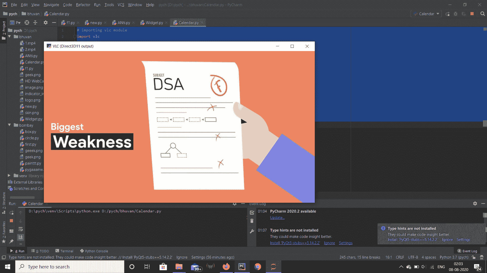

# Python VLC 实例–创建新媒体实例

> 原文:[https://www . geesforgeks . org/python-VLC-instance-creating-new-media-instance/](https://www.geeksforgeeks.org/python-vlc-instance-creating-new-media-instance/)

在本文中，我们将看到如何从 python vlc 模块中的 instance 类创建一个 Media 实例。VLC 媒体播放器是 VideoLAN 项目开发的一款免费开源的便携式跨平台媒体播放器软件和流媒体服务器。实例作为 VLC 图书馆的一个主要对象，通过实例对象，我们可以创建媒体播放器，列表播放器或任何其他在 VLC 可用的播放器。实例类在 VLC 用于创建各种对象的基类。媒体对象包含可以在媒体播放器中播放的媒体。

> 为此，我们将对实例对象使用`media_new`方法
> 
> **语法:** instance.media_new(源)
> 
> **参数:**以文件来源为可选参数
> 
> **返回:**返回媒体对象

下面是实现

```py
# importing vlc module
import vlc

# importing time module
import time

# creating Instance class object
player = vlc.Instance()

# creating a new media list
media_list = player.media_list_new()

# creating a media player object
media_player = player.media_list_player_new()

# creating a new media
media = player.media_new("death_note.mkv")

# adding media to media list
media_list.add_media(media)

# setting media list to the mediaplayer
media_player.set_media_list(media_list)

# start playing video
media_player.play()

# wait so the video can be played for 5 seconds
# irrespective for length of video
time.sleep(5)
```

**输出:**


下面是另一个例子
的实现

```py
# importing vlc module
import vlc

# importing time module
import time

# creating Instance class object
player = vlc.Instance()

# creating a new media list
media_list = player.media_list_new()

# creating a media player object
media_player = player.media_list_player_new()

# creating a new media
media = player.media_new("1.mp4")

# adding media to media list
media_list.add_media(media)

# setting media list to the mediaplayer
media_player.set_media_list(media_list)

# start playing video
media_player.play()

# wait so the video can be played for 5 seconds
# irrespective for length of video
time.sleep(5)
```

**输出:**
