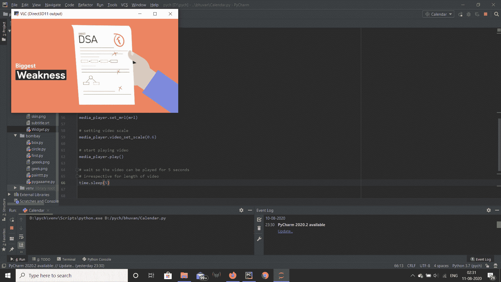

# Python VLC 实例

> 哎哎哎:# t0]https://www . geeksforgeeks . org/python-VLC-instance/

在本文中，我们将看到如何在 python vlc 模块中创建一个 Instance 类实例。VLC 媒体播放器是 VideoLAN 项目开发的一款免费开源的便携式跨平台媒体播放器软件和流媒体服务器。实例作为 VLC 图书馆的一个主要对象，通过实例对象，我们可以创建媒体播放器，列表播放器或任何其他在 VLC 可用的播放器。实例类在 VLC 用于创建各种对象的基类。

> 为了做到这一点，我们将使用`vlc.Instance`方法
> 
> **语法:** vlc。实例()
> 
> **论证:**不需要论证
> 
> **返回:**返回实例对象

下面是实现

```py
# importing vlc module
import vlc

# importing time module
import time

# creating Instance class object
player = vlc.Instance()

# creating a new media
media = player.media_new("death_note.mkv")

# creating a media player object
media_player = player.media_player_new()

media_player.set_media(media)

# setting video scale
media_player.video_set_scale(0.6)

# start playing video
media_player.play()

# wait so the video can be played for 5 seconds
# irrespective for length of video
time.sleep(5)
```

**输出:**


下面是另一个例子
的实现

```py
# importing vlc module
import vlc

# importing time module
import time

# creating Instance class object
player = vlc.Instance()

# creating a new media
media = player.media_new("1.mp4")

# creating a media player object
media_player = player.media_player_new()

media_player.set_media(media)

# setting video scale
media_player.video_set_scale(0.6)

# start playing video
media_player.play()

# wait so the video can be played for 5 seconds
# irrespective for length of video
time.sleep(5)
```

**输出:**
