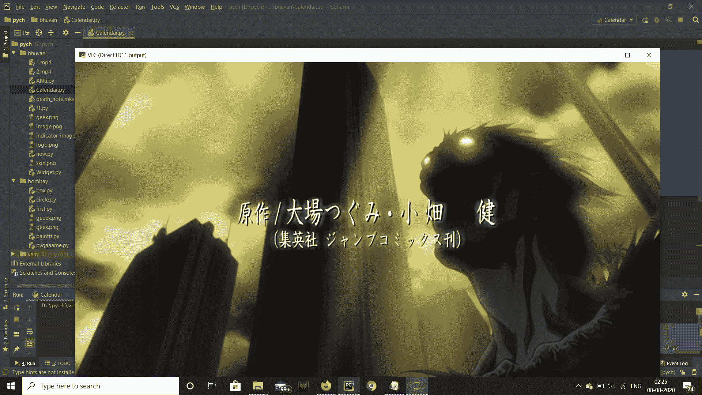

# Python VLC MediaPlayer–检查是否可以暂停

> 原文:[https://www . geesforgeks . org/python-VLC-media player-checking-如果可以暂停/](https://www.geeksforgeeks.org/python-vlc-mediaplayer-checking-if-it-can-be-paused/)

在本文中，我们将看到如何在 python vlc 模块的 MediaPlayer 对象中检查视频是否可播放。VLC 媒体播放器是 VideoLAN 项目开发的一款免费开源的便携式跨平台媒体播放器软件和流媒体服务器。媒体播放器对象是 vlc 模块中播放视频的基本对象。我们可以借助`MediaPlayer`方法创建一个 MediaPlayer 对象。借助`set_pause`方法可以暂停视频。

> 为此，我们将对 MediaPlayer 对象使用`can_pause`方法
> 
> **语法:** media_player.can_pause()
> 
> **论证:**不需要论证
> 
> **返回:**返回 1 为真，否则返回 0

下面是实现

```
# importing vlc module
import vlc

# importing time module
import time

# creating vlc media player object
media_player = vlc.MediaPlayer()

# media object
media = vlc.Media("death_note.mkv")

# setting media to the media player
media_player.set_media(media)

# start playing video
media_player.play()

# wait so the video can be played for 5 seconds
# irrespective for length of video
time.sleep(5)

# checking if it can pause
value = media_player.can_pause()

# printing value
print("Can Pause : ")
print(value)
```

**输出:**


```
Can Pause : 
1

```

下面是另一个例子
的实现

```
# importing vlc module
import vlc

# importing time module
import time

# creating vlc media player object
media_player = vlc.MediaPlayer()

# media object
media = vlc.Media("1mp4.mkv")

# setting media to the media player
media_player.set_media(media)

# start playing video
media_player.play()

# wait so the video can be played for 5 seconds
# irrespective for length of video
time.sleep(5)

# checking if it can pause
value = media_player.can_pause()

# printing value
print("Can Pause : ")
print(value)
```

**输出:**


```
Can Pause : 
1

```