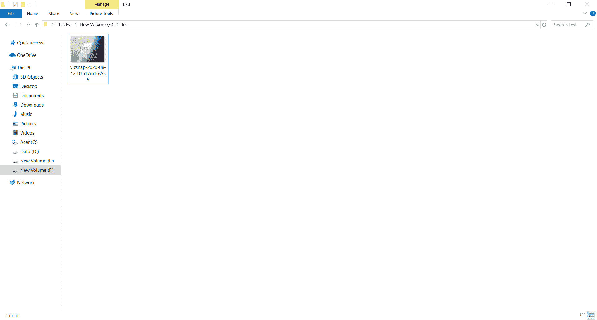
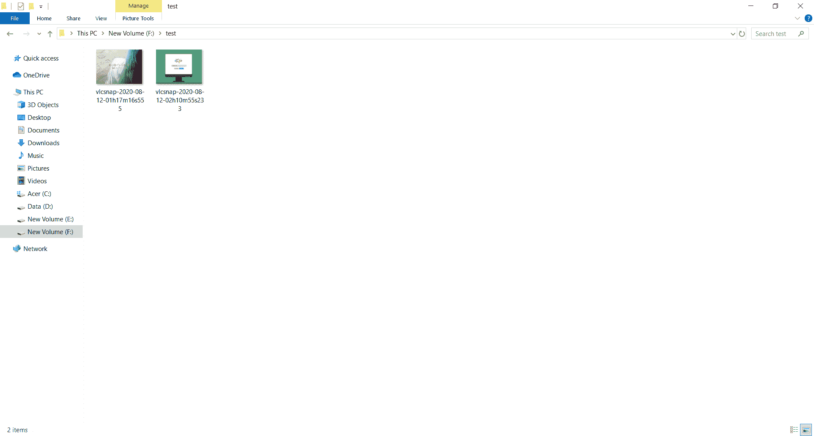

# Python VLC MediaPlayer–截图

> 原文:[https://www . geesforgeks . org/python-VLC-media player-taking-截图/](https://www.geeksforgeeks.org/python-vlc-mediaplayer-taking-screenshot/)

在本文中，我们将看到如何在 python vlc 模块中拍摄 MediaPlayer 对象的屏幕截图。VLC 媒体播放器是 VideoLAN 项目开发的一款免费开源的便携式跨平台媒体播放器软件和流媒体服务器。媒体播放器对象是 vlc 模块中播放视频的基本对象。屏幕截图，也称为 ss、sc、屏幕截图或屏幕截图，是显示计算机显示器内容的数字图像。常见的屏幕截图是由设备上运行的操作系统或软件创建的。截屏或屏幕截图也可以通过拍摄屏幕照片来创建。

> 为此，我们将对 MediaPlayer 对象使用`video_take_snapshot`方法
> 
> **语法:**media _ player . video _ take _ snapshot(n，位置，宽度，高度)
> 
> **参数:**以视频输出号、文件夹位置、截图的宽度和高度为参数
> 
> **返回:**成功返回 0，找不到视频返回-1

下面是实现

```py
# importing vlc module
import vlc

# importing time module
import time

# creating vlc media player object
media_player = vlc.MediaPlayer()

# media object
media = vlc.Media("death_note.mkv")

# setting media to the media player
media_player.set_media(media)

# setting video scale
media_player.video_set_scale(0.6)

# start playing video
media_player.play()

# wait so the video can be played for 5 seconds
# irrespective for length of video
time.sleep(5)

# taking screen shot
media_player.video_take_snapshot(0, "F://test", 400, 300)
```

**输出:**


下面是文件夹位置


下面是另一个例子
的实现

```py
# importing vlc module
import vlc

# importing time module
import time

# creating vlc media player object
media_player = vlc.MediaPlayer()

# media object
media = vlc.Media("1mp4.mkv")

# setting media to the media player
media_player.set_media(media)

# setting video scale
media_player.video_set_scale(0.6)

# start playing video
media_player.play()

# wait so the video can be played for 5 seconds
# irrespective for length of video
time.sleep(5)

# taking screen shot
media_player.video_take_snapshot(0, "F://test", 400, 300)
```

**输出:**


下面是文件夹位置
