# Python 网页抓取教程

> 原文:[https://www.geeksforgeeks.org/python-web-scraping-tutorial/](https://www.geeksforgeeks.org/python-web-scraping-tutorial/)

假设你想从网站上获取一些信息？假设 geeksforgeeks 网站上的一篇文章或一些新闻文章，你会怎么做？你可能想到的第一件事是将信息复制并粘贴到本地媒体中。但是，如果您每天都想尽快获得大量数据，该怎么办呢？在这种情况下，复制和粘贴将不起作用，这就是你需要刮网的地方。

在本文中，我们将讨论如何使用 Python 中的请求库和美化库来执行网页抓取。

## 请求模块

请求库用于向特定的网址发出 HTTP 请求并返回响应。Python 请求提供了管理请求和响应的内置功能。

### 装置

请求安装取决于操作系统的类型，任何地方的基本命令都是打开命令终端并运行，

```py
pip install requests
```

### 提出请求

Python 请求模块有几个内置方法，可以使用 GET、POST、PUT、PATCH 或 HEAD 请求向指定的 URI 发出 HTTP 请求。HTTP 请求意味着要么从指定的 URI 检索数据，要么将数据推送到服务器。它作为客户机和服务器之间的请求-响应协议。这里我们将使用 GET 请求。

[GET 方法](https://www.geeksforgeeks.org/get-method-python-requests/)用于使用给定的 URI 从给定的服务器检索信息。GET 方法发送附加到页面请求的编码用户信息。

### 示例:Python 请求发出 GET 请求

## 蟒蛇 3

```py
import requests

# Making a GET request
r = requests.get('https://www.geeksforgeeks.org/python-programming-language/')

# check status code for response received
# success code - 200
print(r)

# print content of request
print(r.content)
```

**输出:**


### 响应对象

当一个人向 URI 提出请求时，它会返回一个响应。这个用 python 表示的 Response 对象是由 requests.method()返回的，方法是–get、post、put 等。Response 是一个功能强大的对象，它有许多函数和属性来帮助规范化数据或创建代码的理想部分。例如，response.status_code 从标头本身返回状态代码，可以检查请求是否被成功处理。

响应对象可以用来暗示许多特性、方法和功能。

### 示例:Python 请求响应对象

## 蟒蛇 3

```py
import requests

# Making a GET request
r = requests.get('https://www.geeksforgeeks.org/python-programming-language/')

# print request object
print(r.url)

# print status code
print(r.status_code)
```

**输出:**

```py
https://www.geeksforgeeks.org/python-programming-language/
200
```

更多信息，请参考我们的 [Python 请求教程](https://www.geeksforgeeks.org/python-requests-tutorial/)。

## 美丽的图书馆

美化组用于从 HTML 和 XML 文件中提取信息。它提供了一个解析树以及导航、搜索或修改该解析树的功能。

### 装置

要在视窗、Linux 或任何操作系统上安装美化程序，需要 pip 包。要查看如何在您的操作系统上安装画中画，请查看–画中画安装–窗口|| Linux。现在在终端运行下面的命令。

```py
pip install beautifulsoup4
```

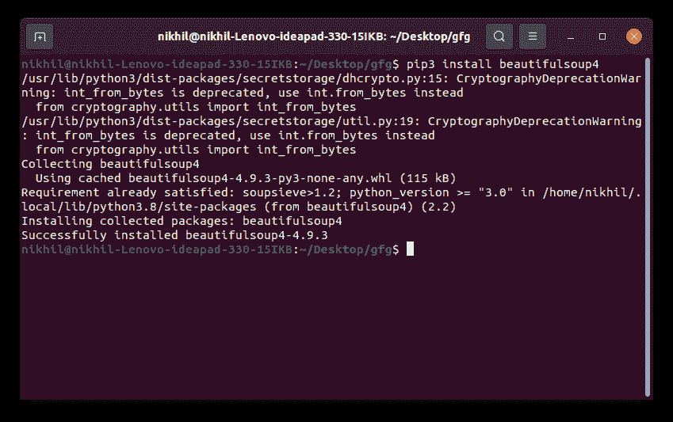

### 检查网站

在从页面的 HTML 中获取任何信息之前，我们必须了解页面的结构。需要这样做，以便从整个页面中选择所需的数据。我们可以通过右键单击要刮取的页面并选择 inspect element 来实现这一点。


单击检查按钮后，浏览器的开发人员工具打开。现在几乎所有的浏览器都安装了开发者工具，我们将在本教程中使用 Chrome。


开发人员的工具允许查看网站的[文档对象模型](https://www.geeksforgeeks.org/dom-document-object-model/)。如果你不知道 DOM，那么不要担心，只要考虑显示为页面的 HTML 结构的文本。

### 解析 HTML

获取页面的 HTML 后，让我们看看如何将这些原始的 HTML 代码解析成一些有用的信息。首先，我们将通过指定我们想要使用的解析器来创建一个美丽的输出对象。

**注意:**beautulsoup 库是建立在 html5lib、lxml、html.parser 等 HTML 解析库之上的。所以美化输出对象和指定解析器库可以同时创建。

### 示例:Python 美化程序解析 HTML

## 蟒蛇 3

```py
import requests
from bs4 import BeautifulSoup

# Making a GET request
r = requests.get('https://www.geeksforgeeks.org/python-programming-language/')

# check status code for response received
# success code - 200
print(r)

# Parsing the HTML
soup = BeautifulSoup(r.content, 'html.parser')
print(soup.prettify())
```

**输出:**

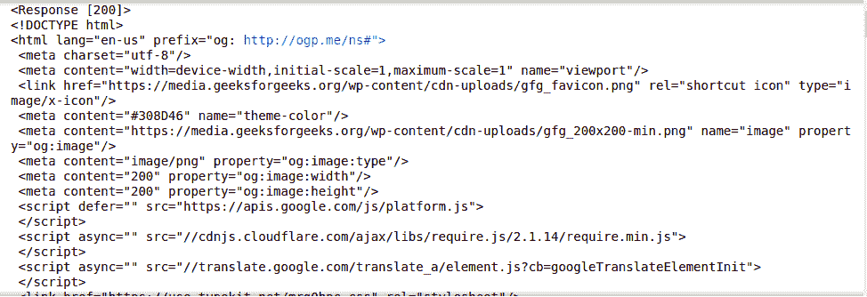

这些信息对我们来说仍然没有用，让我们看看另一个例子，从中得出一些清晰的图片。让我们尝试提取页面的标题。

## 蟒蛇 3

```py
import requests
from bs4 import BeautifulSoup

# Making a GET request
r = requests.get('https://www.geeksforgeeks.org/python-programming-language/')

# Parsing the HTML
soup = BeautifulSoup(r.content, 'html.parser')

# Getting the title tag
print(soup.title)

# Getting the name of the tag
print(soup.title.name)

# Getting the name of parent tag
print(soup.title.parent.name)

# use the child attribute to get
# the name of the child tag
```

**输出:**

```py
<title>Python Programming Language - GeeksforGeeks</title>
title
html
```

### 寻找元素

现在，我们想从 HTML 内容中提取一些有用的数据。soup 对象包含嵌套结构中可以通过编程提取的所有数据。我们要抓取的网站包含大量文本，所以现在让我们抓取所有这些内容。首先，让我们检查一下我们想要抓取的网页。

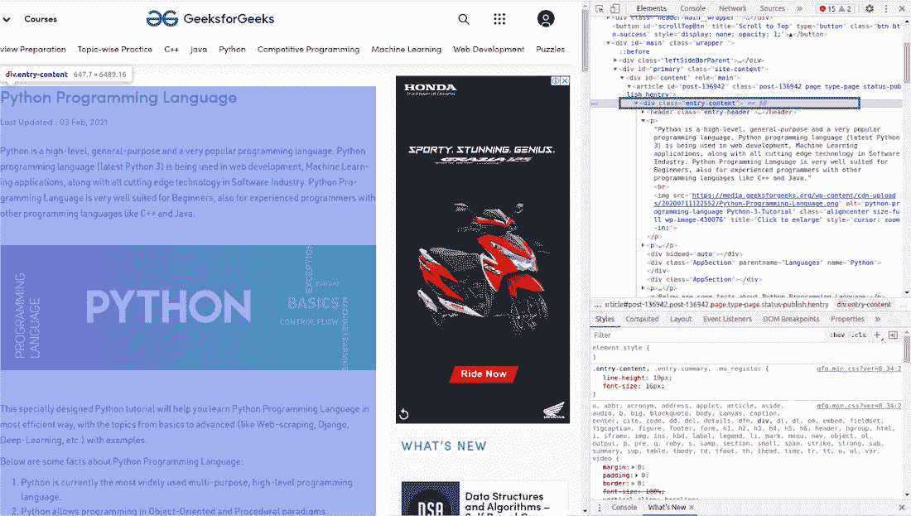

### 按类查找元素

在上图中，我们可以看到页面的所有内容都在 div 下，带有类条目-content。我们将使用 find 类。这个类将找到具有给定属性的给定标记。在我们的例子中，它会找到所有以类作为入口内容的 div。我们已经从该网站获得了所有的内容，但你可以看到，所有的图像和链接也被刮擦。所以我们的下一个任务是只从上面解析的 HTML 中找到内容。再次检查我们网站的 HTML–

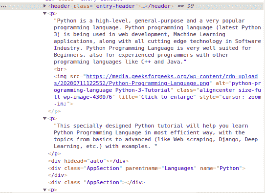

我们可以看到页面的内容在

标签下。现在我们必须找到这个类中所有的 p 标签。我们可以使用美丽组的 [find_all](https://www.geeksforgeeks.org/python-beautifulsoup-find-all-class/) 类。

## 蟒蛇 3

```py
import requests
from bs4 import BeautifulSoup

# Making a GET request
r = requests.get('https://www.geeksforgeeks.org/python-programming-language/')

# Parsing the HTML
soup = BeautifulSoup(r.content, 'html.parser')

s = soup.find('div', class_='entry-content')
content = s.find_all('p')

print(content)
```

**输出:**

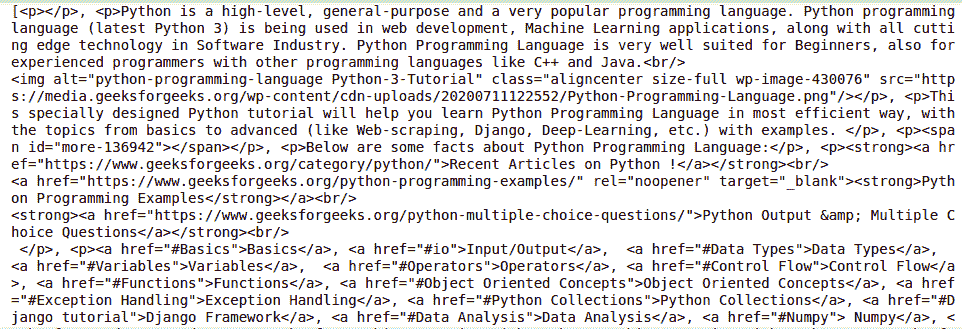

### 按标识查找元素

在上面的例子中，我们已经通过类名找到了元素，但是让我们看看如何通过 id 找到元素。现在，对于这个任务，让我们抓取页面左边栏的内容。第一步是检查页面，看看左栏属于哪个标签。

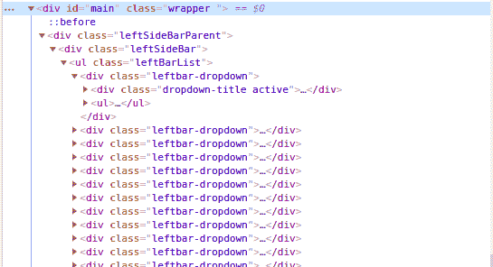

上图显示左栏落在以 id 为主的

标签下。现在让我们获取这个标签下的 HTML 内容。现在让我们检查页面的更多部分，获取左侧栏的内容。

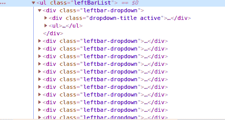

我们可以看到左栏中的列表在

## 蟒蛇 3

```py
import requests
from bs4 import BeautifulSoup

# Making a GET request
r = requests.get('https://www.geeksforgeeks.org/python-programming-language/')

# Parsing the HTML
soup = BeautifulSoup(r.content, 'html.parser')

# Finding by id
s = soup.find('div', id= 'main')

# Getting the leftbar
leftbar = s.find('ul', class_='leftBarList')

# All the li under the above ul
content = leftbar.find_all('li')

print(content)
```

**输出:**

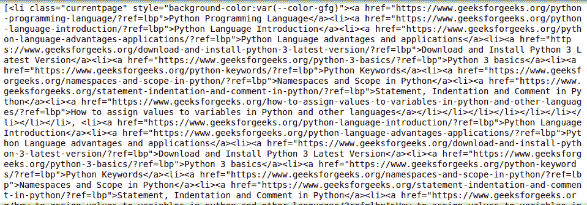

### 从标签中提取文本

在上面的例子中，您一定已经看到，在抓取数据的同时，标签也会被抓取，但是如果我们只需要文本而不需要任何标签呢？别担心，我们会在这一部分讨论同样的问题。我们将使用文本属性。它只打印标签中的文本。我们将使用上面的例子，并将删除他们的所有标签。

### 示例 1:从页面内容中移除标签

## 蟒蛇 3

```py
import requests
from bs4 import BeautifulSoup

# Making a GET request
r = requests.get('https://www.geeksforgeeks.org/python-programming-language/')

# Parsing the HTML
soup = BeautifulSoup(r.content, 'html.parser')

s = soup.find('div', class_='entry-content')

lines = s.find_all('p')

for line in lines:
    print(line.text)
```

**输出:**

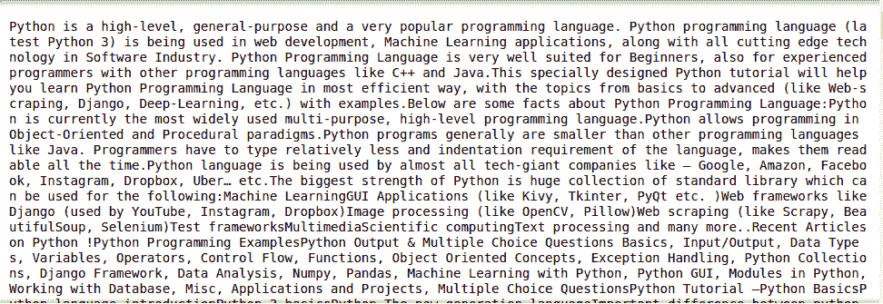

### 示例 2:从左侧栏的内容中移除标签

## 蟒蛇 3

```py
import requests
from bs4 import BeautifulSoup

# Making a GET request
r = requests.get('https://www.geeksforgeeks.org/python-programming-language/')

# Parsing the HTML
soup = BeautifulSoup(r.content, 'html.parser')

# Finding by id
s = soup.find('div', id= 'main')

# Getting the leftbar
leftbar = s.find('ul', class_='leftBarList')

# All the li under the above ul
lines = leftbar.find_all('li')

for line in lines:
    print(line.text)
```

**输出:**

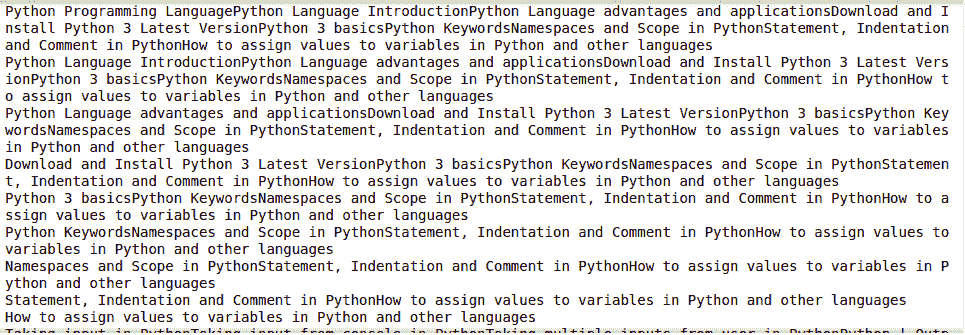

### 提取链接

到现在我们已经看到了如何提取文本，现在让我们看看如何[从页面中提取](https://www.geeksforgeeks.org/beautifulsoup-scraping-link-from-html/)链接。

### 示例:Python BeatifulSoup 提取链接

## 蟒蛇 3

```py
import requests
from bs4 import BeautifulSoup

# Making a GET request
r = requests.get('https://www.geeksforgeeks.org/python-programming-language/')

# Parsing the HTML
soup = BeautifulSoup(r.content, 'html.parser')

# find all the anchor tags with "href" 
for link in soup.find_all('a'):
    print(link.get('href'))
```

**输出:**

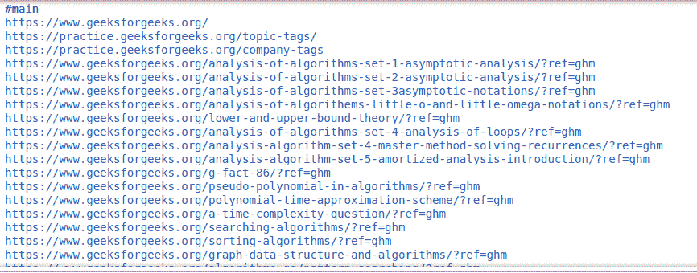

### 提取图像信息

再次检查页面时，我们可以看到图像位于 img 标签内，并且该图像的链接位于 src 属性内。参见下图–


### 示例:Python 美化程序提取图像

## 蟒蛇 3

```py
import requests
from bs4 import BeautifulSoup

# Making a GET request
r = requests.get('https://www.geeksforgeeks.org/python-programming-language/')

# Parsing the HTML
soup = BeautifulSoup(r.content, 'html.parser')

images_list = []

images = soup.select('img')
for image in images:
    src = image.get('src')
    alt = image.get('alt')
    images_list.append({"src": src, "alt": alt})

for image in images_list:
    print(image)
```

**输出:**


## 抓取多个页面

现在，可能会出现各种情况，您可能希望从同一网站的多个页面或多个不同的网址中获取数据，并且为每个网页手动编写代码是一项耗时且乏味的任务。另外，它违反了自动化的所有基本原则。废话！

为了解决这个确切的问题，我们将看到两种主要技术，它们将帮助我们从多个网页中提取数据:

*   同一个网站
*   不同的网站网址

### 示例 1:遍历页码


极客网站底部的页码

大多数网站都有从 1 到 n 标记的页面。这使得我们可以非常简单地遍历这些页面并从中提取数据，因为这些页面具有相似的结构。例如:


极客网站底部的页码

在这里，我们可以看到网址末尾的页面详细信息。利用这些信息，我们可以很容易地创建一个 for 循环，迭代任意多的页面(通过将 page/(i)/放入 URL 字符串中，并迭代“I”直到 N)，并从其中抓取所有有用的数据。下面的代码将让您更加清楚如何使用 Python 中的 For 循环来抓取数据。

## 蟒蛇 3

```py
import requests
from bs4 import BeautifulSoup as bs

URL = 'https://www.geeksforgeeks.org/page/1/'

req = requests.get(URL)
soup = bs(req.text, 'html.parser')

titles = soup.find_all('div',attrs = {'class','head'})

print(titles[4].text)
```

**输出:**

```py
7 Most Common Time Wastes During Software Development
```

现在，使用上面的代码，我们可以通过用一个循环夹住这些行来获得所有文章的标题。

## 蟒蛇 3

```py
import requests
from bs4 import BeautifulSoup as bs

URL = 'https://www.geeksforgeeks.org/page/'

for page in range(1, 10):

    req = requests.get(URL + str(page) + '/')
    soup = bs(req.text, 'html.parser')

    titles = soup.find_all('div', attrs={'class', 'head'})

    for i in range(4, 19):
        if page > 1:
            print(f"{(i-3)+page*15}" + titles[i].text)
        else:
            print(f"{i-3}" + titles[i].text)
```

**输出:**


### 示例 2:遍历不同网址的列表

上面的技巧绝对精彩，但是如果需要刮不同的页面，又不知道它们的页码怎么办？你需要一个接一个地抓取这些不同的网址，并为每个这样的网页手工编写一个脚本。

相反，你可以列出这些网址并循环浏览。通过简单地迭代列表中的项目，即网址，我们将能够提取这些页面的标题，而不必为每个页面编写代码。下面是一个示例代码，说明如何做到这一点。

## 蟒蛇 3

```py
import requests
from bs4 import BeautifulSoup as bs

URL = ['https://www.geeksforgeeks.org','https://www.geeksforgeeks.org/page/10/']

for url in range(0,2):
    req = requests.get(URL[url])
    soup = bs(req.text, 'html.parser')

    titles = soup.find_all('div',attrs={'class','head'})
    for i in range(4, 19):
        if url+1 > 1:
            print(f"{(i - 3) + url * 15}" + titles[i].text)
        else:
            print(f"{i - 3}" + titles[i].text)
```

**输出:**


更多信息，请参考我们的 [Python 美化输出教程](https://www.geeksforgeeks.org/how-to-scrape-websites-with-beautifulsoup-and-python/)。

## 将数据保存到 CSV

首先，我们将创建一个字典列表，其中包含要添加到 CSV 文件中的键值对。然后我们将使用 [csv 模块](https://www.geeksforgeeks.org/working-csv-files-python/)将输出写入 csv 文件。为了更好的理解，请看下面的例子。

### 示例:Python 美化程序保存到 CSV

## 蟒蛇 3

```py
import requests
from bs4 import BeautifulSoup as bs
import csv

URL = 'https://www.geeksforgeeks.org/page/'

soup = bs(req.text, 'html.parser')

titles = soup.find_all('div', attrs={'class', 'head'})
titles_list = []

count = 1
for title in titles:
    d = {}
    d['Title Number'] = f'Title {count}'
    d['Title Name'] = title.text
    count += 1
    titles_list.append(d)

filename = 'titles.csv'
with open(filename, 'w', newline='') as f:
    w = csv.DictWriter(f,['Title Number','Title Name'])
    w.writeheader()

    w.writerows(titles_list)
```

**输出:**

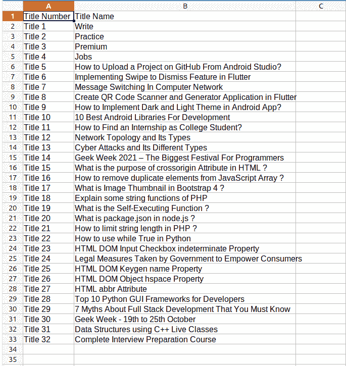