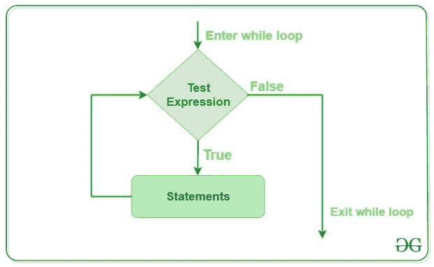
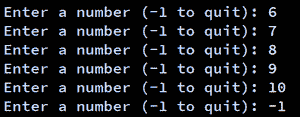

# Python While Loop

> 原文:[https://www.geeksforgeeks.org/python-while-loop/](https://www.geeksforgeeks.org/python-while-loop/)

**Python** **While Loop** 用于重复执行一个语句块，直到满足给定的条件。当条件变为假时，程序中紧接循环之后的行被执行。而循环属于**无限迭代**的范畴。不定迭代意味着循环执行的次数没有预先明确指定。

**语法:**

```
while expression:
    statement(s)
```

语句表示在编程构造被认为是单个代码块的一部分之后缩进相同数量的字符空间的所有语句。Python 使用缩进作为其对语句进行分组的方法。当执行 while 循环时，首先在布尔上下文中计算 expr，如果为真，则执行循环体。然后 expr 再次被检查，如果它仍然为真，那么主体再次被执行，这继续直到表达式变为假。

### **While 循环流程图:**



### **示例 1:** Python While 循环

## 蟒蛇 3

```
# Python program to illustrate
# while loop
count = 0
while (count < 3):
    count = count + 1
    print("Hello Geek")
```

**Output**

```
Hello Geek
Hello Geek
Hello Geek
```

在上面的示例中，只要计数器变量(计数)小于 3，while 的条件将为 True。

### 示例 2:带列表的 Python while 循环

## 蟒蛇 3

```
# checks if list still
# contains any element
a = [1, 2, 3, 4]

while a:
    print(a.pop())
```

**Output**

```
4
3
2
1
```

在上面的例子中，我们在一个列表上运行了一个 while 循环，这个循环将一直运行到列表中出现一个元素。

## 单语句同时阻塞

就像 if 块一样，如果 while 块由一条语句组成，我们可以在一行中声明整个循环。如果组成循环体的块中有多个语句，它们可以用分号(；).

## 蟒蛇 3

```
# Python program to illustrate
# Single statement while block
count = 0
while (count < 5): count += 1; print("Hello Geek")
```

**输出:**

```
Hello Geek
Hello Geek
Hello Geek
Hello Geek
Hello Geek
```

## 循环控制语句

循环控制语句改变其正常顺序的执行。当执行离开一个范围时，在该范围内创建的所有自动对象都将被销毁。Python 支持以下控制语句。

### **继续声明**

Python [Continue 语句](https://www.geeksforgeeks.org/python-continue-statement/)将控制返回到循环的开始。

### 示例:Python while 循环和 continue 语句

## 蟒蛇 3

```
# Prints all letters except 'e' and 's'
i = 0
a = 'geeksforgeeks'

while i < len(a):
    if a[i] == 'e' or a[i] == 's':
        i += 1
        continue

    print('Current Letter :', a[i])
    i += 1
```

**输出:**

```
Current Letter : g
Current Letter : k
Current Letter : f
Current Letter : o
Current Letter : r
Current Letter : g
Current Letter : k
```

### **中断声明**

Python [Break 语句](https://www.geeksforgeeks.org/python-break-statement/)将控制带出循环。

### 示例:带 break 语句的 Python while 循环

## 蟒蛇 3

```
# break the loop as soon it sees 'e'
# or 's'
i = 0
a = 'geeksforgeeks'

while i < len(a):
    if a[i] == 'e' or a[i] == 's':
        i += 1
        break

    print('Current Letter :', a[i])
    i += 1
```

**输出:**

```
Current Letter : g
```

### **通过声明**

Python [传递语句](https://www.geeksforgeeks.org/python-pass-statement/)来编写空循环。Pass 也用于空的控制语句、函数和类。

### 示例:带传递语句的 Python while 循环

## 蟒蛇 3

```
# An empty loop
a = 'geeksforgeeks'
i = 0

while i < len(a):
    i += 1
    pass

print('Value of i :', i)
```

**输出:**

```
Value of i : 13
```

## 当与他人循环时

如上所述，while 循环执行该块，直到满足一个条件。当条件变为假时，循环后立即执行语句。else 子句仅在 while 条件变为 false 时执行。如果脱离循环，或者引发异常，它将不会被执行。

**注意:**for/while 之后的 else 块仅在循环没有被 break 语句终止时执行。

## 蟒蛇 3

```
# Python program to demonstrate
# while-else loop

i = 0
while i < 4:
    i += 1
    print(i)
else:  # Executed because no break in for
    print("No Break\n")

i = 0
while i < 4:
    i += 1
    print(i)
    break
else:  # Not executed as there is a break
    print("No Break")
```

**输出:**

```
1
2
3
4
No Break

1
```

## **哨点控制声明**

在这种情况下，我们不使用任何计数器变量，因为我们不知道循环将执行多少次。这里用户决定他想要执行循环的次数。为此，我们使用一个哨兵值。哨兵值是一个用于在用户输入循环时终止循环的值，通常情况下，哨兵值为-1。

### 示例:带用户输入的 Python while 循环

## 蟒蛇 3

```
a = int(input('Enter a number (-1 to quit): '))

while a != -1:
    a = int(input('Enter a number (-1 to quit): '))
```

**输出:**



**说明:**

*   首先，它要求用户输入一个数字。如果用户输入-1，则循环不会执行
*   用户输入 6，循环主体执行并再次请求输入
*   在这里，用户可以输入多次，直到他输入-1 来停止循环
*   用户可以决定他想要输入多少次