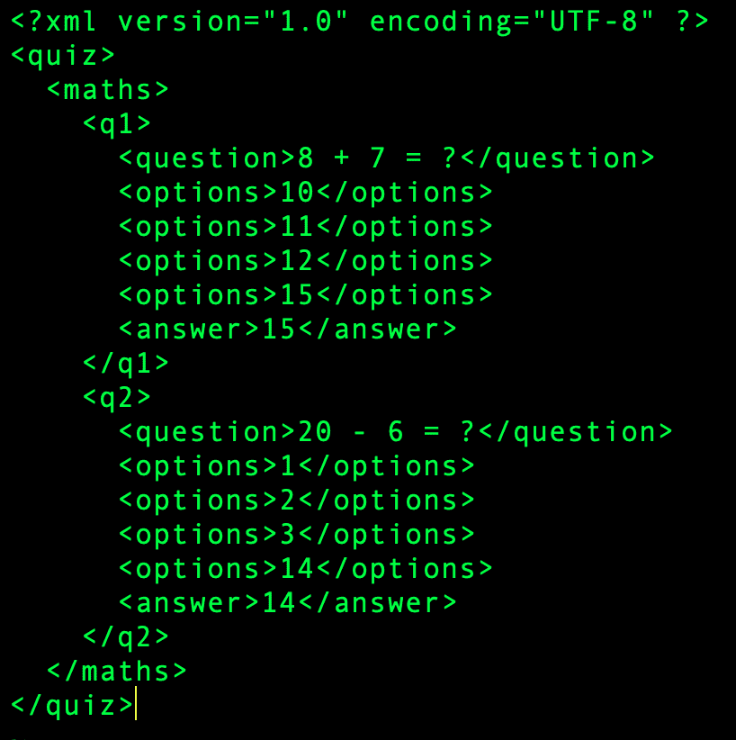
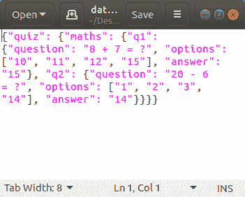

# Python–XML 到 JSON

> 原文:[https://www.geeksforgeeks.org/python-xml-to-json/](https://www.geeksforgeeks.org/python-xml-to-json/)

一个 **JSON** 文件是以 JavaScript Object notification(JSON)格式存储简单数据结构和对象的文件，这是一种标准的数据交换格式。它主要用于在 web 应用程序和服务器之间传输数据。一个 **JSON** 对象包含键/值对形式的数据。键是字符串，值是 JSON 类型。键和值用冒号分隔。每个条目(键/值对)由逗号分隔。JSON 文件是轻量级的、基于文本的、人类可读的，并且可以使用文本编辑器进行编辑。
**注:**更多信息请参考[使用 Python 中的 JSON 数据](http://geeksforgeeks.org/working-with-json-data-in-python/)
**XML** 是一种用于存储数据的标记语言。它区分大小写。XML 提供了定义标记元素和生成定制标记语言的功能。XML 中的基本单元被称为元素。XML 语言没有预定义的标记。它简化了数据共享、数据传输、平台变更、数据可用性。xml
**注:**更多信息请参考 [xml |基础知识](http://geeksforgeeks.org/xml-basics/)
JSON 和 XML 文件格式都用于在客户端和服务器端之间传输数据。
然而，它们都服务于相同的目的，尽管它们的方式不同。

## JSON 与 XML 的比较

<figure class="table">

| JSON | 可扩展标记语言 |
| --- | --- |
| JSON 对象有一个类型 | XML 数据是无类型的 |
| JSON 类型:字符串、数字、数组、布尔值 | 所有的 XML 数据都应该是字符串 |
| 数据很容易作为 JSON 对象访问 | 需要解析 XML 数据 |
| 大多数浏览器都支持 JSON | 跨浏览器的 XML 解析可能很棘手 |
| JSON 没有显示功能 | XML 提供了显示数据的能力，因为它是一种标记语言 |
| JSON 只支持文本和数字数据类型。 | XML 支持各种数据类型，如数字、文本、图像、图表、图形等。它还提供了用实际数据传输数据结构或格式的选项。 |
| 检索值很容易 | 检索值很困难 |
| 受到许多 Ajax 工具包支持 | Ajax 工具包不完全支持 |
| 反序列化/序列化 JavaScript 的全自动方式 | 开发人员必须编写 JavaScript 代码来序列化/反序列化 XML |
| 对象的本机支持 | 对象必须用约定来表达——大多数情况下，属性和元素的使用被遗漏了。 |
| 它只支持 UTF-8 编码。 | 它支持各种编码 |
| 不支持评论。 | 它支持评论。 |
| 与 XML 相比，JSON 文件易于阅读。 | XML 文档相对更难阅读和解释。 |
| 它不提供任何名称空间支持 | 它支持名称空间。 |
| 它不太安全。 | 它比 JSON 更安全。 |

</figure>

## 将 Xml 转换为 json

为了处理 json 文件格式，Python 提供了一个名为 JSON 的模块。
**步骤 1:** 使用 pip 或任何其他 python 包管理器安装 xmltodict 模块

```
pip install xmltodict
```

**步骤 2:** 使用关键字【T2 导入】导入 json 模块

```
import json
```

**STEP 3:** 读取 xml 文件
这里，**“data _ dict”**是我们将 XML 数据转换为字典数据类型后加载到其中的变量。

```
with open("xml_file.xml") as xml_file:
    data_dict = xmltodict.parse(xml_file.read())
```

**步骤 4:** 关闭 XML 文件

```
xml_file.close()
```

**STEP 5:** 将 xml_data 转换成字典并存储在变量
中 JSON 对象被花括号{ }包围。它们以键和值对的形式编写。
json.loads()接收一个字符串并返回一个 json 对象。
json.dumps()接收一个 json 对象并返回一个字符串。
我们使用 xml_data 作为输入字符串，生成 python 对象，所以我们使用 json.dumps()

```
json_data = json.dumps(data_dict)
```

这里，json_data 是用于存储生成的对象的变量。
**STEP 6:** 将 json_data 写入输出文件

```
with open("data.json", "w") as json_file:
        json_file.write(json_data)
```

**步骤 7:** 关闭输出文件

```
json_file.close()
```

**示例:**
**XML 文件:**



## 蟒蛇 3

```
# Program to convert an xml
# file to json file

# import json module and xmltodict
# module provided by python
import json
import xmltodict

# open the input xml file and read
# data in form of python dictionary
# using xmltodict module
with open("test.xml") as xml_file:

    data_dict = xmltodict.parse(xml_file.read())
    xml_file.close()

    # generate the object using json.dumps()
    # corresponding to json data

    json_data = json.dumps(data_dict)

    # Write the json data to output
    # json file
    with open("data.json", "w") as json_file:
        json_file.write(json_data)
        json_file.close()
```

**输出:**

