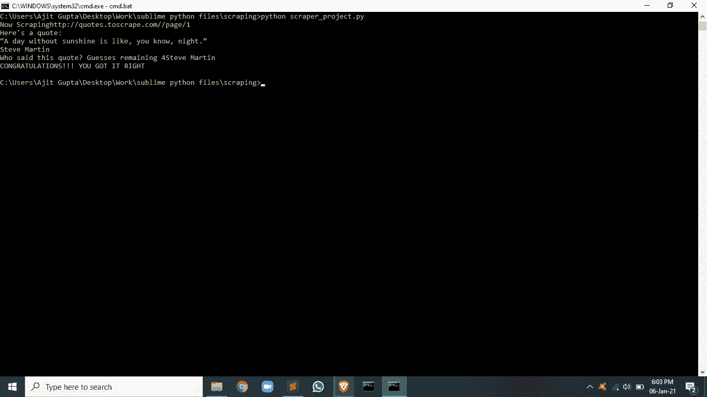
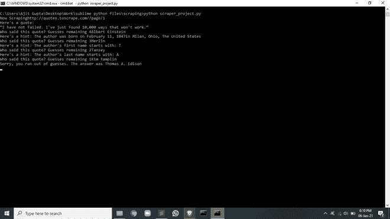

# 引用 Python 中使用网页抓取的猜谜游戏

> 原文:[https://www . geesforgeks . org/quote-猜测-游戏-使用-网页-python 中的刮擦/](https://www.geeksforgeeks.org/quote-guessing-game-using-web-scraping-in-python/)

**先决条件:** [美容耦合安装](https://www.geeksforgeeks.org/beautifulsoup-installation-python/)

在本文中，我们将使用名为[的 python 框架 beauty sup](https://www.geeksforgeeks.org/implementing-web-scraping-python-beautiful-soup/)从该网站中刮取作者的一段引文和详细信息，并使用不同的数据结构和算法开发一个猜谜游戏。

用户将有 4 次机会来猜测一句名言的作者，每次机会用户都会得到一个提示，可以是作者的出生日期、名字的第一个字母、第二个名字的第一个字母等。成功猜测作者后，会打印一条消息，如果用户在 4 次尝试后仍未能猜出答案，则会再次打印一条带有答案的消息。

### 方法

*   导入模块
    *   请求帮助我们抓取页面，当收到响应时，它以字符串的形式存储
    *   bs4 库用于创建 beasutifulSoup 对象。
    *   **csv** 库帮助使用 python 读写 csv 文件
    *   来自时间模块的睡眠功能有助于增加程序执行的延迟。
    *   随机模块中的选择函数返回一个随机元素。
*   创建一个列表来存储刮取的值
*   从这个链接中刮取详情:
*   提取数据
*   游戏逻辑
    *   从创建的字典中返回随机项目
    *   设定猜测次数
    *   写下成功和失败的信息
    *   不断给出提示，直到机会达到零或者用户答对为止

**程序:**

## 蟒蛇 3

```py
import requests
from bs4 import BeautifulSoup
from csv import writer
from time import sleep
from random import choice

# list to store scraped data
all_quotes = []

# this part of the url is constant
base_url = "http://quotes.toscrape.com/"

# this part of the url will keep changing
url = "/page/1"

while url:

    # concatenating both urls
    # making request
    res = requests.get(f"{base_url}{url}")
    print(f"Now Scraping{base_url}{url}")
    soup = BeautifulSoup(res.text, "html.parser")

    # extracting all elements
    quotes = soup.find_all(class_="quote")

    for quote in quotes:
        all_quotes.append({
            "text": quote.find(class_="text").get_text(),
            "author": quote.find(class_="author").get_text(),
            "bio-link": quote.find("a")["href"]
        })
    next_btn = soup.find(_class="next")
    url = next_btn.find("a")["href"] if next_btn else None
    sleep(2)

quote = choice(all_quotes)
remaining_guesses = 4
print("Here's a quote:  ")
print(quote["text"])

guess = ''
while guess.lower() != quote["author"].lower() and remaining_guesses > 0:
    guess = input(
        f"Who said this quote? Guesses remaining {remaining_guesses}")

    if guess == quote["author"]:
        print("CONGRATULATIONS!!! YOU GOT IT RIGHT")
        break
    remaining_guesses -= 1

    if remaining_guesses == 3:
        res = requests.get(f"{base_url}{quote['bio-link']}")
        soup = BeautifulSoup(res.text, "html.parser")
        birth_date = soup.find(class_="author-born-date").get_text()
        birth_place = soup.find(class_="author-born-location").get_text()
        print(
            f"Here's a hint: The author was born on {birth_date}{birth_place}")

    elif remaining_guesses == 2:
        print(
            f"Here's a hint: The author's first name starts with: {quote['author'][0]}")

    elif remaining_guesses == 1:
        last_initial = quote["author"].split(" ")[1][0]
        print(
            f"Here's a hint: The author's last name starts with: {last_initial}")

    else:
        print(
            f"Sorry, you ran out of guesses. The answer was {quote['author']}")
```

**输出:**

 