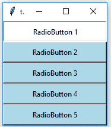
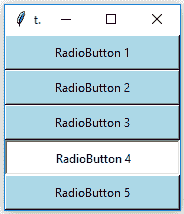
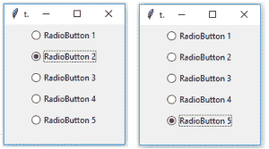
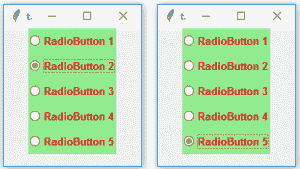

# tkinter | python 中的 radio button

> 原文:[https://www . geesforgeks . org/radio button-in-tkinter-python/](https://www.geeksforgeeks.org/radiobutton-in-tkinter-python/)

**单选按钮**是一个标准的 [Tkinter](https://www.geeksforgeeks.org/python-gui-tkinter/) 小部件，用于实现多项选择中的一项。**单选按钮**可以包含文本或图像，您可以将 Python 函数或方法与每个按钮相关联。当按下按钮时，[Tkit](https://www.geeksforgeeks.org/python-gui-tkinter/)自动调用该函数或方法。
**语法:**

> button = Radiobutton(master，text =“Button 上的名称”，variable =“共享变量”，value =“每个按钮的值”，options = values，…)
> **共享变量** =在所有 Radiobutton 之间共享的一个 Tkinter 变量
> **值** =每个 radiobutton 应该有不同的值，否则会有 1 个以上的 radiobutton 被选中。

**代码#1:**
单选按钮，但不是按钮的形式，是**按钮框**的形式。为了显示按钮框，*指示器/指示器*选项应设置为 0。

## 蟒蛇 3

```py
# Importing Tkinter module
from tkinter import *
# from tkinter.ttk import *

# Creating master Tkinter window
master = Tk()
master.geometry("175x175")

# Tkinter string variable
# able to store any string value
v = StringVar(master, "1")

# Dictionary to create multiple buttons
values = {"RadioButton 1" : "1",
          "RadioButton 2" : "2",
          "RadioButton 3" : "3",
          "RadioButton 4" : "4",
          "RadioButton 5" : "5"}

# Loop is used to create multiple Radiobuttons
# rather than creating each button separately
for (text, value) in values.items():
    Radiobutton(master, text = text, variable = v,
                value = value, indicator = 0,
                background = "light blue").pack(fill = X, ipady = 5)

# Infinite loop can be terminated by
# keyboard or mouse interrupt
# or by any predefined function (destroy())
mainloop()
```

**输出:**

<video class="wp-video-shortcode" id="video-305270-1" width="640" height="360" preload="metadata" controls=""><source type="video/mp4" src="https://media.geeksforgeeks.org/wp-content/uploads/20210216123802/FreeOnlineScreenRecorderProject5.mp4?_=1">[https://media.geeksforgeeks.org/wp-content/uploads/20210216123802/FreeOnlineScreenRecorderProject5.mp4](https://media.geeksforgeeks.org/wp-content/uploads/20210216123802/FreeOnlineScreenRecorderProject5.mp4)</video>

这些按钮盒的背景是浅蓝色的。白色背景和凹陷的按钮框是选中的。



**代码#2:** 将按钮盒改为标准单选按钮。对于此移除指示器选项。

## 蟒蛇 3

```py
# Importing Tkinter module
from tkinter import *
from tkinter.ttk import *

# Creating master Tkinter window
master = Tk()
master.geometry("175x175")

# Tkinter string variable
# able to store any string value
v = StringVar(master, "1")

# Dictionary to create multiple buttons
values = {"RadioButton 1" : "1",
        "RadioButton 2" : "2",
        "RadioButton 3" : "3",
        "RadioButton 4" : "4",
        "RadioButton 5" : "5"}

# Loop is used to create multiple Radiobuttons
# rather than creating each button separately
for (text, value) in values.items():
    Radiobutton(master, text = text, variable = v,
        value = value).pack(side = TOP, ipady = 5)

# Infinite loop can be terminated by
# keyboard or mouse interrupt
# or by any predefined function (destroy())
mainloop()
```

**输出:**



<video class="wp-video-shortcode" id="video-305270-2" width="640" height="360" preload="metadata" controls=""><source type="video/mp4" src="https://media.geeksforgeeks.org/wp-content/uploads/20210216123948/FreeOnlineScreenRecorderProject6.mp4?_=2">[https://media.geeksforgeeks.org/wp-content/uploads/20210216123948/FreeOnlineScreenRecorderProject6.mp4](https://media.geeksforgeeks.org/wp-content/uploads/20210216123948/FreeOnlineScreenRecorderProject6.mp4)</video>

这些单选按钮是使用 **tkinter.ttk** 创建的，这就是为什么背景选项不可用，但是我们可以使用**样式类**进行样式设置。

**代码#3:** 使用样式类为单选按钮添加样式。

## 蟒蛇 3

```py
# Importing Tkinter module
from tkinter import *
from tkinter.ttk import *

# Creating master Tkinter window
master = Tk()
master.geometry('175x175')

# Tkinter string variable
# able to store any string value
v = StringVar(master, "1")

# Style class to add style to Radiobutton
# it can be used to style any ttk widget
style = Style(master)
style.configure("TRadiobutton", background = "light green",
                foreground = "red", font = ("arial", 10, "bold"))

# Dictionary to create multiple buttons
values = {"RadioButton 1" : "1",
          "RadioButton 2" : "2",
          "RadioButton 3" : "3",
          "RadioButton 4" : "4",
          "RadioButton 5" : "5"}

# Loop is used to create multiple Radiobuttons
# rather than creating each button separately
for (text, value) in values.items():
    Radiobutton(master, text = text, variable = v,
                value = value).pack(side = TOP, ipady = 5)

# Infinite loop can be terminated by
# keyboard or mouse interrupt
# or by any predefined function (destroy())
mainloop()
```

**输出:**



<video class="wp-video-shortcode" id="video-305270-3" width="640" height="360" preload="metadata" controls=""><source type="video/mp4" src="https://media.geeksforgeeks.org/wp-content/uploads/20210216124134/FreeOnlineScreenRecorderProject7.mp4?_=3">[https://media.geeksforgeeks.org/wp-content/uploads/20210216124134/FreeOnlineScreenRecorderProject7.mp4](https://media.geeksforgeeks.org/wp-content/uploads/20210216124134/FreeOnlineScreenRecorderProject7.mp4)</video>

您可能会发现字体样式发生了变化，背景和前景色也发生了变化。这里，TRadiobutton 用于样式类，它自动将样式应用于所有可用的 Radiobutton。