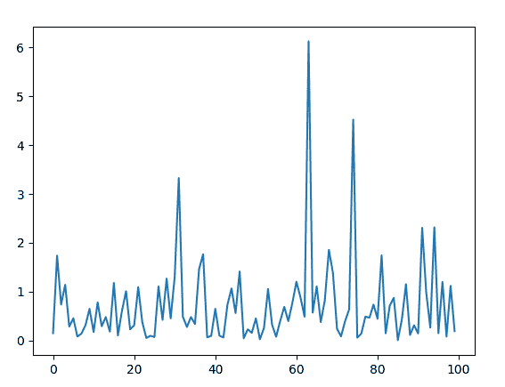
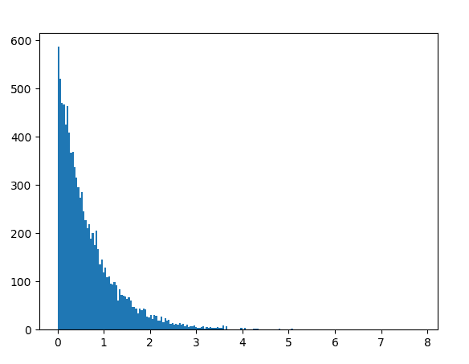

# Python 中的 random.expovariate()函数

> 原文:[https://www . geesforgeks . org/random-Expo variate-function-in-python/](https://www.geeksforgeeks.org/random-expovariate-function-in-python/)

`random`模块用于在 Python 中生成随机数。实际上不是随机的，而是用来生成伪随机数的。这意味着这些随机生成的数字是可以确定的。

## random.expovariate()

`**expovariate()**`是`random`模块的内置方法。用于返回具有[指数分布](https://en.wikipedia.org/wiki/Exponential_distribution)的随机浮点数。

> **语法:** random.expovariate(lambd)
> 
> **参数:**
> λ:一个非零值
> 
> **返回:**一个随机指数分布浮点数
> 如果参数为正，结果范围从 0 到正无穷大
> 如果参数为负，结果范围从 0 到负无穷大

**例 1:**

```py
# import the random module
import random

# determining the values of the parameter
lambd = 1.5

# using the expovariate() method
print(random.expovariate(lambd))
```

**输出:**

```py
0.22759592233982198
```

**例 2:** 我们可以多次生成这个数，并绘制一个图来观察指数分布。

```py
# import the required libraries 
import random 
import matplotlib.pyplot as plt 

# store the random numbers in a  
# list 
nums = [] 
alpha = 3

for i in range(100): 
    temp = random.paretovariate(alpha)
    nums.append(temp) 

# plotting a graph 
plt.plot(nums) 
plt.show()
```

**输出:**

**例 3:** 我们可以创建一个直方图来观察密度的指数分布。

```py
# import the required libraries 
import random 
import matplotlib.pyplot as plt 

# store the random numbers in a list 
nums = [] 
lambd = 1.5

for i in range(10000): 
    temp = random.expovariate(lambd)
    nums.append(temp) 

# plotting a graph 
plt.hist(nums, bins = 200) 
plt.show()
```

**输出:**
