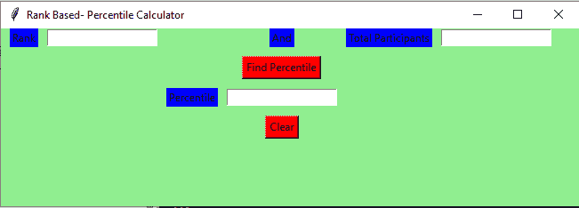

# 使用 Tkinter 的基于等级的百分位 Gui 计算器

> 原文:[https://www . geesforgeks . org/rank-based-percent-GUI-calculator-using-tkinter/](https://www.geeksforgeeks.org/rank-based-percentile-gui-calculator-using-tkinter/)

**先决条件:**

*   [Tkinter 介绍](https://www.geeksforgeeks.org/python-gui-tkinter/)
*   [根据排名计算学生百分位数的程序](https://www.geeksforgeeks.org/program-to-calculate-percentile-of-a-student-based-on-rank/)

Python 为开发图形用户界面提供了多种选择。在所有的 GUI 方法中，Tkinter 是最常用的方法。在本文中，我们将学习如何使用 Tkinter 创建一个基于排名的百分位图形用户界面计算器应用程序，并提供一步一步的指导。
**创建 Tkinter:**

*   导入模块–Tkit
*   创建主窗口(容器)
*   向主窗口添加任意数量的小部件。
*   在小部件上应用事件触发器。

图形用户界面如下所示:



让我们创建一个基于图形用户界面的简单的基于排名的百分位图形用户界面计算器应用程序:

**下面是实现:**

## 蟒蛇 3

```py
# import all functions from the tkinter   
from tkinter import *

# Function to calculate the percentile 
def getPercentile() :

    # take a value from the respective entry boxes
    # get method returns current text as string
    students= int(total_participantField.get())

    rank = int(rankField.get())

    # variable to store the result upto 3
    # decimal points 
    result = round((students - rank) / students * 100,3);

    # insert method inserting the  
    # value in the text entry box.
    percentileField.insert(10, str(result))

# Function for clearing the  
# contents of all text entry boxes
def Clear():

    # deleting the content from the entry box
    rankField.delete(0, END)

    total_participantField.delete(0, END)

    percentileField.delete(0, END)

# Driver Code
if __name__ == "__main__" :

    # Create a GUI window
    gui = Tk()

    # Set the background colour of GUI window  
    gui.configure(background = "light green")

    # set the name of tkinter GUI window 
    gui.title("Rank Based- Percentile Calculator")

     # Set the configuration of GUI window
    gui.geometry("650x200")

    # Create a Rank: label 
    rank = Label(gui, text = "Rank", bg = "blue")

    # Create a And: label 
    andl = Label(gui, text = "And", bg = "blue")

    # Create a Total Participants : label
    total_participant = Label(gui,
                              text = "Total Participants",
                              bg = "blue")

    # Create a Find Percentile Button and
    # attached to getPercentile function
    find = Button(gui, text = "Find Percentile",
                  fg = "Black", bg = "Red",
                  command = getPercentile)

    # Create a Percentile : label 
    percentile = Label(gui, text = "Percentile", bg = "blue")

    # Create a Clear Button and attached
    # to Clear function
    clear = Button(gui, text = "Clear",
                   fg = "Black", bg = "Red",
                   command = Clear)

    # grid method is used for placing  
    # the widgets at respective positions  
    # in table like structure .

    # padx attributed provide x-axis margin 
    # from the root window to the widget.
    rank.grid(row = 1, column = 1,padx = 10)

    andl.grid(row = 1, column = 4)

    total_participant.grid(row = 1, column = 6, padx = 10)

    # pady attributed provide y-axis
    # margin from the widget.   
    find.grid(row = 3, column = 4,pady = 10)

    percentile.grid(row = 4, column = 3,padx = 10)

    clear.grid(row = 5, column = 4,pady = 10)

    # Create a text entry box for filling or
    # typing the information.  
    rankField = Entry(gui)

    total_participantField = Entry(gui)

    percentileField = Entry(gui)

    # grid method is used for placing  
    # the widgets at respective positions  
    # in table like structure .
    rankField.grid(row = 1, column = 2)

    total_participantField.grid(row = 1, column = 7)

    percentileField.grid(row = 4, column = 4)

    # Start the GUI
    gui.mainloop()
```

**输出:**

<video class="wp-video-shortcode" id="video-417004-1" width="640" height="360" preload="metadata" controls=""><source type="video/mp4" src="https://media.geeksforgeeks.org/wp-content/uploads/20210119131611/FreeOnlineScreenRecorderProject2.mp4?_=1">[https://media.geeksforgeeks.org/wp-content/uploads/20210119131611/FreeOnlineScreenRecorderProject2.mp4](https://media.geeksforgeeks.org/wp-content/uploads/20210119131611/FreeOnlineScreenRecorderProject2.mp4)</video>