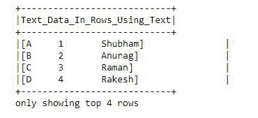
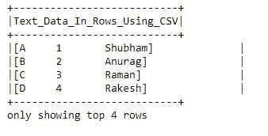
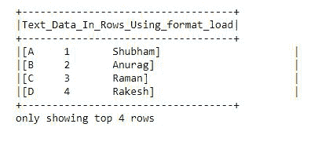

# 将文本文件读入 PySpark 数据框

> 原文:[https://www . geesforgeks . org/read-text-file-into-py spark-data frame/](https://www.geeksforgeeks.org/read-text-file-into-pyspark-dataframe/)

在本文中，我们将看到如何在 PySpark Dataframe 中读取文本文件。

**将文本文件读入 PySpark DataFrame 有三种方式。**

*   使用 spark.read.text()
*   使用 spark.read.csv()
*   使用 spark.read.format()。负载()

使用这些，我们可以将单个文本文件、多个文件以及一个目录中的所有文件读入 Spark DataFrame 和 Dataset。

**使用的文本文件:**


## **方法 1:使用 spark.read.text()**

它用于将文本文件加载到数据框中，数据框的模式以字符串列开始。文本文件中的每一行都是结果数据帧中的新行。使用这种方法，我们还可以一次读取多个文件。

> **语法:** spark.read.text(路径)
> 
> **参数:**该方法接受如下参数，如上所述，如下所述。
> 
> *   **路径:**是输入路径的字符串或字符串列表。
> 
> **返回:**数据帧

**示例:使用 spark.read.text()读取文本文件。**

这里我们将导入模块并创建一个 spark 会话，然后用 **spark.read.text()** 读取文件，然后创建列并将 txt 文件 show 中的数据拆分成一个 dataframe。

## 蟒蛇 3

```py
from pyspark.sql import SparkSession

spark = SparkSession.builder.appName("DataFrame").getOrCreate()

df = spark.read.text("output.txt")

df.selectExpr("split(value, ' ') as\
Text_Data_In_Rows_Using_Text").show(4,False)
```

**输出:**



## **方法 2:** **使用 spark.read.csv()**

它用于将文本文件加载到数据框中。使用这种方法，我们将检查一次输入，以确定是否启用了输入模式。为了避免一次遍历整个数据，请禁用“推断模式”选项或使用模式显式指定模式。

> **语法:** spark.read.csv(路径)
> 
> **返回:**数据帧

**示例:使用 spark.read.csv()读取文本文件。**

首先，导入模块并创建一个 spark 会话，然后用 spark.read.csv()读取文件，然后创建列并将 txt 文件 show 中的数据拆分成一个 dataframe。

## 蟒蛇 3

```py
from pyspark.sql import SparkSession

spark = SparkSession.builder.getOrCreate()

df = spark.read.csv("output.txt")

df.selectExpr("split(_c0, ' ')\
as Text_Data_In_Rows_Using_CSV").show(4,False)
```

**输出:**



## **方法 3:使用 spark.read.format()**

它用于将文本文件加载到数据框中。**。format()** 将输入数据源格式指定为“文本”。**。load()** 从数据源加载数据并返回 DataFrame。

> **语法:** spark.read.format(“文本”)。加载(路径=无，格式=无，模式=无，* *选项)
> 
> **参数:**该方法接受如下参数，如上所述，如下所述。
> 
> *   **路径:**是输入路径的字符串或字符串列表。
> *   **格式:**是数据源格式的可选字符串。默认为“拼花”。
> *   **模式:**它是输入模式的可选 py spark . SQL . types . structure type。
> *   **选项:**所有其他字符串选项
> 
> **返回:**数据帧

**示例:使用 spark.read.format()读取文本文件。**

首先，导入模块并创建一个 spark 会话，然后用 **spark.read.format()** 读取文件，然后创建列并将 txt 文件 show 中的数据拆分成数据帧。

## 蟒蛇 3

```py
from pyspark.sql import SparkSession

spark = SparkSession.builder.getOrCreate()

df = spark.read.format("text").load("output.txt")

df.selectExpr("split(value, ' ')\
as Text_Data_In_Rows_Using_format_load").show(4,False)
```

**输出:**

