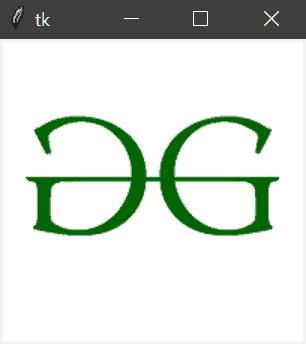

# 用 Python 读取图像–Tkinter

> 原文:[https://www . geesforgeks . org/reading-images-with-python-tkinter/](https://www.geeksforgeeks.org/reading-images-with-python-tkinter/)

Python 中有许多设计 GUI(图形用户界面)的工具，如`tkinter`、`wxPython`、`JPython`等，其中 Tkinter 是标准的 Python GUI 库，它提供了一种用 Python 创建 GUI 应用程序的简单高效的方法。

## 用 Tkinter 读取图像

为了对图像进行各种操作和操控，我们需要 Python `Pillow`包。如果系统中不存在`Pillow`包，则可以使用以下命令进行安装。

*   在命令提示符下:

    ```py
    pip install Pillow
    ```

*   在蟒蛇提示中:

    ```py
    conda install -c anaconda pillow
    ```

**示例 1:** 下面的程序演示了如何使用`PIL`用`tkinter`读取图像。

```py
# importing required packages
import tkinter
from PIL import ImageTk, Image
import os

# creating main window
root = tkinter.Tk()

# loading the image
img = ImageTk.PhotoImage(Image.open("gfg.jpeg"))

# reading the image
panel = tkinter.Label(root, image = img)

# setting the application
panel.pack(side = "bottom", fill = "both",
           expand = "yes")

# running the application
root.mainloop()
```

**输出:**



在上述程序中，使用`PhotoImage()`方法加载图像，然后使用`Label()`方法读取图像。`pack()`方法安排主窗口，`mainloop()`函数用于无限循环运行应用程序。

**示例 2:** 让我们看另一个示例，其中我们将图像参数与应用程序参数一起排列。

```py
# importing required packages
import tkinter  
from PIL import ImageTk, Image  

# creating main window
root = tkinter.Tk()  

# arranging application parameters
canvas = tkinter.Canvas(root, width = 500, 
                        height = 250)  

canvas.pack()  

# loading the image
img = ImageTk.PhotoImage(Image.open("gfg.ppm"))  

# arranging image parameters 
# in the application
canvas.create_image(135, 20, anchor = NW,
                   image = img) 

# running the application
root.mainloop() 
```

**输出:**


在上述程序中，应用参数使用`Canvas()`方法处理，图像参数使用`create_image()`方法处理，使得图像`gfg.ppm`显示在具有定义的高度和宽度的主窗口中。
**注:**Canvas 方法 create_image(x0，y0，options …)用于在画布上绘制图像。create_image 不直接接受图像。它使用由 PhotoImage()方法创建的对象。PhotoImage 类只能从文件中读取 GIF 和 PGM/PPM 图像。