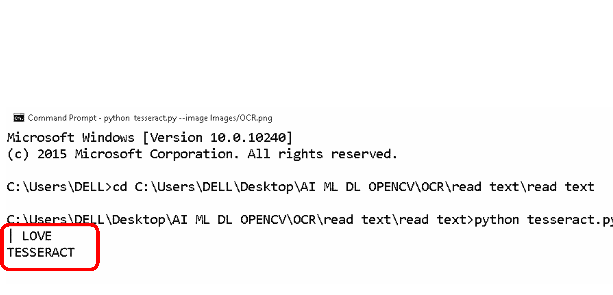

# 使用宇宙魔方

从图像中读取文本

> 原文:[https://www . geesforgeks . org/reading-text-from-the-image-using-tesseract/](https://www.geeksforgeeks.org/reading-text-from-the-image-using-tesseract/)

**小魔方**或**Python-小魔方**是一款针对 Python 的光学字符识别(OCR)工具。它将读取和识别图像、车牌等中的文本。在这里，我们将使用宇宙魔方包从给定的图像中读取文本。

这里主要涉及 3 个简单的步骤，如下所示

*   加载从计算机保存的图像，或使用浏览器下载图像，然后加载该图像。(任何带文本的图像)。
*   图像二值化(将图像转换为二值)。
*   然后，我们将通过光学字符识别系统传递图像。

### 实施:

下面的 python 代码表示文本的本地化和正确猜测图像中的文本。

## 蟒蛇 3

```py
# We import the necessary packages
#import the needed packages
import cv2
import os,argparse
import pytesseract
from PIL import Image

#We then Construct an Argument Parser
ap=argparse.ArgumentParser()
ap.add_argument("-i","--image",
                required=True,
                help="Path to the image folder")
ap.add_argument("-p","--pre_processor",
                default="thresh", 
                help="the preprocessor usage")
args=vars(ap.parse_args())

#We then read the image with text
images=cv2.imread(args["image"])

#convert to grayscale image
gray=cv2.cvtColor(images, cv2.COLOR_BGR2GRAY)

#checking whether thresh or blur
if args["pre_processor"]=="thresh":
    cv2.threshold(gray, 0,255,cv2.THRESH_BINARY| cv2.THRESH_OTSU)[1]
if args["pre_processor"]=="blur":
    cv2.medianBlur(gray, 3)

#memory usage with image i.e. adding image to memory
filename = "{}.jpg".format(os.getpid())
cv2.imwrite(filename, gray)
text = pytesseract.image_to_string(Image.open(filename))
os.remove(filename)
print(text)

# show the output images
cv2.imshow("Image Input", images)
cv2.imshow("Output In Grayscale", gray)
cv2.waitKey(0)
```

现在，按照以下步骤成功读取图像中的文本:

*   将要从中读取文本的代码和图像保存在同一个文件中。
*   打开命令提示符。转到保存代码文件和图像的位置。
*   执行以下命令查看输出。

**例 1:**

执行以下命令查看输出。

```py
python  tesseract.py --image Images/title.png

```

我们显示了原始图像。


标题

我们显示了灰度图像。(p.png)


p

**输出:**


**例 2:**

执行以下命令查看输出。

```py
python  tesseract.py --image Images/OCR.png

```

我们显示了原始图像。


光学字符识别

我们显示了灰度图像。(p.png)


p

**输出:**

