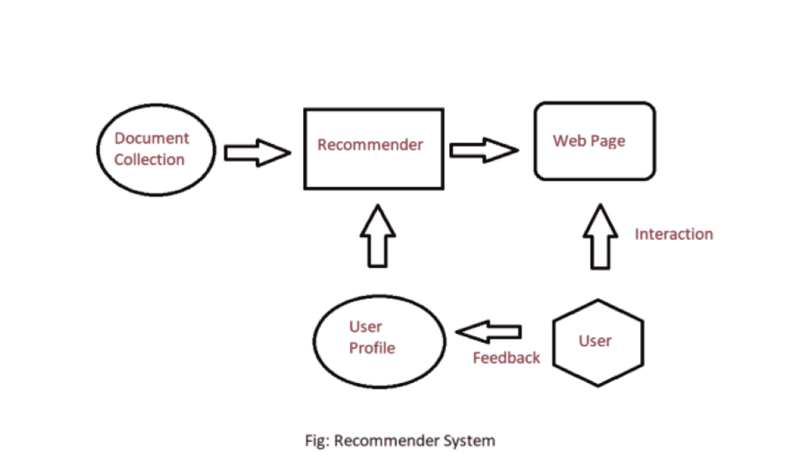

# Python 中的推荐系统

> 原文:[https://www . geesforgeks . org/pro 荐-python 中的系统/](https://www.geeksforgeeks.org/recommendation-system-in-python/)

有许多应用程序，网站从用户那里收集数据，并使用这些数据来预测用户的好恶。这允许他们推荐他们喜欢的内容。推荐系统是一种向用户的特定思维方式建议或类似项目和想法的方式。

推荐系统有不同的类型:

*   **协同过滤:**协同过滤基于用户和/或项目之间的相似性度量推荐项目。算法背后的基本假设是兴趣相似的用户有共同的偏好。
*   **基于内容的推荐:**它是监督机器学习，用于诱导分类器来区分用户感兴趣和不感兴趣的项目。

**基于内容的** **推荐系统:** 基于内容的系统向客户推荐类似于之前客户高评分项目的项目。它使用项目的特征和属性。从这些属性，它可以计算项目之间的相似性。

在一个基于内容的推荐系统中，首先、我们需要为每个项目创建一个描述文件，描述这些项目的属性。从用户简档中为特定用户推断。我们使用这些用户配置文件向目录中的用户推荐商品。



基于内容的推荐系统

**物品简介:**

在基于内容的推荐系统中，我们需要为每个项目构建一个概要文件，其中包含每个项目的重要属性。例如，如果电影是一个项目，那么它的演员、导演、上映年份、和流派是它的重要属性、，对于文档、来说，重要属性是其中的 类型的内容和一组重要词汇。

让我们来看看如何创建项目配置文件。首先，我们需要执行 TF-IDF 矢量器，这里一个单词的  TF(术语频率)是它在文档中出现的次数，一个单词的 IDF(逆文档频率)是该术语在整个语料库中有多重要的度量。这些可以通过以下公式计算:

*   项频可通过下式计算:

<center></center>

其中 *f <sub>ij</sub>* 是术语(特征) *i* 在文件(项目)*j*中出现的频率

*   逆文档频率可以用:计算

<center></center>

其中，*N<sub>I</sub>T3】提到术语*的文档数量，N* 是文档总数。*

*   因此，总公式为:

<center></center>

在这里，文档配置文件是一组带有

**用户简介:**

用户简档是描述用户偏好的向量。在创建用户配置文件的过程中，我们使用描述用户和项目之间关系的效用矩阵。从这些信息中，我们可以决定用户喜欢哪个项目的最佳估计是这些项目的简档的某种集合。

**优缺点:**

*   **优势:**
    *   申请类似用户时不需要其他用户的数据。
    *   能够推荐给口味独特的用户。
    *   能够推荐新的&热门单品
    *   推荐项目说明。
*   T1】劣势:T3
    *   找到合适的特征很难。
    *   不推荐用户配置文件之外的项目。

**协同过滤:**协同过滤是基于相似的人(基于数据)一般倾向于喜欢相似的东西的思想。I t 基于其他相似用户的物品偏好来预测用户会喜欢哪个物品。

协同过滤使用用户-项目矩阵来生成推荐。该矩阵包含表示用户对给定项目的偏好的值。这些值可以表示显性反馈(直接用户评分)或隐性反馈(间接用户行为，如听、买、看)。

*   **明确反馈:**当用户选择这样做时，从用户那里收集的数据量。很多时候，用户选择不为用户提供数据。所以，这个数据是稀缺的和有时候  要花的钱。例如，来自用户的评级。
*   **内隐反馈:**在内隐反馈中，我们跟踪用户行为来预测其偏好。

**示例:**

*   考虑一个用户 x，我们需要找到另一个评分与 x 的评分相似的用户，然后我们根据另一个用户来估计 x 的评分。

<figure class="table">

|   | M_1 | m2 | m3 | M_4 | M_5 | M_6 | M_7 |
| --- | --- | --- | --- | --- | --- | --- | --- |
| A | four |   |   | five | one |   |   |
| B | five | five | four |   |   | five |   |
| C |   |   |   | Two | four |   |   |
| D |   | three |   |   |   |   | three |

</figure>

*   让我们创建一个代表不同用户和电影的矩阵:
*   考虑具有评级向量 r <sub>x</sub> 和 r <sub>y</sub> 的两个用户 x、y。我们需要确定一个相似度矩阵来计算相似度 b/w sim(x，y)。计算相似度的方法有很多，如:Jaccard 相似度、余弦相似度、pearson 相似度等。这里，我们使用中心余弦相似度/皮尔逊相似度，通过减去平均值来标准化评分:

<figure class="table">

|   | M_1 | m2 | m3 | M_4 | M_5 | M_6 | M_7 |
| --- | --- | --- | --- | --- | --- | --- | --- |
| A | 2/3 |   |   | 5/3 | -7/3 |   |   |
| B | 1/3  | 1/3 | -2/3 |   |   |   |   |
| C |   |   |   | -5/3 | 1/3 | 4/3 |   |
| D |   | Zero |   |   |   |   | Zero |

</figure>

*   这里我们可以计算相似度:例如:sim(A，B) = cos(r <sub>A</sub> ，r<sub>B</sub>)= 0.09；sim(A，C) = -0.56。> sim(甲、乙)sim(甲、丙)。

**评级预测**

*   设 r <sub>x</sub> 为用户 x 评分的向量。设 N 为同样对项目 I 进行评分的 k 个相似用户的集合，那么我们可以用下面的公式计算出用户 x 和项目 I 的预测值:

<center></center>

**优缺点:**

*   **优势:**
    *   不需要领域知识，因为嵌入是自动学习的。
    *   捕捉固有的细微特征。
*   T1】劣势:T3
    *   由于冷启动问题，无法处理新鲜物品。
    *   很难添加任何可以提高模型质量的新特性

### 实施:

## 蟒蛇 3

```
# code
import numpy as np
import pandas as pd
import sklearn
import matplotlib.pyplot as plt
import seaborn as sns

import warnings
warnings.simplefilter(action='ignore', category=FutureWarning)

ratings = pd.read_csv("https://s3-us-west-2.amazonaws.com/recommender-tutorial/ratings.csv")
ratings.head()

movies = pd.read_csv("https://s3-us-west-2.amazonaws.com/recommender-tutorial/movies.csv")
movies.head()

n_ratings = len(ratings)
n_movies = len(ratings['movieId'].unique())
n_users = len(ratings['userId'].unique())

print(f"Number of ratings: {n_ratings}")
print(f"Number of unique movieId's: {n_movies}")
print(f"Number of unique users: {n_users}")
print(f"Average ratings per user: {round(n_ratings/n_users, 2)}")
print(f"Average ratings per movie: {round(n_ratings/n_movies, 2)}")

user_freq = ratings[['userId', 'movieId']].groupby('userId').count().reset_index()
user_freq.columns = ['userId', 'n_ratings']
user_freq.head()

# Find Lowest and Highest rated movies:
mean_rating = ratings.groupby('movieId')[['rating']].mean()
# Lowest rated movies
lowest_rated = mean_rating['rating'].idxmin()
movies.loc[movies['movieId'] == lowest_rated]
# Highest rated movies
highest_rated = mean_rating['rating'].idxmax()
movies.loc[movies['movieId'] == highest_rated]
# show number of people who rated movies rated movie highest
ratings[ratings['movieId']==highest_rated]
# show number of people who rated movies rated movie lowest
ratings[ratings['movieId']==lowest_rated]

## the above movies has very low dataset. We will use bayesian average
movie_stats = ratings.groupby('movieId')[['rating']].agg(['count', 'mean'])
movie_stats.columns = movie_stats.columns.droplevel()

# Now, we create user-item matrix using scipy csr matrix
from scipy.sparse import csr_matrix

def create_matrix(df):

    N = len(df['userId'].unique())
    M = len(df['movieId'].unique())

    # Map Ids to indices
    user_mapper = dict(zip(np.unique(df["userId"]), list(range(N))))
    movie_mapper = dict(zip(np.unique(df["movieId"]), list(range(M))))

    # Map indices to IDs
    user_inv_mapper = dict(zip(list(range(N)), np.unique(df["userId"])))
    movie_inv_mapper = dict(zip(list(range(M)), np.unique(df["movieId"])))

    user_index = [user_mapper[i] for i in df['userId']]
    movie_index = [movie_mapper[i] for i in df['movieId']]

    X = csr_matrix((df["rating"], (movie_index, user_index)), shape=(M, N))

    return X, user_mapper, movie_mapper, user_inv_mapper, movie_inv_mapper

X, user_mapper, movie_mapper, user_inv_mapper, movie_inv_mapper = create_matrix(ratings)

from sklearn.neighbors import NearestNeighbors
"""
Find similar movies using KNN
"""
def find_similar_movies(movie_id, X, k, metric='cosine', show_distance=False):

    neighbour_ids = []

    movie_ind = movie_mapper[movie_id]
    movie_vec = X[movie_ind]
    k+=1
    kNN = NearestNeighbors(n_neighbors=k, algorithm="brute", metric=metric)
    kNN.fit(X)
    movie_vec = movie_vec.reshape(1,-1)
    neighbour = kNN.kneighbors(movie_vec, return_distance=show_distance)
    for i in range(0,k):
        n = neighbour.item(i)
        neighbour_ids.append(movie_inv_mapper[n])
    neighbour_ids.pop(0)
    return neighbour_ids

movie_titles = dict(zip(movies['movieId'], movies['title']))

movie_id = 3

similar_ids = find_similar_movies(movie_id, X, k=10)
movie_title = movie_titles[movie_id]

print(f"Since you watched {movie_title}")
for i in similar_ids:
    print(movie_titles[i])
```

**输出:**

```
Number of ratings: 100836
Number of unique movieId's: 9724
Number of unique users: 610
Average number of ratings per user: 165.3
Average number of ratings per movie: 10.37
==========================================
# lowest rated
    movieId    title    genres
2689    3604    Gypsy (1962)    Musical

# highest rated
    movieId    title    genres
48    53    Lamerica (1994)    Adventure|Drama

# who rate highest rated movie
userId    movieId    rating    timestamp
13368    85    53    5.0    889468268
96115    603    53    5.0    963180003

# who rate lowest rated movie
userId    movieId    rating    timestamp
13633    89    3604    0.5    1520408880

Since you watched Grumpier Old Men (1995)
Grumpy Old Men (1993)
Striptease (1996)
Nutty Professor, The (1996)
Twister (1996)
Father of the Bride Part II (1995)
Broken Arrow (1996)
Bio-Dome (1996)
Truth About Cats & Dogs, The (1996)
Sabrina (1995)
Birdcage, The (1996
```