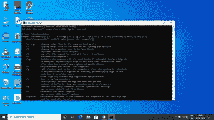

# 用语音识别重启电脑

> 原文:[https://www . geeksforgeeks . org/用语音识别重新启动计算机/](https://www.geeksforgeeks.org/restart-your-computer-with-speech-recognition/)

我们可以在 Python 的帮助下做到这一点。Python 有许多库，可以帮助完成许多简单的事情。我们需要终端的帮助来完成这项任务。Python 最好的库之一语音识别将帮助我们做到这一点。

### 所需模块

*   **Pyttsx3:** 这是 Python 中的文本到语音库。我们不得不使用 pip。

```
pip install pyttsx3
```

*   **语音识别模块:**它是帮助我们识别语音和给计算机的命令的模块。我们必须使用画中画来安装语音识别。

```
pip install SpeechRecognition
```

*   **OS 模块:**是 python 中提供与操作系统交互功能的模块。操作系统模块附带 Python 包。不需要 Pip。

### 为什么使用终端？

当我们在终端中键入关机时，我们将获得许多选项，在这些选项的帮助下，我们可以重新启动计算机。因为我们会有很多标签。我们可以使用带关机的“/r”来重启。



带有关机命令的终端。我们可以看到完全关闭和重新启动有/r。

### 逐步方法:

**第一步:**我们要做 Speak 功能，让电脑和我们交流。

## 蟒蛇 3

```
# Method to give 
# output voice commands 
def Speak(self, audio):
    engine = pyttsx3.init('sapi5')

    # initial constructor of pyttsx3
    voices = engine.getProperty('voices')

    # getter and setter method
    engine.setProperty('voice', voices[1].id)
    engine.say(audio)
    engine.runAndWait()
```

**第二步:**我们现在要做一个接受命令的函数。

## 蟒蛇 3

```
# Method to take
# input voice commands
def take_commands(self):
      r = sr.Recognizer()

    # Making the use of Recognizer
    # and Microphone method from
    # Speech Recognition for taking commands
    with sr.Microphone() as source:
          print('Listening')
        r.pause_threshold = 0.7
        # seconds of non-speaking audio
        # before a phrase is considered complete
        audio = r.listen(source)
        try:
            print("Recognizing")
            Query = r.recognize_google(audio, language='en-in')

            # For listening the command in indian english
            print("the query is printed='", Query, "'")

            # For printing the query or the
            # command that we give
        except Exception as e:

            # This is for printing the exception
            print(e)
            print("Say that again sir")
            return "None"
    return Query
```

**第三步:**现在我们来做一个让电脑重启的 Restart 方法。

## 蟒蛇 3

```
# Method to restart PC
def restart(self):
    self.Speak("do u want to restart the computer sir")
    take = self.takeCommand()
    choice = take
    if choice == 'yes':
        print("Restarting  the computer")
        self.Speak("Restarting the computer")
        os.system("shutdown /r /t 30")
    if choice == 'no':
        print("Thank u sir")
        self.Speak("Thank u sir")
```

**第四步:**现在我们将有主要方法。

## 蟒蛇 3

```
# Driver Code
if __name__ == '__main__':
    Maam = Main()
    Maam.restart()
```

以下是上述方法的完整程序:

## 蟒蛇 3

```
# Import required modules
import pyttsx3
import time
import speech_recognition as sr
import os

# Creating class
class Main:

    # Method to give output commands
    def Speak(self, audio):
        engine = pyttsx3.init('sapi5')
        voices = engine.getProperty('voices')
        engine.setProperty('voice', voices[1].id)
        engine.say(audio)
        engine.runAndWait()

    # Method to take input voice commands
    def takeCommand(self):

        # This method is for taking
        # the commands and recognizing the command

        r = sr.Recognizer()
        # from the speech_Recognition module
        # we will use the recongizer method
        # for recognizing

        with sr.Microphone() as source:
            # from the speech_Recognition module
            # we will use the Microphone module for
            # listening the command

            print('Listening')
            # seconds of non-speaking audio
            # before a phrase is considered complete
            r.pause_threshold = 0.7
            audio = r.listen(source)

            try:
                print("Recognizing")
                Query = r.recognize_google(audio, language='en-in')

                # for listening the command
                # in indian english
                print("the query is printed='", Query, "'")

                # for printing the query or the
                # command that we give
            except Exception as e:

                # this method is for handling
                # the exception and so that
                # assistant can ask for telling
                # again the command
                print(e) 

                print("Say that again sir")
                return "None"
            return Query

    # Method to restart PC
    def restart(self):
        self.Speak("do u want to switch off the computer sir")
        take = self.takeCommand()
        choice = take
        if choice == 'yes':
            print("Shutting down the computer")
            os.system("shutdown /s /t 30")
            self.Speak("Shutting the computer")
        if choice == 'no':
            print("Thank u sir")
            self.Speak("Thank u sir")

# Driver Code
if __name__ == '__main__':
    Maam = Main()
    Maam.restart()
```