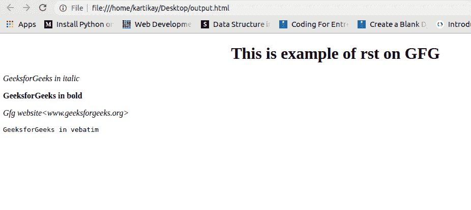

# 重构文本|。使用 Python 将第一个文件转换为 HTML 文件用于文档

> 原文:[https://www . geesforgeks . org/restraited text-rst-file-to-html-file-use-python-for-documentation/](https://www.geeksforgeeks.org/restructuredtext-rst-file-to-html-file-using-python-for-documentations/)

**简介。rst 文件(重组文本):**

**`reStructuredText`** 是一种文本数据的文件格式，主要由基于 Python 的社区使用，以类似于 Java 的 Javadoc 等其他工具的简单方式开发文档。基于 Python 的软件和库的大多数文档都是使用*重构文本*编写的，因此在为任何组织做贡献时学习它是很重要的。

像 Python 一样，RST 语法对缩进也很敏感。

**重构文本的示例代码:**
下面给出了一些基本语法及其 HTML 呈现。

<colgroup><col width="15%"><col width="45%"><col width="40%"></colgroup>
| 使用 | 句法 | HTML 呈现 |
| --- | --- | --- |
| 标题 | *****标题
***** | 

## 标题

 |
| 斜体 | <cite>*斜体*</cite> | *斜体* |
| 加粗 | <cite>* *加粗**</cite> | **加粗** |
| 链接 | 【gfg】<www.geeksforgeeks.org>` | [gfg](/) |

**重组第一次**

```py
******************************
This is example of rst on GFG
******************************

*GeeksforGeeks in italic*

**GeeksforGeeks in bold**

`Gfg website<www.geeksforgeeks.org>`

``GeeksforGeeks in vebatim``
```

用*保存文件。rst* 分机。

**Python 代码:**

以下是转换*的 Python 代码。rst* 文件转换为 HTML 文件。`docutils` 是安装 Python 时下载的预定义库。`publish_file` 方法通过传递文件名作为参数，将 *rst* 转换为 html。

```py
import docutils.core

docutils.core.publish_file(
    source_path ="restructured.rst",
    destination_path ="Output.html",
    writer_name ="html")
```

**Output.html**
运行完 python 代码后，会在与 rst 文件相同的目录下创建一个 HTML 文件。HTML 的代码比一个人写的普通 HTML 代码复杂，因为它是自动生成的。下图显示了上面显示的重构文本的 HTML 呈现。

