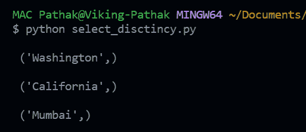

# 用 SQLite 返回 SQLAlchemy 中不同的行

> 原文:[https://www . geesforgeks . org/returning-distinct-row-in-sqlalchemy-with-SQLite/](https://www.geeksforgeeks.org/returning-distinct-rows-in-sqlalchemy-with-sqlite/)

在本文中，我们将看到如何用 Python 中的 SQLite 返回 SQLAlchemy 中的不同行。

## 装置

SQLAlchemy 可通过 pip 安装包获得。

```
pip install sqlalchemy
```

但是，如果您正在使用 flask，您可以使用它自己的 SQLAlchemy 实现。它可以通过以下方式安装–

```
pip install flask-sqlalchemy
```

## 使用 SQLite 创建数据库和表

我们将利用 sqlite3 数据库。您可以从该链接下载数据库。将下载的文件解压到一个目录。之后，创建一个数据库。按照以下流程创建名为**用户**的数据库:

*   打开命令提示符，指向存在**sqlite.exe**文件的目录。
*   使用命令**创建一个名为 users 的数据库**
*   使用命令**检查创建的数据库。数据库**


使用 sqlite3 创建数据库

在运行 SQLAlchemy 查询之前，我们需要一个数据库表和一些记录。让我们创建一个名为 employees 的表，并在其中插入一些值。原始 SQL 查询由以下公式给出:

```
CREATE TABLE employees (
  emp_name VARCHAR(50),
  emp_email VARCHAR(50),
  emp_address VARCHAR(50)
);
INSERT INTO employees VALUES
  ('John', 'john.doe@email.com', 'Washington'),
  ('Sundar', 'spichai@eail.com', 'California'),
  ('Rahul', 'rahul@email.com', 'Mumbai'),
  ('Sonia', 'sonia@email.com', 'Mumbai'),
  ('Aisha', 'aisha@email.com', 'California');
```

以上两个查询将创建**员工**表，并在其中插入 5 条记录。查询可以在 sqlite3 shell 中运行，如下所示–


在 SQLite 外壳中运行查询

## 使用 SQLAlchemy 获取不同的记录

现在，我们已经准备好了表，所以我们可以编写 SQLAlchemy 代码来从表中提取不同的记录。我们将从 **emp_address** 字段的**员工**表中获取不同的(即唯一的)记录。

## 计算机编程语言

```
import sqlalchemy as db

# Define the Engine (Connection Object)
engine = db.create_engine("sqlite:///users.db")

# Create the Metadata Object
meta_data = db.MetaData(bind=engine)
db.MetaData.reflect(meta_data)

# Get the `employees` table from the Metadata object
EMPLOYEES = meta_data.tables['employees']

# SQLAlchemy Query to extract DISTINCT records
query = db.select([db.distinct(EMPLOYEES.c.emp_address)])

# Fetch all the records
result = engine.execute(query).fetchall()

# View the records
for record in result:
    print("\n", record)
```

**输出:**



代码输出

**说明:**

*   首先，为了简单起见，我们将 sqlalchemy 库导入为 **db** 。所有 sqlalchemy 对象、方法等都将使用此 **db** 前缀导入，以提高清晰度。
*   然后我们创建引擎，它将作为数据库的连接来执行所有的数据库操作。
*   创建元数据对象。元数据对象“元数据”包含关于我们的数据库的所有信息。
*   使用元数据信息从数据库中获取**‘员工’**表。
*   我们现在可以编写一个 SQLAlchemy 查询来获取唯一的记录。我们对 **emp_address** 字段执行 DISTINCT 操作，使用 SQLalchemy 的**“DISTINCT()”**函数检索相应字段中的唯一值集。
*   打印所有提取的记录。在输出中，我们可以看到只有 3 个不同的员工地址值。