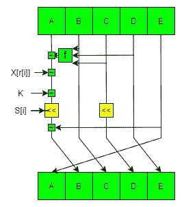

# RIPEMD 哈希函数

> 原文:[https://www.geeksforgeeks.org/ripemd-hash-function/](https://www.geeksforgeeks.org/ripemd-hash-function/)

[散列函数](https://www.geeksforgeeks.org/hash-functions-system-security/)是一个在使系统安全方面具有巨大作用的函数，因为它将给予它的正常数据转换为固定长度的不规则值。我们可以想象它是我们家里的一个摇床。当我们把数据放入这个函数时，它输出一个不规则的值。它输出的不规则值称为“哈希值”。哈希值只是数字，但通常用十六进制表示。计算机以二进制形式管理值。哈希值也是一个数据，通常用二进制管理。

#### 重复一遍

RACE 完整性原语评估消息摘要(RIPEMD)是由汉斯·多伯坦(Hans Dobbertin)、安托万·博瑟莱尔斯(Antoon Bosselaers)和巴特·普雷内尔(Bart Preneel)于 1992 年开发的一组散列函数。RIPEMD 的开发思路是基于 MD4，MD4 本身就是一个弱哈希函数。它被开发来很好地与 32 位处理器一起工作。RIPEMD 的类型:

*   ripd-128 战斗机
*   ripd-160 战斗机
*   RIPEMD-256 战斗机
*   ripd-320 战斗机

#### 工作

它是 RIPEMD-160 哈希算法的一个子块。该消息由压缩功能以 512 比特的块进行处理，并通过使用常数“k”的值也不同的 5 个不同版本通过该子块的两个流。



**不同版本的 RIPEMD**

*   第一个 RIPEMD 没有被认为是一个好的散列函数，因为一些设计缺陷导致了一些主要的安全问题，其中之一是输出的大小是 128 位，太小了，容易被破坏。在下一个版本 **RIPEMD-128** 中，设计缺陷被移除，但输出仍然是 128 位，这使得它不太安全。
*   **RIPEMD-160** 是下一个版本，它将输出长度增加到 160 位，并提高了哈希函数的安全级别。该函数旨在替代 128 位哈希函数 MD4、MD5 和 RIPEMD-128。
*   **RIPEMD-256 和 RIPEMD-320** 是 RIPEMD-128 的扩展，提供与 RIPEMD-160 和 RIPEMD-128 相同的安全性，RIPEMD-128 是为更喜欢大哈希值而不是更高安全级别的应用而设计的。

**例 1:**

```
# Python program to demonstrate
# RIPEMD 

import hashlib

# Passing the required algorithm
# as string to the new constructor
x = hashlib.new('ripemd160')

# passing GeeksforGeeks 
# to x() which uses 
# ripemd 160 algorithm for
# hashing
x.update(b"GeeksForGeeks")

# printing the equivalent hexadecimal
# value. 
print("The hexadecimal equivalent of hash is :") 
print(x.hexdigest())
```

**输出:**

```
The hexadecimal equivalent of hash is :
1b4470fb3147534653ddca6d7a1b2109b5449089

```

在上例中，`new()`构造函数将算法名称作为字符串，并为该算法创建一个对象。然后`update()`方法获取一个二进制字符串，以便哈希函数可以接受它。`x()`散列函数对其进行编码，然后使用`hexdigest()`，打印十六进制等效编码字符串。

**示例 2:** 让我们看看是否要找到编码哈希值的字节表示。

```
# Python program to demonstrate
# RIPEMD 

import hashlib

# Passing the required algorithm
# as string to the new constructor
x = hashlib.new('ripemd160')

# passing GeeksforGeeks 
# to x() which uses 
# ripemd 160 algorithm for
# hashing
x.update(b"GeeksForGeeks")

# printing the equivalent hexadecimal
# value. 
print("The byte equivalent of hash is :") 
print(x.digest())
```

**输出:**

```
The byte equivalent of hash is :
b'\x1bDp\xfb1GSFS\xdd\xcamz\x1b!\t\xb5D\x90\x89'

```