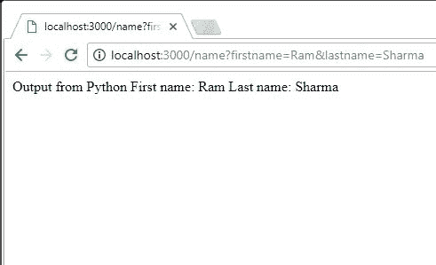

# 使用子进程产卵()方法从 Node.js 运行 Python 脚本

> 原文:[https://www . geesforgeks . org/run-python-script-node-js-using-child-process-产卵-method/](https://www.geeksforgeeks.org/run-python-script-node-js-using-child-process-spawn-method/)

Node.js 是采用最多的 web 开发技术之一，但它缺乏对机器学习、深度学习和人工智能库的支持。幸运的是，Python 支持所有这些和许多其他特性。Python 的 Django 框架可以利用 Python 的这一功能，并且可以为使用机器学习和人工智能构建新时代的网络应用程序提供支持。

对于那些不熟悉 Django 框架但是使用 Node JS 框架的开发人员来说，使用 Python 为 Node JS 使用子流程模块也可以受益于*。*

节点 JS 的子进程模块也提供了以 JavaScript 以外的语言(如 Python)运行脚本或命令的功能。我们可以在 Node JS 应用程序中实现机器学习算法、深度学习算法以及通过 Python 库提供的许多特性。子进程允许我们在 Node JS 应用程序中运行 Python 脚本，并将数据流入/流出 Python 脚本。

```py
child_process.spawn(): This method helps us to spawn child process asynchronously.
```

让我们创建一个简单的 Python 脚本，将两个命令行参数作为 ***名*** 和 ***姓*** 然后显示它们。稍后，我们将从 Node JS 应用程序运行该脚本，并在浏览器窗口中显示输出。

**Python 脚本:**

```py
import sys
# Takes first name and last name via command 
# line arguments and then display them
print("Output from Python")
print("First name: " + sys.argv[1])
print("Last name: " + sys.argv[2])

# save the script as hello.py
```

**节点 JS 服务器代码:**

```py
// import express JS module into app
// and creates its variable.
var express = require('express');
var app = express();

// Creates a server which runs on port 3000 and 
// can be accessed through localhost:3000
app.listen(3000, function() {
    console.log('server running on port 3000');
} )

// Function callName() is executed whenever 
// url is of the form localhost:3000/name
app.get('/name', callName);

function callName(req, res) {

    // Use child_process.spawn method from 
    // child_process module and assign it
    // to variable spawn
    var spawn = require("child_process").spawn;

    // Parameters passed in spawn -
    // 1\. type_of_script
    // 2\. list containing Path of the script
    //    and arguments for the script 

    // E.g : http://localhost:3000/name?firstname=Mike&lastname=Will
    // so, first name = Mike and last name = Will
    var process = spawn('python',["./hello.py",
                            req.query.firstname,
                            req.query.lastname] );

    // Takes stdout data from script which executed
    // with arguments and send this data to res object
    process.stdout.on('data', function(data) {
        res.send(data.toString());
    } )
}

// save code as start.js
```

保存 Python 脚本和服务器脚本代码后，通过以下命令从源代码文件夹运行代码:

```py
 node start.js 
```

通过链接访问应用程序:

```py
localhost:3000/name?firstname=*"Enter first name"*&lastname=*"Enter last name"*

For e g. : localhost:3000/name?firstname=Ram&lastname=Sharma
```

**输出:**



**应用:**

1.  这种方法可以用来替代 REST-API。
2.  这种方法可以帮助我们的 web 应用程序从其他语言的特殊特性中获益，这些特性目前在 javascript 中是不可用的
3.  机器学习模块可以用 Python 实现，然后使用这种方法在网络应用程序中使用它们。

****参考:****

*   [https://nodejs.org/api/child_process.html](https://nodejs.org/api/child_process.html)