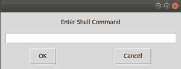

# 使用 Python 从 GUI 运行 shell 命令

> 原文:[https://www . geesforgeks . org/run-shell-command-from-GUI-using-python/](https://www.geeksforgeeks.org/run-shell-command-from-gui-using-python/)

在本文中，我们将讨论如何创建一个图形用户界面窗口，该窗口将操作系统命令作为输入，并在执行它们后，在弹出窗口中显示输出。

### **所需模块:**

**PyAutoGui:** 它是 python 中的一个模块，用于自动化 Gui 并控制鼠标和键盘。它是一个外部模块，可以使用以下命令安装在系统中:

```
Linux:
pip3 install pyautogui
Windows:
pip install pyautogui
```

**OS:**Python 中的 OS 模块提供了与操作系统交互的功能。该模块属于 Python 的标准实用程序模块。它提供了一种使用操作系统相关功能的可移植方式。

### **进场:**

*   导入模块。
*   使用 *pyautogui* 模块的*提示()*获取输入命令
*   使用*操作系统*模块的*系统()*执行命令。
*   最后调用 *os* 模块的 *popen()* 生成弹出窗口，然后使用 *pyautogui* 模块的 *alert()* 显示输出。

### **实施:**

下面的程序描述了如何创建一个以操作系统命令为输入的窗口。

## 蟒蛇 3

```
# import required modules
import os
import pyautogui

# prompts message on screen and takes the
# input command in val variable
val = pyautogui.prompt("Enter Shell Command")

# executes the value of val variable
os.system(val)
```

**输出:**



然而，当输入命令时，它们是在后台执行的。下面是上面之前 python 程序的一个更好的版本，其中在执行给定命令时，输出显示在一个弹出窗口中。

## 蟒蛇 3

```
# import required modules
import os
import pyautogui

# prompts message on screen and gets the command
# value in val variable
value = pyautogui.prompt("Enter Shell Command")

# executes the command and returns
# the output in stream variable
stream = os.popen(value)

# reads the output from stream variable
out = stream.read()
pyautogui.alert(out)
```

**输出:**

<video class="wp-video-shortcode" id="video-534850-1" width="640" height="360" preload="metadata" controls=""><source type="video/mp4" src="https://media.geeksforgeeks.org/wp-content/uploads/20201231105405/test.mp4?_=1">[https://media.geeksforgeeks.org/wp-content/uploads/20201231105405/test.mp4](https://media.geeksforgeeks.org/wp-content/uploads/20201231105405/test.mp4)</video>