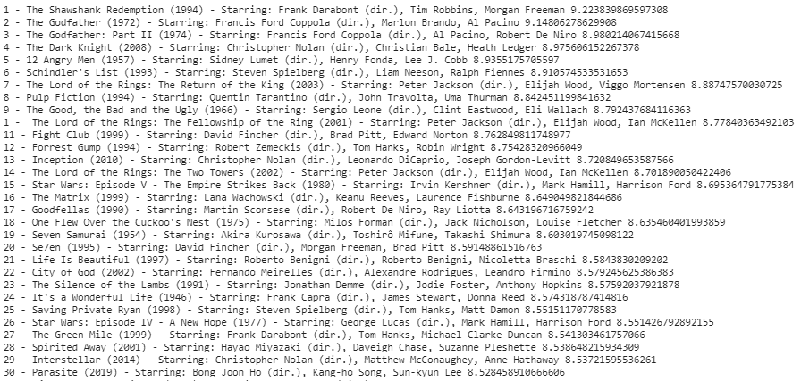

# 使用 Python 刮取 IMDB 电影分级和细节

> 原文:[https://www . geesforgeks . org/scratch-IMDB-movie-rating-and-details-use-python/](https://www.geeksforgeeks.org/scrape-imdb-movie-rating-and-details-using-python/)

我们可以借助 Python 的[beauty sup](https://www.geeksforgeeks.org/implementing-web-scraping-python-beautiful-soup/?ref=rp)库来抓取 IMDb 电影的收视率和它们的细节。

### 所需模块:

下面是需要从 IMDB 中抓取的模块列表。

*   [请求](https://www.geeksforgeeks.org/python-requests-tutorial/):请求库是 Python 的一个组成部分，用于向指定的 URL 发出 HTTP 请求。无论是 REST APIs 还是 Web 报废，都必须了解请求，以便进一步使用这些技术。当一个人向 URI 提出请求时，它会返回一个响应。
*   [html5lib](https://www.geeksforgeeks.org/html5lib-and-lxml-parsers-in-python/) :解析 html 的纯 python 库。它的设计符合 WHATWG HTML 规范，所有主要的网络浏览器都是这样实现的。
*   [bs4](https://www.geeksforgeeks.org/implementing-web-scraping-python-beautiful-soup/) :美妆对象由美妆汤提供，美妆汤是 Python 的网页抓取框架。网页抓取是使用自动化工具从网站中提取数据的过程，以使该过程更快。

### 方法:

用 python 实现网页抓取以提取 IMDb 电影分级及其分级的步骤:

*   导入所需的模块。

## 蟒蛇 3

```
from bs4 import BeautifulSoup
import requests
import re
```

*   通过分配网址和创建一个 soap 对象来访问网页中的 HTML 内容。

## 蟒蛇 3

```
# Downloading imdb top 250 movie's data
url = 'http://www.imdb.com/chart/top'
response = requests.get(url)
soup = BeautifulSoup(response.text, 'lxml')
```

*   提取电影分级及其细节。在这里，我们使用像 href、title 等 Html 标签从美化组对象中提取数据。

## 蟒蛇 3

```
movies = soup.select('td.titleColumn')
links = [a.attrs.get('href') for a in soup.select('td.titleColumn a')]
crew = [a.attrs.get('title') for a in soup.select('td.titleColumn a')]
ratings = [b.attrs.get('data-value') for b in soup.select('td.posterColumn span[name=ir]')]
votes = [b.attrs.get('data-value') for b in soup.select('td.ratingColumn strong')]
```

*   提取电影细节后，创建一个空列表并将细节存储在字典中，然后将它们添加到列表中。

## 蟒蛇 3

```
# create a empty list for storing
# movie information
list = []

# Iterating over movies to extract
# each movie's details
for index in range(0, len(movies)):

    # Separating  movie into: 'place',
    # 'title', 'year'
    movie_string = movies[index].get_text()
    movie = (' '.join(movie_string.split()).replace('.', ''))
    movie_title = movie[len(str(index))+1:-7]
    year = re.search('\((.*?)\)', movie_string).group(1)
    place = movie[:len(str(index))-(len(movie))]

    data = {"movie_title": movie_title,
            "year": year,
            "place": place,
            "star_cast": crew[index],
            "rating": ratings[index],
            "vote": votes[index],
            "link": links[index]}
    list.append(data)
```

*   现在或列表充满了顶级 IMBD 电影及其细节。最后显示电影细节列表

## 蟒蛇 3

```
for movie in list:
    print(movie['place'], '-', movie['movie_title'], '('+movie['year'] +
          ') -', 'Starring:', moive['star_cast'], movie['rating'])
```

**完整代码:**

## 蟒蛇 3

```
from bs4 import BeautifulSoup
import requests
import re

# Downloading imdb top 250 movie's data
url = 'http://www.imdb.com/chart/top'
response = requests.get(url)
soup = BeautifulSoup(response.text, 'lxml')

movies = soup.select('td.titleColumn')
links = [a.attrs.get('href') for a in soup.select('td.titleColumn a')]
crew = [a.attrs.get('title') for a in soup.select('td.titleColumn a')]

ratings = [b.attrs.get('data-value')
           for b in soup.select('td.posterColumn span[name=ir]')]

votes = [b.attrs.get('data-value')
         for b in soup.select('td.ratingColumn strong')]

list = []

# create a empty list for storing
# movie information
list = []

# Iterating over movies to extract
# each movie's details
for index in range(0, len(movies)):

    # Separating  movie into: 'place',
    # 'title', 'year'
    movie_string = movies[index].get_text()
    movie = (' '.join(movie_string.split()).replace('.', ''))
    movie_title = movie[len(str(index))+1:-7]
    year = re.search('\((.*?)\)', movie_string).group(1)
    place = movie[:len(str(index))-(len(movie))]
    data = {"movie_title": movie_title,
            "year": year,
            "place": place,
            "star_cast": crew[index],
            "rating": ratings[index],
            "vote": votes[index],
            "link": links[index]}
    list.append(data)

# printing movie details with its rating.
for movie in list:
    print(movie['place'], '-', movie['movie_title'], '('+movie['year'] +
          ') -', 'Starring:', movie['star_cast'], movie['rating'])
```

**输出:**

