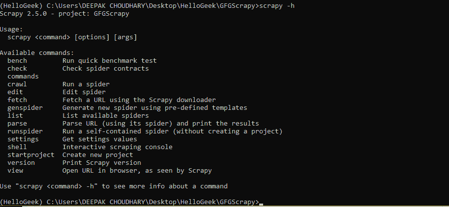
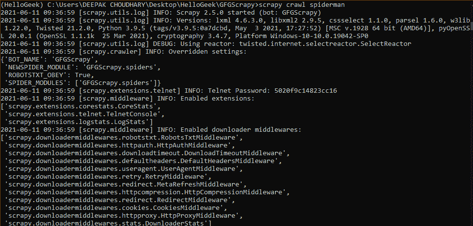
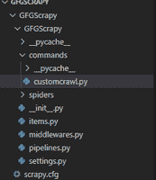
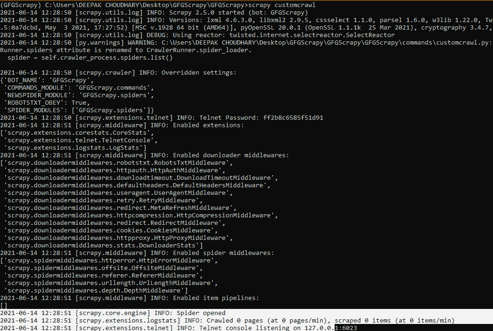

# Scrapy–命令行工具

> 原文:[https://www.geeksforgeeks.org/scrapy-command-line-tools/](https://www.geeksforgeeks.org/scrapy-command-line-tools/)

**前提:** [用 Scrapy](https://www.geeksforgeeks.org/implementing-web-scraping-python-scrapy/) 实现 Python 中的网页抓取

Scrapy 是一个 python 库，用于网络抓取和搜索整个网络的内容。它使用蜘蛛抓取整个页面，找出选择器中指定的内容。因此，使用不同的选择器提取网页的所有内容是一个非常方便的工具。

要创建一个蜘蛛并让它在 scrapy 中爬行，有两种方法，或者我们可以创建一个包含文件和文件夹的目录，并在其中一个文件中编写一些代码并执行搜索命令，或者我们可以通过 Scrapy 的命令行外壳与蜘蛛交互。因此，为了在 shell 中进行交互，我们应该熟悉 scrapy 的命令行工具。

Scrapy 命令行工具提供各种命令，可用于各种目的。让我们逐一研究每个命令。

### **创建报废项目**

首先，确保您的系统上是否安装了 Python。然后创建一个虚拟环境。

**示例:**


检查 Python 并为杂乱的目录创建 Virtualenv。

我们正在使用虚拟环境来节省内存，因为我们在全球范围内将如此大的软件包下载到我们的系统中，那么它将消耗大量内存，并且我们也不会大量要求该软件包，直到您专注于继续使用它。

要激活刚刚创建的虚拟环境，我们必须首先进入**脚本**文件夹，然后运行激活命令

> cd 脚本
> 
> 使活动
> 
> 激光唱片..

**示例:**


激活虚拟环境

然后我们必须运行下面给出的命令从 pip 安装 scrapy，然后下一个命令创建名为 **GFGScrapy 的 scrapy 项目。**

> #这是在虚拟环境中安装 scrapy 的命令。上面创建的
> 
> pip 安装报废
> 
> #这是启动一个杂乱项目的命令。
> 
> scrapy 启动 gfgscrapy

**示例:**


创建报废项目

现在我们要在 scrapy 里创造一只蜘蛛。对于那个蜘蛛，我们应该输入我们想要抓取的网站的网址。


目录结构

> #将目录更改为制作剪贴簿项目的目录。
> 
> GFGScrapy 光盘
> 
> #输入网址
> 
> 好斗的蜘蛛人 https://quotes.toscrape.com/

因此，我们创造了一种在上述网站上爬行的刺痒蜘蛛。

**示例:**


创造蜘蛛

要查看 scrapy 中可用工具的列表或获取任何相关帮助，请键入以下命令。

**语法:**

> scrapy -h

如果我们需要任何特定命令的更多描述，请键入给定的命令。

**语法:**

> 刺痒<command></command> -h

**示例:**



这些是 scrapy 中使用的命令行工具列表

下面讨论命令列表及其应用:

*   **bench:** 该命令用于执行 benchmark 测试，意思是 scrapy 软件能否在给定的系统环境下运行。

**语法:**

> 破旧的长凳

*   **检查:**检查蜘蛛契约。

**语法:**

> 报废检查[选项]

**示例:**


报废检查命令

*   **爬行:**此命令用于爬行蜘蛛通过指定的 URL 并分别收集数据。

**语法:**

> 好斗的爬行蜘蛛人

**示例:**



蜘蛛在网页上爬行

*   **编辑和生成蜘蛛:**这两个命令分别用于修改现有蜘蛛或创建新蜘蛛，
*   **版本和视图:**这些命令分别返回 scrapy 的版本和蜘蛛看到的站点的 URL。

**语法:**

> 报废版本

此命令打开一个新的选项卡，其中包含保存指定 URL 数据的 HTML 文件的 URL 名称，

**语法:**

> 剪贴簿视图[url]

**示例:**


版本检查

*   **列表、解析和设置:**顾名思义，它们用于创建可用蜘蛛的列表，解析提到的蜘蛛的网址，并分别在 settings.py 文件中设置值。

### **自定义命令**

除了所有这些默认的命令行工具之外，scrapy 还为用户提供了创建自己的自定义工具的能力，如下所述:

在 settings.py 文件中，我们可以在名为 **COMMANDS_MODULE 的标题下添加自定义工具。**

**语法:**

> COMMAND _ MODULES = ' spider man . COMMANDS '

格式为<project_name>。commands 其中 commands 是包含所有 commands.py 文件的文件夹。让我们创建一个自定义命令。我们将制作一个自定义命令，用来抓取蜘蛛。</project_name>

*   首先，创建一个**命令**文件夹，该文件夹与 settings.py 文件所在的目录相同。



目录结构

*   接下来，我们将在名为 **customcrawl.py** 文件的命令文件夹中创建一个. py 文件，用于编写我们的命令将要执行的工作。这里命令的名字是**刺儿头海关爬行。**在这个文件中，我们将使用一个名为**命令**的类，该类继承自 **ScrapyCommand** ，并包含三种创建命令的方法。

**程序:**

## 蟒蛇 3

```
from scrapy.commands import ScrapyCommand

class Command(ScrapyCommand):

    # requires the use of project
    requires_project = True

    # syntax for command
    def syntax(self):
        return '[options]'

    # description of command
    def short_desc(self):
        return 'Runs the spider using custom command'

    # the main running command
    def run(self, args, opts):

        # derieves to spider of scrapy project
        spider = self.crawler_process.spiders.list()

        # calls crawl command for that particular spider
        self.crawler_process.crawl(spider[0], **opts.__dict__)

        # starts the crawl
        self.crawler_process.start()
```

*   从现在开始，我们已经创建了一个 commands 文件夹，并在其中创建了一个 customcrawl.py 文件，现在是时候通过 settings.py 文件对这个命令进行 scrapy 访问了。

所以在 settings.py 文件下，提到一个名为 **COMMANDS_MODULE** 的标题，并添加 COMMANDS 文件夹的名称，如图所示:


settings.py 文件

*   现在是时候看输出了

**语法:**

> 剪贴簿自定义命令文件名称

**示例:**



我们的自定义命令成功运行

因此，我们看到了如何定义自定义命令并使用它，而不是使用默认命令。我们还可以将命令添加到库中，并在 scrapy 中 setup.py 文件下的部分中导入它们。