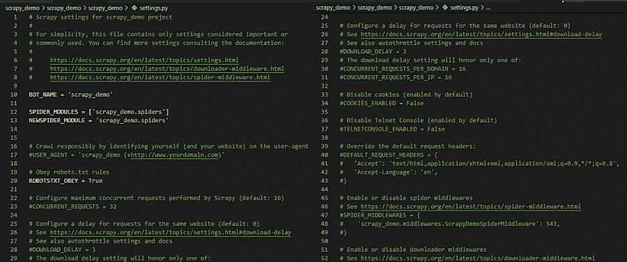
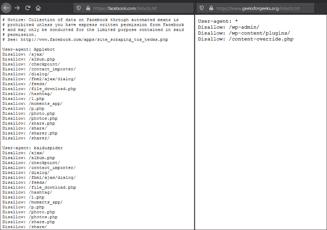
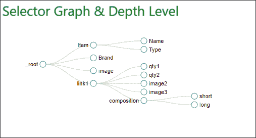
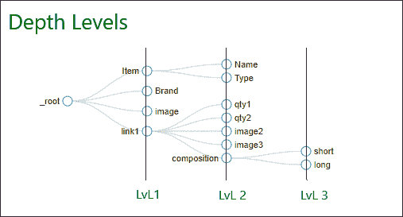
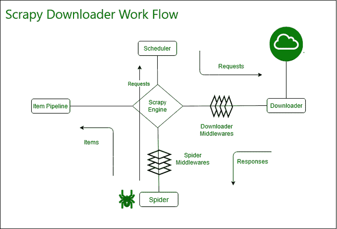
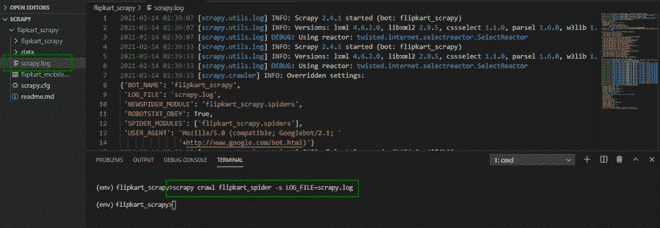

# 剪贴簿–设置

> 原文:[https://www.geeksforgeeks.org/scrapy-settings/](https://www.geeksforgeeks.org/scrapy-settings/)

Scrapy 是一个用 Python 框架构建的开源工具。它为我们提供了一个强大而健壮的网络爬行框架，在 XPath 支持的选择器的帮助下，可以轻松地从在线页面中提取信息。

我们可以借助 Scrapy 设置来定义 Scrapy 组件的行为。管道和设置文件对 scrapy 来说非常重要。这是任务自动化的核心。这些规则有助于将数据插入数据库。当我们从基本模板开始时，这些文件包括在内。Scrapy 设置允许您自定义所有 Scrapy 组件的行为，包括核心、扩展、管道和蜘蛛本身。

我们经常遇到这样的情况，我们需要定义多个 crapper 项目，在这种情况下，我们可以借助 scrapy 设置来定义哪个单独的项目。为此，应该使用环境变量 SCRAPY_SETTINGS_MODULE，其值应该在 Python 路径语法中。因此，在剪贴簿设置的帮助下，可以指定用于选择当前活动的剪贴簿项目的机制。

设置的基础结构提供了键值映射的全球命名空间，代码可以使用该命名空间从其中提取配置值。这些设置通常通过不同的机制填充，如下所述。

使用这些命令启动剪贴簿模板文件夹。

```
scrapy startproject <project_name>
```


这是这个杂乱项目的基本轮廓。

在本文中，我们将重点关注 settings.py 文件。



settings.py 文件看起来像这样。我们将此作为默认设置。

最常用的设置及其描述如下:

## **重要报废设置**

*   bot _ name

这是项目的名称。机器人象征着我们在剪切机的帮助下实现的自动化。默认为“剪贴簿”。如截图所示，当你启动项目时，它会自动显示你的项目名称。

*   **用户代理**

用户代理帮助我们识别身份。它基本上告诉服务器和网络对等方“你是谁”。它有助于识别请求用户代理的应用程序、操作系统、供应商和/或版本。除非明确指定，否则爬行时默认为“Scrapy/VERSION(+https://Scrapy . org)”。

浏览器的常见格式:

```
User-Agent: <browser>/<version> (<system-info>) <platform> (<platform-details>) <extensions>
```

例如:

```
# Crawl responsibly by identifying yourself (and your website) on the user-agent
USER_AGENT = 'Mozilla/5.0 (compatible; Googlebot/2.1; +http://www.google.com/bot.html)'
```

*   **ROBOTSTXT_OBEY**

robots.txt 文件基本上告诉搜索引擎的爬虫它可以从网站请求哪些页面。ROBOTSTXT_OBEY 默认为“假”。它大部分是保持启用的，所以我们的剪贴簿会尊重网站的 robots.txt 政策。



图中显示了 robots.txt 文件的内容，这里写的策略是由 ROBOTSTXT _ OBEY 设置管理的。

*   **并发请求**

基本上就是要求网站开放。默认为 16。所以基本上是爬虫将执行的请求的最大数量。

更多的请求会增加服务器的负载，所以将它保持在 16 或 32 是一个很好的值。

*   **并发 _ 项目**

这意味着在丢弃数据的同时，每次响应最多可以并行处理多少个并发项目。它默认为 100，这也是一个很好的值。

```
custom_settings = {
   'CONCURRENT_REQUESTS' = 30,
   'CONCURRENT_ITEMS' = 80,
}
```

*   **CONCURRENT _ REQUESTS _ PER _ DOMAIN**

这意味着在废弃数据的同时，对于任何单个域值，可以并发执行的现有请求的最大数量是多少。它默认为值“8”。

*   **CONCURRENT _ REQUESTS _ PER _ IP**

这意味着在废弃数据的同时，对于任何单个 IP 地址，可以并发执行的现有请求的最大数量是多少。它默认为值“0”。

```
custom_settings = {
    'CONCURRENT_REQUESTS_PER_DOMAIN' = 8,
    'CONCURRENT_REQUESTS_PER_IP' = 2
}
```

*   **下载 _ 延迟**

它是下载器在再次从网站下载页面之前的延迟时间。这再次用于限制网站所在服务器的负载。默认为 0。

例如:

```
DOWNLOAD_DELAY = 0.25    # 250 ms of delay
```

*   **下载 _ 超时**

这是超时时间。告诉 scrapy 等待给定的时间，等待下载器超时。默认为 180。

*   **日志 _ 启用**

它用于启用或禁用剪贴机的日志记录。默认为“真”。

*   **FTP_PASSWORD**

用于设置 FTP 连接的密码。该值仅在请求元中没有“ftp_password”时使用。默认为“客人”。

*   FTP _ user

用于设置 FTP 连接的用户名。该值仅在请求元中没有“ftp_user”时使用。默认为“匿名”。

*   **默认 _ 项目 _ 类别**

此设置用于表示剪贴簿中的项目，值以 DEFAULT _ ITEM _ CLASS 指定的类格式存储。默认格式由“scrapy.item.Item”给出。

*   **DEFAULT_REQUEST_HEADERS**

给定的设置列出了由 Scrapy 发出的 HTTP 请求所使用的默认标头。它被填充在缺省头端中间件中。

默认标题值由下式给出:

```
{
    'Accept': 'text/html,application/xhtml+xml,application/xml;q=0.9,*/*;q=0.8',
    'Accept-Language': 'en',
}
```

*   **REACTOR _ THREADPOOL _ MAXSIZE**

反应器螺纹池也可以设置在废料堆内。它绑定了蜘蛛的反应堆线程池的最大大小。它的默认大小是 10。

例如，这些设置可以像下面的 Python 代码一样在代码中应用:

```
class exampleSpider(scrapy.Spider):
  name = 'example'
  custom_settings = {
      'CONCURRENT_REQUESTS': 25,
      'CONCURRENT_REQUESTS_PER_DOMAIN': 100,
      'DOWNLOAD_DELAY': 0
  }

  f = open("example")
  start_urls = [url.strip() for url in f.readlines()]
  f.close()

  def parse(self, response):
      for itemin response.xpath("//div[@class=<class_component>]"):
          urlgem = item.xpath(".//div[@class=<class_component>]/a/@href").extract()
```

*   **AWS_ACCESS_KEY_ID**

有了这个，你可以在你的剪贴簿中设置自动气象站标识，它被用来访问亚马逊网络服务。它默认为“无”值。

*   **AWS_SECRET_ACCESS_KEY**

有了这个，你可以在你的剪贴簿里设置 AWS 访问密钥(密码或身份凭证)，它被用来访问亚马逊网络服务。它默认为“无”值。

*   **深度 _ 极限**

蜘蛛爬行目标站点的极限深度。默认为 0。

*   **深度 _ 优先级**

它还管理对目标站点进行爬网的深度优先级。它也默认为 0。



这是 Scrapy 中选择器图形的基本布局。组件可以构建在这个选择器图形中。每个组件负责从现场报废单个物品。

*   **深度 _ 统计**

使用此设置，我们还可以收集已爬网级别的日志中的深度统计信息。如果启用了该设置，则在统计信息中收集每个深度的每个单独请求的值。它的默认值是“真”。

*   **DEPTH_STATS_VERBOSE**

通过启用在每个详细深度的统计信息中收集的请求数量，进一步改进了 DEPTH_STATS。

默认为“假”。



根据网站管理员的结构，选择器级别可以扩展到无限的深度。通过各种深度设置，我们有责任在我们的爬虫中限制选择器图形。

*   **DNSCACHE_ENABLED**

有了这个设置，我们可以在内存缓存中启用域名系统。默认为“真”。

*   **DNSCACHE_SIZE**

通过此设置，我们可以定义 DNS 内存缓存的大小。它的默认值是 10000。

*   **DNS _ 超时**

这是域名系统处理垃圾查询的超时时间。默认为 60。

*   **下载中**

爬虫使用的实际下载器。默认格式由“scrapy . core . downloader . downloader”给出。

*   **下载器 _ middleware**

字典保存下载中间件及其订单。默认情况下，它是空的。



*   **EXTENSIONS_BASE**

具有内置扩展值的字典。默认为值:{ ' scrapy . extensions . corestats . corestats ':0，}

*   **FEED_TEMPDIR**

这是一个目录，用于设置存储爬虫临时文件的自定义文件夹。

*   **项目 _ 管道**

我们可以将 scrapy 字典定义为具有管道，这代表连接每个项目类的管道。它默认为空值。

*   **LOG_STDOUT**

使用此设置，如果设置为 true，所有并发进程输出将出现在日志文件中。其默认值为“假”。

**设置数值**

建议将这些值手动放入 settings.py 文件中。不过，也有一个选项可以使用命令行修改这些值。

例如:

如果您想生成一个报废的日志文件，请使用以下命令。

```
scrapy crawl myspider -s LOG_FILE=scrapy.log
```



**结论:**这是剪贴簿最重要的文件。只有使用这个文件，您才可以自定义所有 Scrapy 组件的行为。