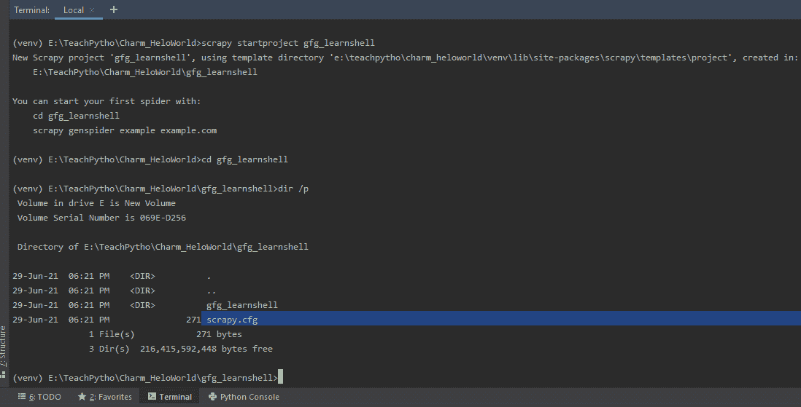
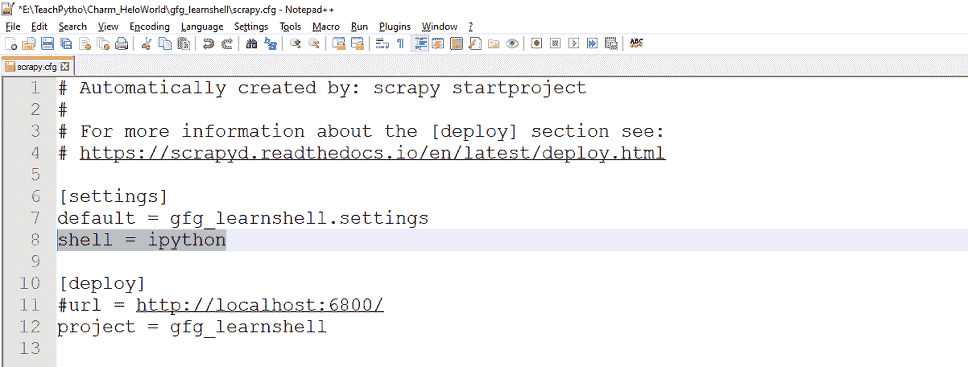
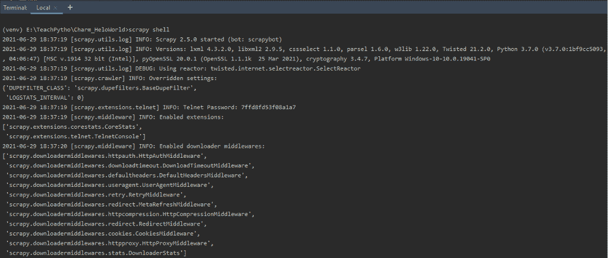
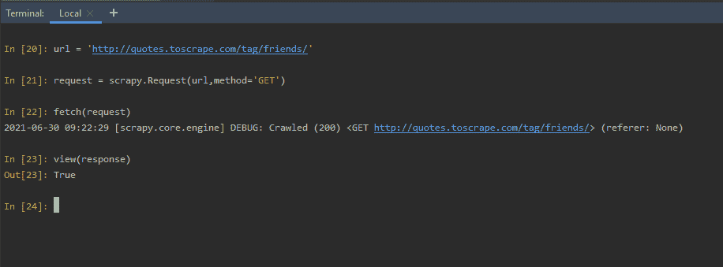
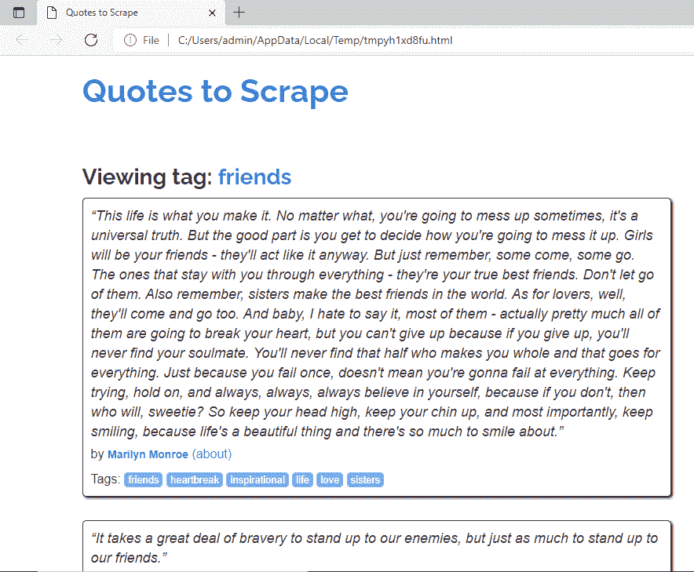
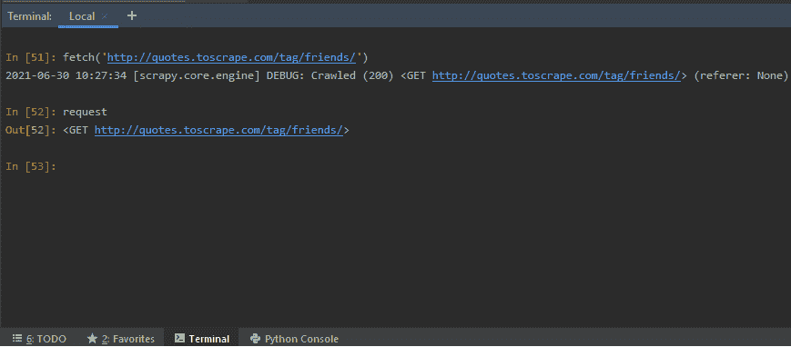
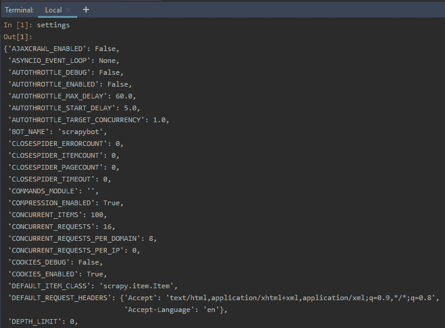
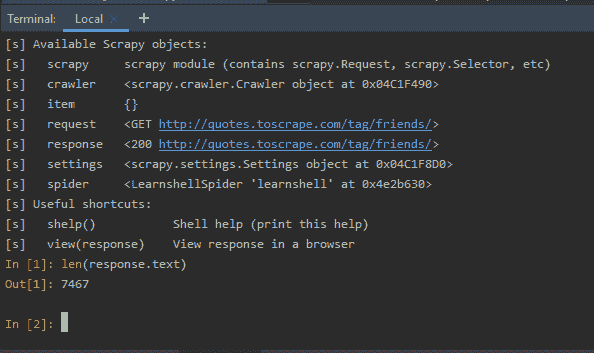
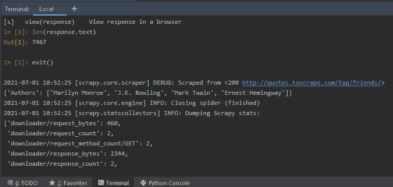

# 报废–外壳

> 原文:[https://www.geeksforgeeks.org/scrapy-shell/](https://www.geeksforgeeks.org/scrapy-shell/)

**Scrapy** 是一个组织良好的框架，用于大规模的网页抓取。使用选择器，像 XPath 或 CSS 表达式，可以无缝地抓取数据。它允许系统的抓取和抓取数据，并以不同的文件格式存储内容。Scrapy 配备了一个外壳，有不同的用途。在这篇文章中，我们将学习关于 Scrapy Shell。

### **报废外壳**

Scrapy 附带了一个交互式外壳，允许运行简单的命令，无需使用蜘蛛代码就能抓取数据，并允许测试编写的表达式。使用 XPath 或 CSS 表达式，可以通过传递所需网页的网址来查看抓取的数据。要安装 Scrapy，请在终端使用以下命令:

```py
pip install Scrapy
```

### **配置外壳**

一旦我们使用 pip 命令安装了 Scrapy，我们就可以通过编写以下命令在任何 IDE 中的标准 Python 终端上执行 shell:

```py
scrapy shell
```


默认情况下，在安装了 Scrapy 库之后，在 PyCharm IDE 终端中的 Scrapy 外壳

或者，可以将 IPython(一种命令外壳)用于各种编程语言。这是一个丰富的选项，提供优雅的媒体，外壳语法，彩色输出，历史信息，以及许多其他功能。如果你在 UNIX 操作系统上工作，这是非常有益的。每个 Scrapy 项目都有一个' scrapy.cfg '文件，这是一个配置文件。我们可以在这里定义项目设置。一旦创建了一个零碎的项目，使用“startproject”命令，可以将 shell 值设置为“ipython”。使用“开始项目”命令创建一个剪贴簿项目，如下所示:

```py
startproject Project_name
```



剪贴簿项目中的剪贴簿. cfg 配置文件

Scrapy.cfg 文件存在于您创建的 Scrapy 项目中。要使用 ipython，请在 scrapy.cfg 中将“shell”值设置为“ipython”，如下所示:



将“外壳”的值设置为“ipython”以使用 IPython 外壳

除了 IPython，还可以为 Python 解释器配置‘bpython’shell，这是另一个精致的接口解释器。


将“shell”的值设置为“bpython”以使用 BPython Shell

还可以将环境变量 SCRAPY_PYTHON_SHELL 设置为“ipython”或“bpython”。在本文中，我们使用标准的 Python 终端来进一步研究 Shell。

### **发射炮弹**

要启动 shell，可以在终端使用以下命令:

```py
scrapy shell
```

执行该命令后，我们可以看到如下所示的详细信息:



在终端执行命令“scrapy shell”

如果我们只是在终端执行命令“scrapy shell”，那么它就会启动，Telnet 控制台，用于检查和控制正在运行的 scrapy 进程。默认情况下，Telnet 控制台是启用的，并且是内置的 Scrapy 扩展。它主要是一个普通的 Python 外壳，在 Scrapy 进程中运行。默认情况下，它监听端口 6023。它显示关于已启用的中间件、扩展等的信息。它还显示可用的剪贴簿对象，以及它们的详细信息。通常，我们通过传递网页的网址来启动一个 shell，如下所示进行抓取:

> **语法:**刮壳<网址 _ to _ be _ 刮壳>

**示例:**

```py
scrapy shell http://quotes.toscrape.com/tag/friends/
```


用网址' http://quotes . toscrape . com/tag/friendly/'启动 shell

外壳是活动的，从网址获取的响应如下所示:


打开蜘蛛获取网址并获取响应

执行上述命令后，我们得到了统计数据，关于远程登录控制台，剪贴簿对象等。主要是因为我们传递了一个 URL，所以打开了 spider 对象，并且显示了响应代码。如果请求成功，那么在输出中可以看到 HTTP 200 代码。

### **外壳上可用的快捷方式**

一旦我们学会了启动 shell，我们就可以主要用它来测试抓取代码了。在编写任何 Python 蜘蛛代码之前，应该使用外壳测试网页的抓取。剪贴簿外壳有一些快捷方式可用。一旦我们发射炮弹，它们就可以使用了。让我们一个接一个地看一遍:

**help():**help()命令显示剪贴簿对象列表和有用的快捷方式。可以看到，请求对象代表发送到链接 http://quotes.toscrape.com/tag/friends/.的 GET 请求。同样，响应对象包含 200 个 HTTP 代码，表示请求成功。除此之外，还提到了 Crawler 和 Spider 对象的位置。


使用“帮助”快捷方式

**fetch(URL):** 这个‘URL’是网页的链接，我们需要刮一下。获取快捷方式接受一个网址，即要抓取的网页。它返回蜘蛛信息，以及响应是成功还是失败。在下面的例子中，我们有一个有效的网址和一个无效的网址。根据请求的性质，提取会显示错误或成功代码。

```py
fetch('http://quotes.toscrape.com/tag/friends/')
```


使用提取快捷方式

**fetch(请求):**我们可以创建一个请求对象，并将其传递给 fetch 方法。要做到这一点，创建一个剪贴簿对象。请求类提及所需的 HTTP 方法、网页的 URL、标题(如果有)。我们想要抓取 URL ' http://quotes . toscrape . com/tag/friends/'，因此，我们将请求对象准备为:

```py
fetch(request_object)
```


使用提取(requestObject)快捷方式

**查看(响应):**查看快捷方式，在默认浏览器中打开网页。网页是在提取方法中作为请求对象或网址发送的网页。因此，当我们键入 view(响应)时，在上述 fetch(请求)之后，网页会在默认浏览器中打开。

```py
view(response)
```



使用查看(响应)快捷方式

网页是在本地机器上创建的临时文件。在浏览器中可以看到如下:



网页以视图方式打开(响应)

### **外壳上的碎屑**

使用获取快捷方式后，通过一个网址或一个请求对象，我们可以检查可用的 Scrapy 对象。让我们看看可用的废品-

**Crawler:** 一旦执行了 fetch 方法，我们就可以了解当前 Crawler 对象了。Crawler 对象提供了对 Scrapy 核心组件的访问。爬虫对象通常用蜘蛛和设置对象实例化。爬虫在基于网址创建的蜘蛛对象的帮助下抓取网页。

```py
crawler
```

**请求；**在 fetch()方法之后，我们获得了作为请求发送的 URL 的详细信息。它告诉我们，如果使用的请求方法是 GET 或 POST，或者任何其他带有 URL 的方法。



使用请求报废对象

**响应:**执行 fetch()后，我们可以查看收到的响应的详细信息。您可以使用响应对象测试将在蜘蛛代码中使用的抓取代码。抓取代码是使用选择器、XPath 或 CSS 表达式编写的。


使用响应废料对象

如上所示，通过在 shell 中编写 response.text，我们可以获得整个页面的 HTML 代码。让我们看看如何使用响应对象和 XPath 或 CSS 表达式来测试抓取代码。Scrapy 允许使用选择器，从网页上抓取某些需要的信息。这些选择器导航到 HTML 标签，并从中检索数据。

**设置:**Scrapy 设置对象，允许我们自定义 Scrapy 组件的众多行为，比如 Scrapy 核心、扩展、蜘蛛等等。我们可以选择设置与 FTP 密码、HTTPCACHE、FEED 导出、TELNETCONSOLE 等相关的值。

```py
Setting
```



使用设置剪贴簿对象

### **从刺痒蜘蛛中召唤外壳**

有时，有必要分析创建的 spider 代码中的响应对象。这可以通过创建一个蜘蛛来完成，并从代码中引用 Shell 模块。要了解相同的内容，请按照下列步骤操作:

**步骤 1:** 创建一个蜘蛛项目–蜘蛛项目可以在终端使用“startproject”创建，如下所示

```py
scrapy startproject gfg_learnshell
```

该命令将创建一个名为“gfg_learnshell”的剪贴簿项目或文件夹，其中包含所有必需的剪贴簿配置文件。它还创建了一个蜘蛛文件夹，在那里可以编写所有与蜘蛛相关的代码。“startproject”如下所示:


使用 startproject 命令创建一个剪贴簿项目

**步骤 2:** 创建一个 Spider Python 文件，然后将目录更改为新创建的文件夹‘gfg _ learn shell’。使用“genspider”命令创建一个蜘蛛 Python 文件，并注明要废弃的网址，如下所示:

```py
scrapy genspider spider_name url_to_be_scraped
```

在这个例子中，我们将抓取网页“http://quotes . toscrape . com/tag/friends/”。因此，我们将在终端执行以下命令:

```py
scrapy genspider learnshell quotes.toscrape.com/tag/friends
```

上面的命令将在蜘蛛文件夹中创建一个名为“learnshell.py”的 Python 文件。这是我们的蜘蛛，这里写着抓取代码。默认情况下，蜘蛛代码如下所示:

## 蟒蛇 3

```py
# Import the required Scrapy library
import scrapy

# The Spider class created
class LearnshellSpider(scrapy.Spider):

    # Name of spider mentioned in 'genspider'
    # command
    name = 'learnshell'

    # The domain to be scraped
    allowed_domains = ['quotes.toscrape.com/tag/friends/']

    # The allowed URLs to be scraped
    start_urls = ['http://quotes.toscrape.com/tag/friends/']

    # The default callback parse method
    def parse(self, response):
        pass
```

**我们将从代码中调用 Scrapy Shell，并检查响应。现在，蜘蛛代码如下所示:**

## 蟒蛇 3

```py
# Import the required libraries
import scrapy

# The Spider code
class LearnshellSpider(scrapy.Spider):

    # Name of the spider
    name = 'learnshell'

    # The domain allowed for scraping
    allowed_domains = ['quotes.toscrape.com/tag/friends']

    # The URL(s) to be scraped
    start_urls = ['http://quotes.toscrape.com/tag/friends/']

    # Default callback method called when a spider crawls
    def parse(self, response):
        if "quotes" in response.url:

           # Invoke the Scrapy Shell and inspect the response
            from scrapy.shell import inspect_response

            # Inspect the response
            inspect_response(response, self)

            # Execute rest of the code after
            # inspecting the response at shell and exit()
            # XPath selector for fetching the author names
            quotes = response.xpath('//*[@class="author"]/text()').extract()

            # The spider crawls and prints the authors
            # present on the URL
            yield{'Authors': quotes}
```

**说明:**

*   当我们运行“genspider”命令时，会分配蜘蛛名称、允许的域和 URL。
*   默认的解析方法是回调方法，在蜘蛛抓取时调用。它返回一个响应对象。
*   我们通过使用 scraply . shell 模块来调用 Scrapy shell。它有一个“inspect_response”方法，允许我们检查外壳中的任何选择器表达式。因此，当我们使用“爬行”语法运行蜘蛛代码时，它会在执行之间打开 shell 窗口，并允许我们检查任何响应。爬网语法是“杂乱的爬网 spider_name”。


使用“爬网”命令运行 spider

**步骤 3:** 因此，在执行之间，如果我们在 shell 中键入任何语法，例如，通过使用以下命令检查响应体的长度:

```py
len(response.text)
```



在蜘蛛代码执行之间检查响应对象

上面的检查是可能的，因为我们已经在 Spider python 代码中使用了 inspect_response 方法。一旦我们键入 exit()，我们将退出 shell，剩下的 spider 代码执行就完成了。如下所示



在 exit()之后，蜘蛛代码的剩余部分被执行和抓取

在 exit()之后，剩余的 python 代码被执行，作者的名字根据代码中编写的选择器被删除。