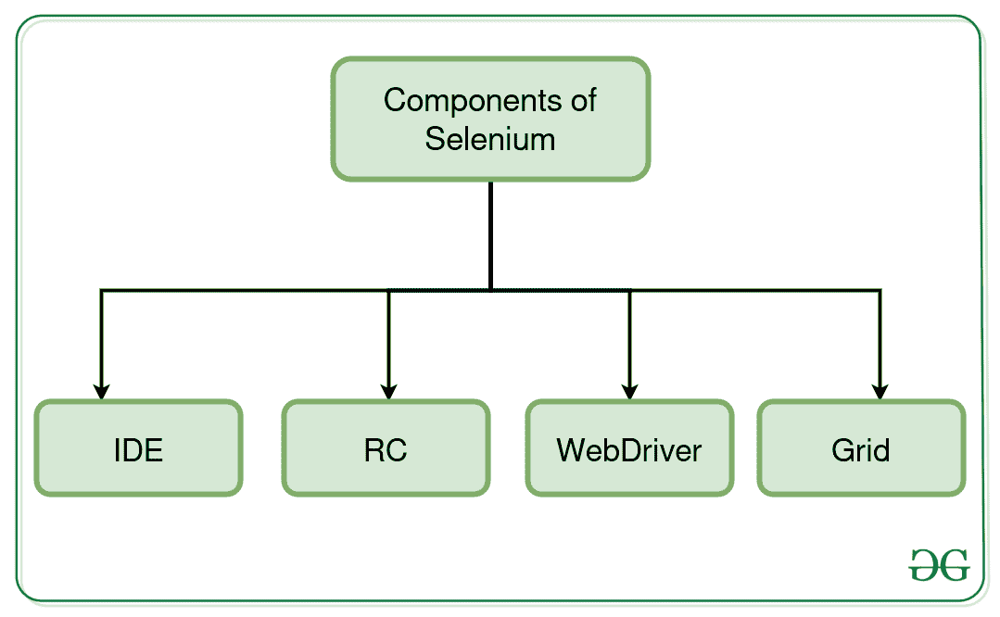

# 硒的基本成分、特性、用途和限制

> 原文:[https://www . geesforgeks . org/selenium-basic-components-features-use-and-limits/](https://www.geeksforgeeks.org/selenium-basics-components-features-uses-and-limitations/)

Selenium 是一个通过程序控制网络浏览器的强大工具。它适用于所有浏览器，适用于所有主要操作系统，其脚本是用各种语言编写的，如 Python、Java、C#等，我们将使用 Python。硒有四个主要组成部分-硒集成开发环境，硒 RC，硒网络驱动程序，硒网格。

# 硒基础

*   [组件](#components)
*   [功能](#features)
*   [应用程序](#applications)
*   [限制](#limitations)

## 成分

硒在工业中已经存在了很长时间，并且被全球的自动化测试人员使用。
我们来看看硒的四大成分–

*   [硒 IDE](#IDE)
*   [硒 RC](#RC)
*   [硒网驱动](#web-driver)
*   [硒栅](#GRID)

#### 硒 IDE

硒集成开发环境是硒套件中的主要工具。这是一个完整的硒测试集成开发环境。它被实现为火狐插件和 Chrome 扩展。它允许记录、编辑和调试功能测试。它以前被称为硒记录器。Selenium-IDE 最初由 Shinya Kasatani 创建，并于 2006 年捐赠给 Selenium 项目。硒 IDE 以前很少维护。硒 IDE 从 2018 年开始积极维护。

脚本可以自动录制和手动编辑，提供自动完成支持和快速移动命令的能力。脚本记录在 Selenese 中，Selenese 是 Selenium 的一种特殊测试脚本语言。Selenese 提供了在浏览器中执行操作(单击链接，选择选项)以及从结果页面中检索数据的命令。

#### 硒遥控

硒远程控制是一个服务器，用 Java 编写，通过 HTTP 接受浏览器的命令。RC 使得用任何编程语言为 web 应用程序编写自动化测试成为可能，这允许在现有的单元测试框架中更好地集成 Selenium。为了使编写测试更容易，Selenium 项目目前为 PHP、Python、Ruby、.NET、Perl 和 Java。Java 驱动程序也可以和 JavaScript 一起使用(通过 Rhino 引擎)。需要 selenium RC 服务器的一个实例来启动 html 测试用例——这意味着每个并行运行的端口应该是不同的。但是，对于 Java/PHP 测试用例，只需要一个 Selenium RC 实例持续运行。

#### 硒网络驱动程序

Selenium WebDriver 是 Selenium RC 的继承者。Selenium 网络驱动程序接受命令(以 Selenese 语言发送，或通过客户端应用编程接口发送)并将其发送到浏览器。这是通过特定于浏览器的浏览器驱动程序实现的，该驱动程序向浏览器发送命令并检索结果。大多数浏览器驱动程序实际上启动并访问一个浏览器应用程序(如火狐、谷歌 Chrome、Internet Explorer、Safari 或微软 Edge)；还有一个 HtmlUnit 浏览器驱动程序，它使用无头浏览器 HtmlUnit 模拟浏览器。

Selenium WebDriver 不需要特殊的服务器来执行测试。相反，网络驱动程序直接启动浏览器实例并控制它。但是，硒网格可以与网络驱动程序一起使用，在远程系统上执行测试(见下文)。在可能的情况下，网络驱动程序使用本机操作系统级别的功能，而不是基于浏览器的 JavaScript 命令来驱动浏览器。这绕过了原生命令和 JavaScript 命令之间细微差异的问题，包括安全限制。

#### 硒网格

Selenium Grid 是一个允许测试使用运行在远程机器上的网络浏览器实例的服务器。有了硒网格，一台服务器就成了中心。测试联系中心以获得对浏览器实例的访问。该中心有一个服务器列表，提供对浏览器实例(网络驱动程序节点)的访问，并允许测试使用这些实例。Selenium Grid 允许在多台机器上并行运行测试，并集中管理不同的浏览器版本和浏览器配置(而不是在每个单独的测试中)。

在远程浏览器实例上运行测试的能力对于将测试负载分散到几台机器上以及在运行于不同平台或操作系统上的浏览器中运行测试非常有用。后者在不是所有用于测试的浏览器都可以在同一个平台上运行的情况下特别有用。
更多信息，请查看–[硒的成分](https://www.geeksforgeeks.org/components-of-selenium/)。

## 特征

*   **开源可移植**–Selenium 是一个开源可移植的 Web 测试框架。
*   **工具和 DSL 的结合**–Selenium 是工具和 DSL(领域特定语言)的结合，以进行各种类型的测试。
*   **更容易理解和实现**–Selenium 命令按照不同的类进行分类，这样更容易理解和实现。
*   **减少测试执行时间**–Selenium 支持并行测试执行，减少执行并行测试所花费的时间。
*   **所需资源更少**–与 UFT、RFT 等竞争对手相比，Selenium 所需资源更少。
*   **支持多种编程语言**–c#、Java、Python、PHP、Ruby、Perl 和 JavaScript
*   **支持多种操作系统**–安卓、iOS、Windows、Linux、Mac、Solaris。
*   **支持多浏览器**–谷歌 Chrome、Mozilla Firefox、Internet Explorer、Edge、Opera、Safari 等。
*   **并行测试执行**–它还支持并行测试执行，减少了时间，提高了测试效率。

更多信息，请查看硒网络驱动程序的[功能](https://www.geeksforgeeks.org/features-of-selenium-webdriver/)

## 应用程序

Selenium WebDriver 用于自动化 web 应用程序测试，以验证它是否如预期那样工作。它支持许多浏览器，如火狐、Chrome、IE 和 Safari。然而，使用 Selenium 网络驱动程序，我们只能自动测试网络应用程序。

*   **开源可移植**–Selenium 是一个开源可移植的 Web 测试框架。
*   **减少测试人员的负担和压力**–如上所述，在每一个新的构建上进行重复测试场景所需的时间减少到几乎为零。因此，测试人员的负担减轻了。
*   **降低业务客户的成本**-业务需要支付测试人员的工资，这是使用自动化测试工具节省下来的。自动化不仅节省了时间，还为企业带来了成本效益。
*   **增加测试覆盖率**–使用 Selenium 后，测试时间缩短，因此测试人员可以同时对其他测试场景进行更多测试。
*   **减少测试执行时间**–Selenium 支持并行测试执行，减少执行并行测试所花费的时间。

更多信息，请查看–[硒网络驱动程序的应用和使用](https://www.geeksforgeeks.org/applications-and-uses-of-selenium-webdriver/)

## 限制

*   **不支持桌面应用**–Selenium 不支持桌面应用的测试。
*   **专业知识**–硒需要您团队的专业知识和资源来管理。
*   **维护和可扩展性**–Selenium 是一个维护量很大的框架，并且随着规模的增长很难扩展。
*   **开源论坛**–既然 Selenium 是开源软件，那就得依靠社区论坛来解决你的技术问题。
*   **不支持 REST 和 SOAP 平台**–我们不能使用 Selenium 对像 SOAP 或 REST 这样的 web 服务进行自动化测试。
*   **无报告功能**–Selenium 没有任何内置的报告功能，必须依赖 JUnit 和 TestNG 等插件来获取测试报告。
*   **图像测试**–无法对图像进行测试。需要将 Selenium 与 Sikuli 集成在一起进行图像测试。

更多信息，请查看–[硒网络驱动程序的局限性](https://www.geeksforgeeks.org/limitations-of-selenium-webdriver/)