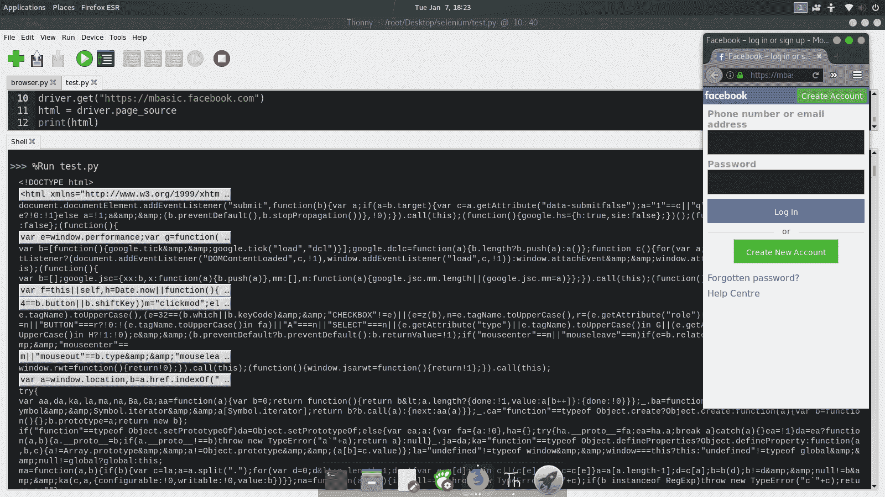

# 硒蟒基础

> 原文:[https://www.geeksforgeeks.org/selenium-python-basics/](https://www.geeksforgeeks.org/selenium-python-basics/)

Selenium 是一个用于测试 web 应用程序的可移植框架。Selenium 为编写功能测试提供了一个回放工具，而不需要学习测试脚本语言。在继续之前，如果您没有安装[硒](https://www.geeksforgeeks.org/how-to-install-selenium-in-python)，请参考本页。本文围绕《硒中的定位器》和各种策略展开。

#### 内容

*   [网络驱动程序](#webdriver)
*   [获取网页/网址的来源](#getting-source)
*   **通过**定位元件
    1.  [Id](#byid)
    2.  [名称](#byname)
    3.  [链接文本](#bylinktext)
    4.  [部分链接文本](#bypartiallinktext)
    5.  [XPath](#byxpath)
    6.  [标签名称](#bytagname)
    7.  [CSS 选择器](#bycssselector)
    8.  [类名](#bycssselector)
*   [使用硒脚本在输入字段中输入输入](#InsertingInput)
*   [定位提交按钮](#findingsubmitbutton)
*   [演示登录脸书的完整代码](#FacebookLoginCode)

#### web 驱动程序

Selenium 网络驱动程序像真正的用户一样，在本地或远程机器上驱动浏览器。要启动网络浏览器，python 硒模块需要网络驱动程序。铬浏览器可以从[这里](https://chromedriver.chromium.org/downloads)下载

```py
# Python program to demonstrate
# Webdriver For Firefox
from selenium import webdriver
driver = webdriver.Firefox()
driver.get("https://mbasic.facebook.com")
```

#### 如何使用其他网络驱动程序

```py
# Firefox 
driver = webdriver.Firefox()
# Google Chrome 
driver = webdriver.Chrome()
```

#### 获取网页/网址的来源

通过使用这个可以得到当前打开的网址/网页的完整的网页源代码。

```py
# Python program Continued
# Webdriver For Firefox
from selenium import webdriver
driver = webdriver.Chrome()
driver.get("https://mbasic.facebook.com")
html = driver.page_source # Getting Source of Current URL / Web-Page Loaded
print(html)
# End
```

**输出:**


#### 创建 Selenium 自动化脚本需要浏览页面的源代码

例如:-


#### 定位元素依据:-

#### 1.身份

HTML 元素有一些属性“id”，可以用来定位这些元素。
例如:-查找电子邮件字段的输入框

```py
# Python program Continued

# Finding Input Box For Email Field
# Go Through the Screen Shot Above or Page Source
driver.find_element_by_id("m_login_email") 
# End
```

#### 2.名字

HTML 元素有关联的属性“名称”，可以用来定位这些元素。
例如:-查找密码字段的输入框

```py
# Python program Continued

# Finding Input Box For Password Field
# Go Through the Screen Shot Above or Page Source
driver.find_element_by_name("pass")    
# End
```

#### 3.链接文本

实际上是到另一个页面的链接的 HTML 元素可以使用特定的链接文本来定位。
例如:-查找忘记的密码链接字段

```py
# Python program Continued

# Finding Forgotten Password Link Field
driver.find_element_by_link_text("Forgotten password?")
# End
```

#### 4.部分链接文本

实际上是到另一个页面的链接的 HTML 元素可以使用特定的部分链接文本来定位。
例如:-查找忘记的密码链接字段

```py
# Python program Continued

# Finding Forgotten Password Link Field
driver.find_element_by_partial_link_text("Forgotten password?")
# End
```

#### 5.XPath

使用此
可以轻松找到 HTML 元素，例如:-查找电子邮件和密码输入字段

```py
# Python program Continued

# Creating a Reference of Form For Finding Email and Password
# Reference for Form Finding
form = driver.find_element_by_xpath("//form[@id ='login_form']")
# Email
email = form.find_element_by_name("email") 
# Password
password = form.find_element_by_name("pass") 
# End
```

#### 6.标签名

使用标签名
可以很容易地找到 Html 元素，例如:-使用标签名找到元素，如 Title、Head、Body、HTML、a、div 等。

```py
# Python program Continued

# Finding Title of Facebook Login Page
# Output will be "Facebook - log in or sign up"
title = driver.find_element_by_tag_name("title") 
print(title)
# End
```

#### 7.CSS 选择器

使用 CSS
可以轻松找到 HTML 元素例如:-使用类、样式等找到元素。

```py
# Python program Continued

# Finding Password Input Field Using Class Name "bl bm bo bp"
password = driver.find_element_by_css_selector('input.bl.bm.bo.bp')
# End
```

#### 8.类别名

使用类名
可以很容易的找到 HTML 元素例如:-使用类名找到元素。

```py
# Python program Continued

# Finding Password Input Field Using Class Name "bl bm bo bp"
password = driver.find_element_by_class_name('bl bm bo bp')
# End
```

#### 9.使用硒脚本在输入字段中输入输入

它用于使用内置函数 send _ keys 将输入插入输入字段。

```py
# Python program Continued

# Creating a Reference of Form For Finding Email and Password

# Reference for Form Finding
form = driver.find_element_by_xpath("//form[@id ='login_form']") 

email = form.find_element_by_name("email") 
password = form.find_element_by_name("pass") 

# Inserting("abc@gmail.com") in the Email Input Field
email.send_keys("singh.swaraj1999@gmail.com") 

# Inserting("Your Facebook Password") in the Password Input Field 
password.send_keys("Your Facebook Password")   

# End
```

#### 10.定位提交按钮

它用于定位用于提交表单的提交按钮

```py
# Python program Continued

# Creating a Reference of Form For Finding Email and Password
form = driver.find_element_by_xpath("//form[@id ='login_form']") 
email = form.find_element_by_name("email") 
password = form.find_element_by_name("pass") 
email.send_keys("singh.swaraj1999@gmail.com")  
password.send_keys("Your Facebook Password") 

# Locating Submit Button
submit_button = driver.find_element_by_xpath("//input[@type ='submit']") 
submit_button.click()  # Button Click
# End
```

**输出:-**


#### 11.演示登录脸书的完整代码

```py
# Python program to demonstrate Facebook Login
from selenium import webdriver

driver = webdriver.Firefox()  
driver.get("https://mbasic.facebook.com")  
# Creating a Reference of Form For Finding Email and Password
form = driver.find_element_by_xpath("//form[@id ='login_form']")
email = form.find_element_by_name("email") 
password = form.find_element_by_name("pass")
email.send_keys("singh.swaraj1999@gmail.com")
password.send_keys("Your Facebook Password") 
submit_button = driver.find_element_by_xpath("//input[@type ='submit']")
submit_button.click() 
# Error Password in Output
# Because i had not used my real password here
# End
```

**输出:-**
