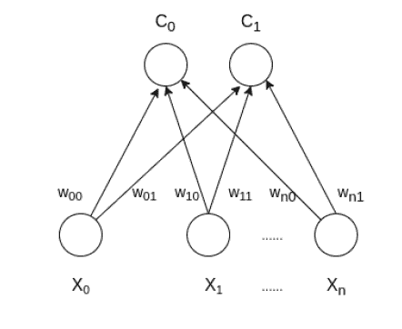

# 自组织地图–科霍宁地图

> 原文:[https://www . geesforgeks . org/self-organization-maps-koho nen-maps/](https://www.geeksforgeeks.org/self-organising-maps-kohonen-maps/)

**自组织映射(或 Kohonen Map 或 SOM)** 是一种人工神经网络，也是受 20 世纪 70 年代神经系统生物模型的启发，它遵循无监督学习方法，并通过竞争学习算法训练其网络。SOM 用于聚类和映射(或降维)技术，将多维数据映射到较低维上，这允许人们减少复杂的问题，以便于解释。SOM 有两层，一层是输入层，另一层是输出层。具有两个集群和任意样本的 n 个输入特征的自组织地图的体系结构如下所示:



### SOM 是如何工作的？

假设一个大小为(m，n)的输入数据，其中 m 是训练示例的数量，n 是每个示例中的特征数量。首先，它初始化大小(n，C)的权重，其中 C 是簇的数量。然后迭代输入数据，对于每个训练示例，它更新获胜向量(距离训练示例最短的权重向量(例如欧几里德距离))。权重上升规则由下式给出:

```
wij = wij(old) - alpha(t) *  (xik - wij(old))
```

其中α是在时间 t 的学习率，j 表示获胜向量，I 表示训练示例的第 i <sup>个</sup>特征，k 表示来自输入数据的第 k <sup>个</sup>训练示例。在训练 SOM 网络之后，训练的权重被用于聚类新的例子。一个新的例子属于获胜向量的簇。

### 算法

涉及的步骤有:

*   重量初始化
*   对于 1 到 N 个时代
*   选择一个培训示例
*   计算获胜向量
*   更新获胜向量
*   对所有训练示例重复步骤 3、4、5。
*   对测试样本进行聚类

下面是上述方法的实现:

## 蟒蛇 3

```
import math

class SOM :

    # Function here computes the winning vector
    # by Euclidean distance
    def winner( self, weights, sample ) :

        D0 = 0      
        D1 = 0

        for i  in range( len( sample ) ) :

            D0 = D0 + math.pow( ( sample[i] - weights[0][i] ), 2 )
            D1 = D1 + math.pow( ( sample[i] - weights[1][i] ), 2 )

            if D0 > D1 :
                return 0
            else :
                return 1

    # Function here updates the winning vector
    def update( self, weights, sample, J, alpha ) :

        for i in range( len ( weights ) ) :
            weights[J][i] = weights[J][i] + alpha * ( sample[i] - weights[J][i] )

        return weights

# Driver code
def main() :

    # Training Examples ( m, n )
    T =  [ [ 1, 1, 0, 0 ], [ 0, 0, 0, 1 ], [ 1, 0, 0, 0 ], [ 0, 0, 1, 1 ] ]

    m, n = len( T ), len( T[0] )

    # weight initialization ( n, C )
    weights = [ [ 0.2, 0.6, 0.5, 0.9 ], [ 0.8, 0.4, 0.7, 0.3 ] ]

    # training
    ob = SOM()

    epochs = 3
    alpha = 0.5

    for i in range( epochs ) :
        for j in range( m ) :

            # training sample
            sample = T[j]

            # Compute winner vector
            J = ob.winner( weights, sample )

            # Update winning vector
            weights = ob.update( weights, sample, J, alpha )

    # classify test sample
    s = [ 0, 0, 0, 1 ]
    J = ob.winner( weights, s )

    print( "Test Sample s belongs to Cluster : ", J )
    print( "Trained weights : ", weights )

if __name__ == "__main__":
    main()
```

**Output:**Test Sample s belongs to Cluster : 0 Trained weights : [[0.6000000000000001, 0.8, 0.5, 0.9], [0.3333984375, 0.0666015625, 0.7, 0.3]]