# 使用 Rasa 聊天机器人发送自动电子邮件

> 原文:[https://www . geesforgeks . org/send-automated-emails-use-rasa-chatbot/](https://www.geeksforgeeks.org/send-automated-emails-using-rasa-chatbot/)

Rasa 是一个 python 模块，用于创建定制的 AI 聊天机器人。您可以使用 rasa chatbot 轻松地向您的用户发送自动电子邮件。 Rasa 是一个使用 Python 和自然语言理解构建定制 AI 聊天机器人的工具(NLU)。Rasa 为开发使用自然语言理解的人工智能聊天机器人提供了一个框架(NLU)。它还允许用户训练模型并添加自定义操作。

在本文、中，我们将看到如何使用 Rasa 发送电子邮件。

### 流程图:

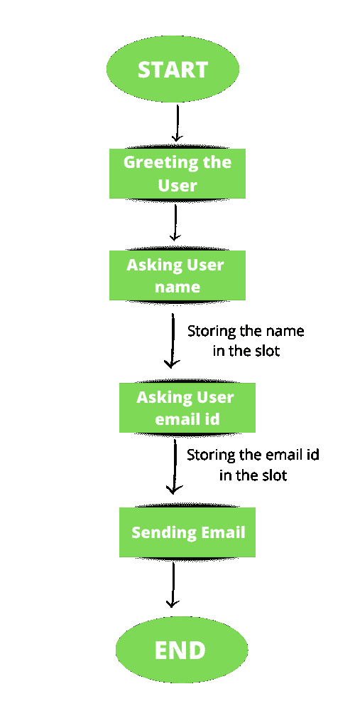

## **创建 Rasa 聊天机器人**

首先，你需要一个 rasa 聊天机器人，通过它你可以发送自动电子邮件。

要安装 rasa 模块，请在终端中键入以下命令(需要 Python 3.6、3.7 或 3.8)。

```
pip3 install -U pip
pip3 install rasa
```

要使用示例训练数据创建新项目，请在终端中键入以下命令。

```
rasa init
```

现在你的 rasa 聊天机器人准备好了。您可以使用下面的命令与聊天机器人交谈。

```
rasa shell
```

现在，在下一步中，我们将向这个聊天机器人添加更多的训练数据。

## **添加意图、回应和故事**

现在我们的聊天机器人可以响应基本的用户输入，但是我们必须添加更多的意图、响应和故事来从用户那里获取电子邮件标识和名称。关于意图、回应和故事的深入解释，请参考这篇[文章](https://www.geeksforgeeks.org/chatbots-using-python-and-rasa/#:~:text=Rasa%20is%20a%20tool%20to,model%20and%20add%20custom%20actions.)。

### **添加意图:**

这里我们需要两个新的名字和电子邮件 id 的意图。在 nlu.yml 文件中添加以下行。

```
- intent: email_id
  examples: |
    - [abc@gmail.com](email)
    - [abc@yourdomain](email)
    - @gmail.com
    - [xyz@gmail.com](email)
- intent: user_name
  examples: |
    - [YOURNAME](name)
    - [RANDOM_PERSON_NAME](name)
```

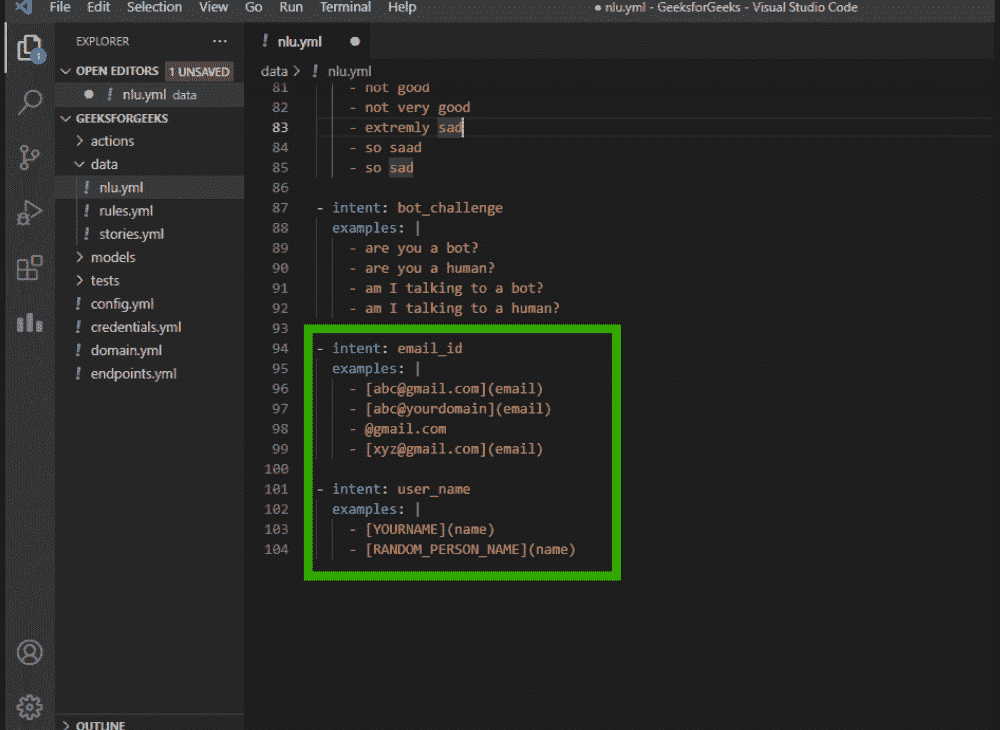

这里我们还创建了两个槽(电子邮件和名称)，我们将在其中存储用户数据，因此在您的 domain.yml 文件中添加新的槽和意图。

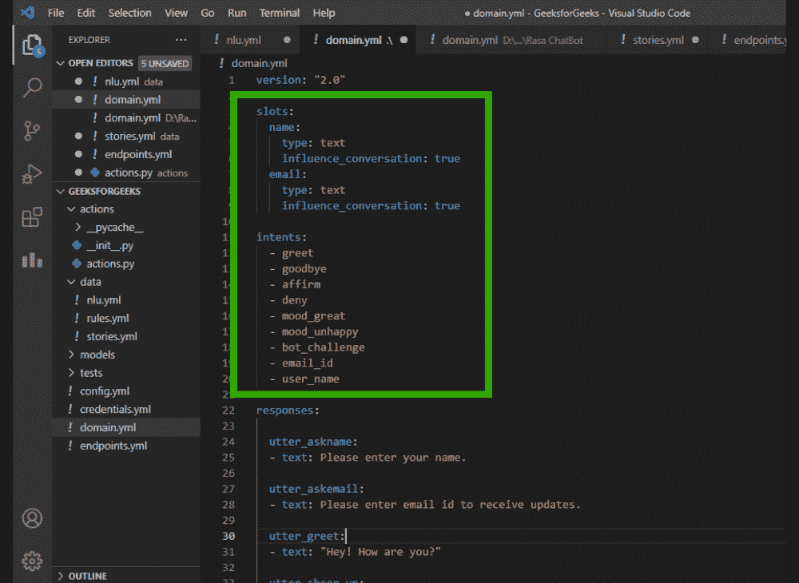

### **添加响应:**

现在我们必须给聊天机器人添加两个新的响应。

*   要求用户输入姓名。
*   要求用户输入电子邮件 id。

为此，在 domain.yml 文件的响应部分添加以下几行。

```
utter_askname:
- text: Please enter your name.

utter_askemail:
- text: Please enter email id to receive updates.
```

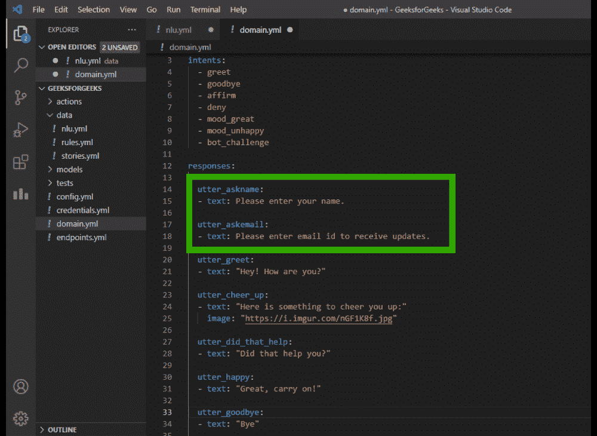

### **添加故事:**

现在我们必须在 stories.yml 文件中添加一些相关的故事，所以删除该文件中的所有故事，并添加下面的行(您可以根据需要添加更多的故事)。

```
- story: GeekforGeek story 
  steps:
  - intent: greet
  - action: utter_askname
  - intent: user_name
  - slot_was_set:
    - name: "YOURNAME"
  - action: utter_askemail
  - slot_was_set:
    - email: 'abc@gmail.com'
  - intent: email_id
  - action: action_email
```

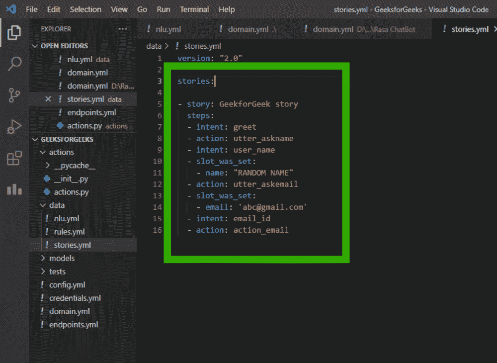

这里“action_email”不存在，所以我们必须创建此操作来发送电子邮件，但在此之前，请转到 endpoints.yml 文件并取消对以下行的注释。

```
action_endpoint:
  url: "http://localhost:5055/webhook"
```

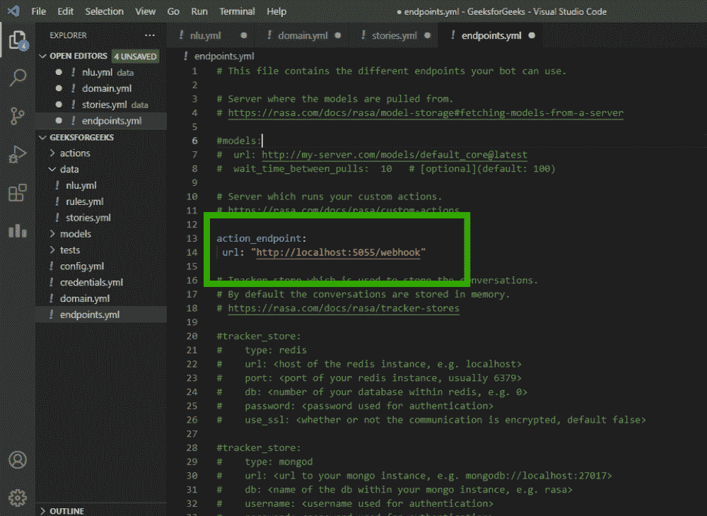

## **添加自定义电子邮件操作**

现在我们将在 actions.py 文件中添加一个新的类来发送自动电子邮件。在 actions.py 文件中添加以下代码。

## 蟒蛇 3

```
# Importing required modules
from typing import Any, Text, Dict, List
from rasa_sdk import Action, Tracker
from rasa_sdk.executor import CollectingDispatcher
import smtplib

# Creating new class to send emails.
class ActionEmail(Action):

    def name(self) -> Text:

          # Name of the action
        return "action_email"

    def run(self, dispatcher: CollectingDispatcher,
            tracker: Tracker,
            domain: Dict[Text, Any]) -> List[Dict[Text, Any]]:

        # Getting the data stored in the
        # slots and storing them in variables.
        user_name = tracker.get_slot("name")
        email_id = tracker.get_slot("email")

        # Code to send email
        # Creating connection using smtplib module
        s = smtplib.SMTP('smtp.gmail.com',587)

        # Making connection secured
        s.starttls() 

        # Authentication
        s.login("SENDER_EMAILID", "PASSWORD")

        # Message to be sent
        message = "Hello {} , This is a demo message".format(user_name)

        # Sending the mail
        s.sendmail("SENDER_EMAIL_ID",email_id, message)

        # Closing the connection
        s.quit()

        # Confirmation message
        dispatcher.utter_message(text="Email has been sent.")
        return []
```

**说明:**首先导入 rasa 和 smtplib 模块。然后创建一个 python 类，该类将返回一个名为“action_email”的操作，并从插槽中获取用户名和 email id，并将它们存储在单独的变量中。使用 smtplib 模块的 SMTP 方法创建连接。然后使用 smtplib 模块的 starttls()方法确保连接安全。然后使用 login()函数登录 Gmail 帐户，该函数将以电子邮件 id 和密码为参数。将消息存储在名为“message”的新变量中。然后使用 Sendmail 函数发送电子邮件，该函数将发送者的电子邮件 id、接收者的电子邮件 id 和消息作为其参数。然后使用 quit()函数关闭连接。

#### 您还必须允许访问 Gmail 帐户中不太安全的应用程序。

登录你的 Gmail 账户，进入“管理你的谷歌账户”。

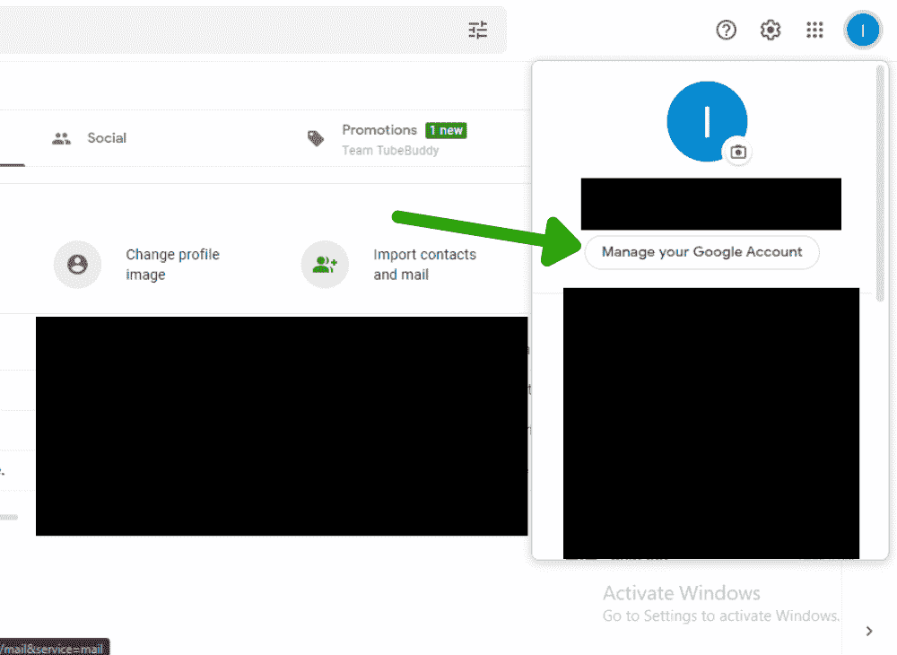

**然后点击“安全”选项卡。**

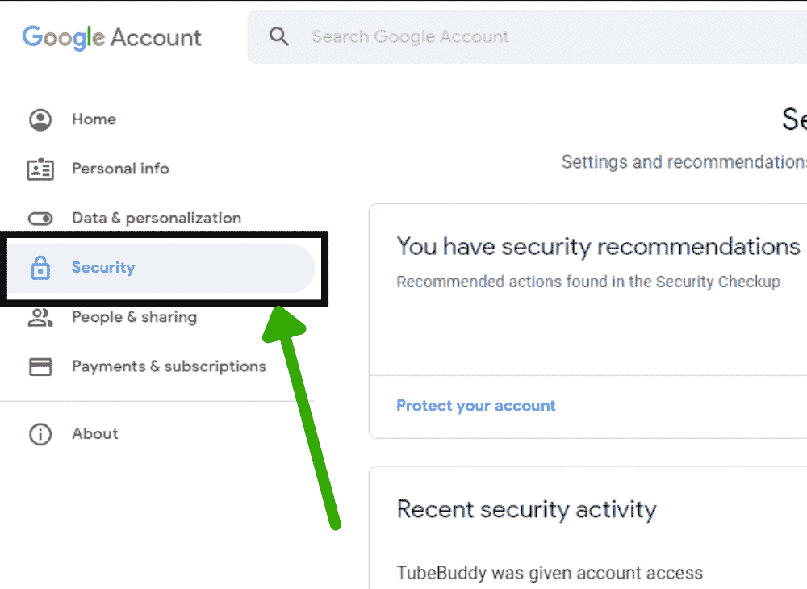

**然后打开“不太安全的应用访问”:**

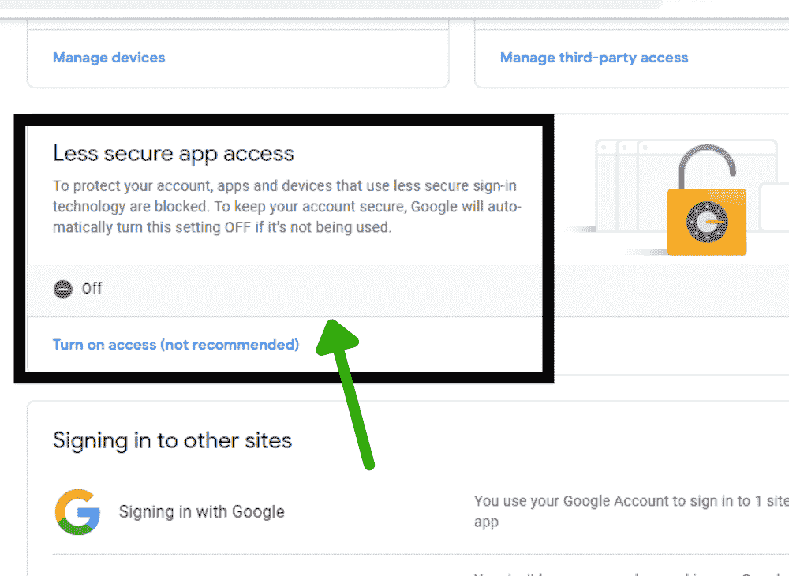

**之后，在 domain.yml 文件中添加以下行:**

```
actions:
- action_email
```

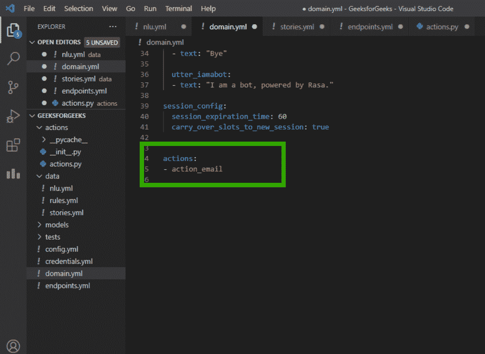

**现在一切都准备好了，我们只需要训练我们的聊天机器人。对于这种类型，终端中有以下命令:**

```
rasa train
```

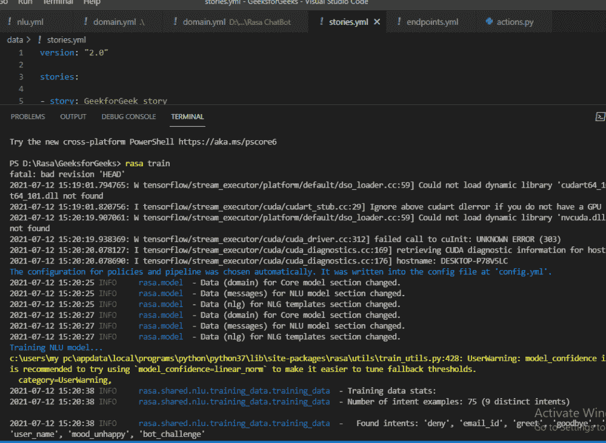

**训练完成后，您可以通过在终端中键入以下命令与聊天机器人交谈。运行动作服务器:**

```
rasa run actions
```

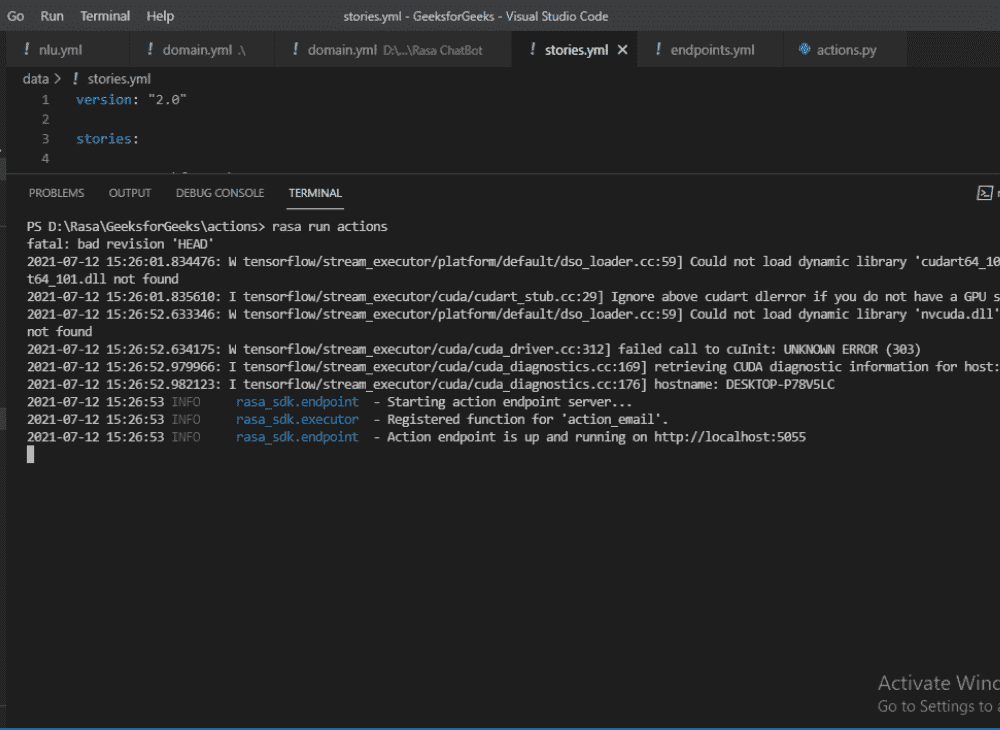

**运行训练好的模型:**

```
rasa shell
```

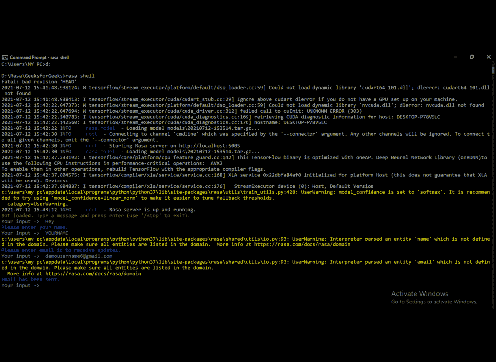

**输出:**

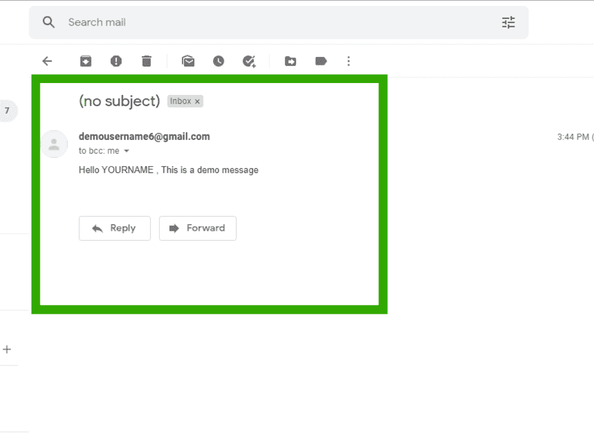

**视频输出:**

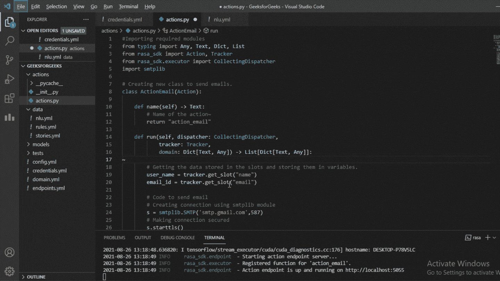