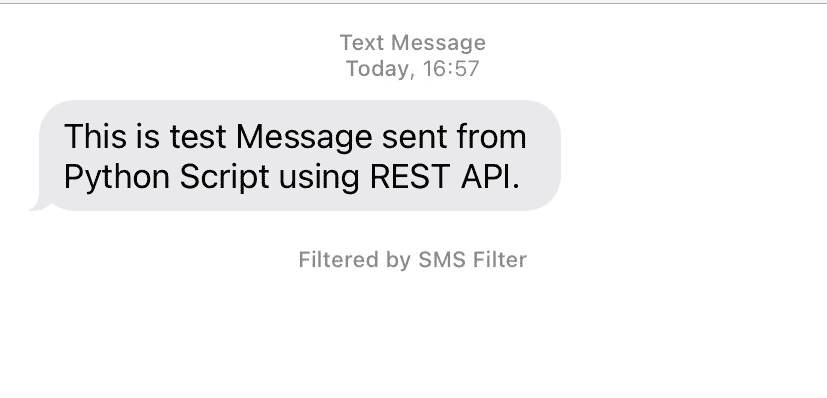

# 使用 Python 通过 REST 发送短信

> 原文:[https://www . geeksforgeeks . org/send-SMS-rest-use-python/](https://www.geeksforgeeks.org/send-sms-with-rest-using-python/)

在本文中，我们将看到如何使用 Python 使用 REST 发送短信。[请求](https://www.geeksforgeeks.org/python-requests-tutorial/)库可以利用 Python 发送短信进行 REST 请求。

### 接近 **:**

*   您需要首先使用 Python 脚本创建一个发送短信的 REST API KEY。我们已经使用 [**快速 2 毫秒**](https://www.fast2sms.com/) 来创建应用编程接口密钥。
*   你可以在网站上创建一个账户，之后你就可以拥有自己的应用编程接口密钥。
*   创建一个 Python 文件，复制下面的代码，用你的 API KEY 替换“API_KEY_OF_YOURS”，在 numbers 参数中，输入你要发送短信的号码，可以输入多个号码。

**以下是** [**GET**](https://www.geeksforgeeks.org/get-post-requests-using-python/) **API 中使用的参数:**

*   **授权–**为真，提供“YOUR_API_KEY”。注册应用编程接口密钥
*   **消息–**真，要发送的消息“文本”
*   **语言–**false，默认语言为“英语”。API 将自动检测“unicode”消息。
*   **路线–**为真，对于快速短信，使用“q”
*   **号码–**true，您可以发送多个用逗号分隔的手机号码，如:“XXXXXXXX98，YYYYYY89”
*   **闪烁–**false，此字段为可选，它将使用“0”作为默认值，或者您可以将其设置为“1”以发送闪烁消息。

#### **下面是实现:**

## 计算机编程语言

```
import requests

url = "https://www.fast2sms.com/dev/bulkV2"

querystring = {
    "authorization": "API_KEY_OF_YOURS",
    "message": "This is test Message sent from \
         Python Script using REST API.",
    "language": "english",
    "route": "q",
    "numbers": "XXXXXXXX98, YYYYYYYY89"}

headers = {
    'cache-control': "no-cache"
}
try:
    response = requests.request("GET", url,
                                headers = headers,
                                params = querystring)

    print("SMS Successfully Sent")
except:
    print("Oops! Something wrong")
```

**输出:**

```
SMS Successfully Sent
```



使用 Python 中的 REST 发送的消息