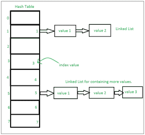

# Python 中的集合

> 原文:[https://www.geeksforgeeks.org/sets-in-python/](https://www.geeksforgeeks.org/sets-in-python/)

集合是一种无序的集合数据类型，它是可迭代的、可变的，并且没有重复的元素。Python 的集合类代表了集合的数学概念。与列表相比，使用集合的主要优点是，它有一个高度优化的方法来检查集合中是否包含特定元素。这是基于一个被称为[散列表](https://www.geeksforgeeks.org/hashing-set-1-introduction/)的数据结构。由于集合是无序的，我们不能像在[列表](https://www.geeksforgeeks.org/python-list/)中那样使用索引来访问项目。

```
# Python program to
# demonstrate sets

# Same as {"a", "b", "c"}
myset = set(["a", "b", "c"])
print(myset)

# Adding element to the set
myset.add("d")
print(myset)
```

**Output:**

```
{'c', 'b', 'a'}
{'d', 'c', 'b', 'a'}

```

## 冻结集

**Python 中的冻结集**是不可变的对象，它们只支持产生结果的方法和运算符，而不影响应用它们的一个或多个冻结集。虽然集合的元素可以随时修改，但冻结集合的元素在创建后保持不变。
如果没有参数被传递，它返回一个空的 frozenset。

```
# Python program to demonstrate differences
# between normal and frozen set

# Same as {"a", "b","c"}
normal_set = set(["a", "b","c"])

print("Normal Set")
print(normal_set)

# A frozen set
frozen_set = frozenset(["e", "f", "g"])

print("\nFrozen Set")
print(frozen_set)

# Uncommenting below line would cause error as
# we are trying to add element to a frozen set
# frozen_set.add("h")
```

**Output:**

```
Normal Set
set(['a', 'c', 'b'])

Frozen Set
frozenset(['e', 'g', 'f'])

```

## 集合的内部工作

这是基于一个被称为[散列表](https://www.geeksforgeeks.org/hashing-set-1-introduction/)的数据结构。
如果多个值出现在同一个索引位置，则该值被附加到该索引位置，以形成一个链表。在中，Python 集合使用带有虚拟变量的字典来实现，其中键是对时间复杂度进行了更大优化的成员集合。

**设置实现:-**



对单个哈希表进行大量操作的集合:-


## 集合的方法

#### 添加元素

set 中的插入是通过 set.add()函数完成的，在该函数中创建一个适当的记录值存储在哈希表中。与检查项目相同，即平均为 0(1)。然而，在最坏的情况下，它可能变成 O(n)。

```
# A Python program to
# demonstrate adding elements
# in a set

# Creating a Set
people = {"Jay", "Idrish", "Archi"}

print("People:", end = " ")
print(people)

# This will add Daxit
# in the set
people.add("Daxit")

# Adding elements to the
# set using iterator
for i in range(1, 6): 
    people.add(i) 

print("\nSet after adding element:", end = " ")
print(people)
```

**Output:**

```
People: {'Idrish', 'Archi', 'Jay'}

Set after adding element: {1, 2, 3, 4, 5, 'Idrish', 'Archi', 'Jay', 'Daxit'}

```