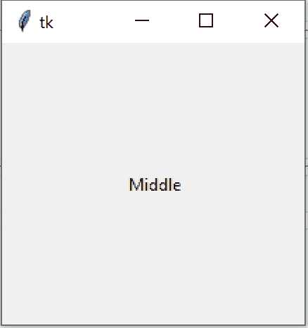
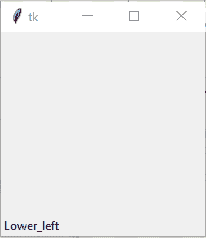
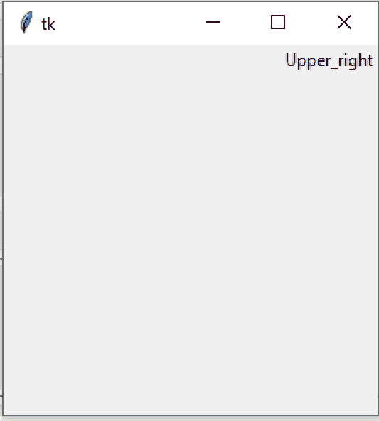

# 设置 TKinter 标签的位置

> 原文:[https://www . geeksforgeeks . org/setting-the-position-of-tkinter-labels/](https://www.geeksforgeeks.org/setting-the-position-of-tkinter-labels/)

Tkinter 是 Python 的标准图形用户界面库。Python 中的 Tkinter 附带了很多好的小部件。小部件是标准的 GUI 元素，标签也会出现在这些小部件
**下注:**更多信息，请参考[Python GUI–tkinter](https://www.geeksforgeeks.org/python-gui-tkinter/)

#### 标签:

Tkinter Label 是一个小部件，用于实现可以放置文本或图像的显示框。开发人员可以随时更改此小部件显示的文本。它还用于执行任务，例如给文本的一部分加下划线，以及将文本跨多行。

**例:**


#### 设置 Tkit 标签的位置

我们可以使用 [place()](https://www.geeksforgeeks.org/python-place-method-in-tkinter/) 方法来设置 Tkinter 标签的位置。

**示例 1:** 在窗口中间放置标签

## 蟒蛇 3

```py
import tkinter as tk

# Creating the root window
root = tk.Tk()

# creating the Label with
# the text Middle
Label_middle = tk.Label(root,
                        text ='Middle')

# Placing the Label at
# the middle of the root window
# relx and rely should be properly
# set to position the label on
# root window
Label_middle.place(relx = 0.5,
                   rely = 0.5,
                   anchor = 'center')
# Execute Tkinter
root.mainloop()
```

**输出:**



**示例 2:** 在窗口左下角放置标签

## 蟒蛇 3

```py
# Import Module
import tkinter as tk

# Create Object
root = tk.Tk()

# Create Label and add some text
Lower_left = tk.Label(root,text ='Lower_left')

# using place method we can set the position of label
Lower_left.place(relx = 0.0,
                 rely = 1.0,
                 anchor ='sw')

# Execute Tkinter
root.mainloop()
```

**输出**T2】



**示例 3:** 在窗口右上角放置标签

## 蟒蛇 3

```py
# Import Module
import tkinter as tk

# Create Object
root = tk.Tk()

# Create Label and add some text
Upper_right = tk.Label(root,text ='Upper_right')

# using place method we can set the position of label
Upper_right.place(relx = 1.0,
                  rely = 0.0,
                  anchor ='ne')

# Execute Tkinter
root.mainloop()
```

**输出**T2】

