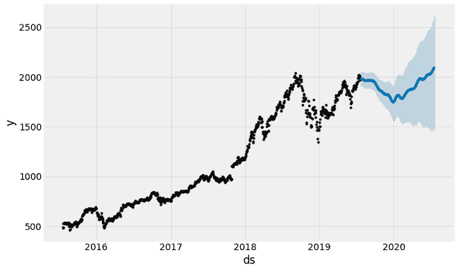
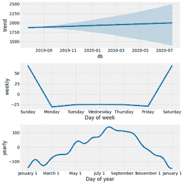

# 利用脸书先知进行股价预测

> 原文:[https://www . geesforgeks . org/股价-预测-使用-facebook-prophet/](https://www.geeksforgeeks.org/share-price-forecasting-using-facebook-prophet/)

时间序列预测可以广泛应用于预算预测、股票市场分析等领域。但是同样有用的是，预测正确的预测也是具有挑战性的，因此由于潜在的假设和因素，不能容易地自动化。做出准确预测的分析师也很少，他们有很大的市场，因为这需要对统计数据和数据分析有很好的理解，并且有进行时间序列预测的经验。

脸书在 2017 年开源了名为“预言家”的时间序列预测工具，由熟练的分析师用最少的人力做出准确的预测。脸书先知以 Python 和 R/的 API 形式提供

**先知是如何工作的:**

脸书先知使用加性回归模型，使用以下四个组成部分:

**y(t)= g(t)+s(t)+h(t)+\ε_ t**

*   **g(t):** 分段线性或 logistic 增长曲线趋势。预言家通过从数据中选择变化点来自动检测趋势的变化。
*   **s(t):** 使用傅立叶级数建模的年季节分量和使用虚拟变量建模的周季节分量
*   **h(t):** 用户提供的重要节假日列表。
*   **e <sub>t</sub> :** 错误**先知使用的术语**。

**脸书先知的优势:**

prophet 针对脸书遇到的业务相关问题进行了优化，它具有以下特点:

*   脸书先知像一个熟练的分析师一样准确，可以在几秒钟内产生结果
*   脸书先知需要最少的数据处理，可以处理几个异常值和空值。
*   用户可以手动添加季节性和节假日值，这有助于轻松集成特定领域的知识。

在这篇文章中，我们将使用 Python 中的脸书先知。我们试图用(2015-2019 年)的股价数据来预测亚马逊股票(2019-2020 年)的股价。

**实施:**

*   对于这篇文章，我们将使用亚马逊股票价格数据，它可以从雅虎财经网站下载。
*   首先，我们需要安装 fbprophet 工具，它可以用 python 中的以下命令安装。

```
Requirement already satisfied: fbprophet in /usr/local/lib/python3.6/dist-packages (0.6)
Requirement already satisfied: Cython>=0.22 in /usr/local/lib/python3.6/dist-packages (from fbprophet) (0.29.21)
Requirement already satisfied: cmdstanpy==0.4 in /usr/local/lib/python3.6/dist-packages (from fbprophet) (0.4.0)
Requirement already satisfied: pystan>=2.14 in /usr/local/lib/python3.6/dist-packages (from fbprophet) (2.19.1.1)
Requirement already satisfied: numpy>=1.10.0 in /usr/local/lib/python3.6/dist-packages (from fbprophet) (1.18.5)
Requirement already satisfied: pandas>=0.23.4 in /usr/local/lib/python3.6/dist-packages (from fbprophet) (1.0.5)
Requirement already satisfied: matplotlib>=2.0.0 in /usr/local/lib/python3.6/dist-packages (from fbprophet) (3.2.2)
Requirement already satisfied: LunarCalendar>=0.0.9 in /usr/local/lib/python3.6/dist-packages (from fbprophet) (0.0.9)
Requirement already satisfied: convertdate>=2.1.2 in /usr/local/lib/python3.6/dist-packages (from fbprophet) (2.2.1)
Requirement already satisfied: holidays>=0.9.5 in /usr/local/lib/python3.6/dist-packages (from fbprophet) (0.9.12)
Requirement already satisfied: setuptools-git>=1.2 in /usr/local/lib/python3.6/dist-packages (from fbprophet) (1.2)
Requirement already satisfied: python-dateutil>=2.8.0 in /usr/local/lib/python3.6/dist-packages (from fbprophet) (2.8.1)
Requirement already satisfied: pytz>=2017.2 in /usr/local/lib/python3.6/dist-packages (from pandas>=0.23.4->fbprophet) (2018.9)
Requirement already satisfied: cycler>=0.10 in /usr/local/lib/python3.6/dist-packages (from matplotlib>=2.0.0->fbprophet) (0.10.0)
Requirement already satisfied: kiwisolver>=1.0.1 in /usr/local/lib/python3.6/dist-packages (from matplotlib>=2.0.0->fbprophet) (1.2.0)
Requirement already satisfied: pyparsing!=2.0.4, !=2.1.2, !=2.1.6, >=2.0.1 in /usr/local/lib/python3.6/dist-packages (from matplotlib>=2.0.0->fbprophet) (2.4.7)
Requirement already satisfied: ephem>=3.7.5.3 in /usr/local/lib/python3.6/dist-packages (from LunarCalendar>=0.0.9->fbprophet) (3.7.7.1)
Requirement already satisfied: pymeeus<=1, >=0.3.6 in /usr/local/lib/python3.6/dist-packages (from convertdate>=2.1.2->fbprophet) (0.3.7)
Requirement already satisfied: six in /usr/local/lib/python3.6/dist-packages (from holidays>=0.9.5->fbprophet) (1.12.0)
```

*   现在，我们需要导入 fbprophet 和一些其他模块进行数据处理和绘图。我们将使用均方误差和平均绝对误差作为度量标准。

**代码:**

## 蟒蛇 3

```
import pandas as pd
import numpy as np
import matplotlib.pyplot as plt
import fbprophet as fbp
from sklearn.metrics import mean_squared_error, mean_absolute_error
# Use fivethirtyeight plot style
plt.style.use('fivethirtyeight')
```

*   现在，我们将从 CSV 文件中读取数据，并将其放入熊猫数据框中。

**代码:**

## 蟒蛇 3

```
# We will be using amazon share price dat whichcanbe downloaded from YAHOO finance website.
df = pd.read_csv('sample_data / AMZN.csv')
df.head()
```

**输出:**

```
Date    Open    High    Low    Close    Adj Close    Volume
0    2015-07-21    487.899994    488.880005    482.549988    488.000000    488.000000    3181800
1    2015-07-22    485.989990    492.500000    484.899994    488.269989    488.269989    3114900
2    2015-07-23    491.660004    491.660004    475.700012    482.179993    482.179993    9374400
3    2015-07-24    578.989990    580.570007    529.349976    529.419983    529.419983    21909400
4    2015-07-27    527.750000    544.950012    526.599976    531.409973    531.409973    7491000
```

*   由于我们只需要两列日期和调整后的收盘价，因此，我们对原始数据集进行子集化以获得这些列。因为数据需要以两列的形式出现在先知中，这两列名为 ds(用于日期列)和 y(用于数据列)。

**代码:**

## 蟒蛇 3

```
# add two columnsin dataframe having values as Date and Adj Close
df[['ds', 'y']] = df[['Date', 'Adj Close']]
# Subset two columns from data frame
df = df[['ds', 'y']]

df.head()
```

**输出:**

```
ds    y
0    2015-07-21    488.000000
1    2015-07-22    488.269989
2    2015-07-23    482.179993
3    2015-07-24    529.419983
4    2015-07-27    531.409973
```

*   现在，我们将数据帧分为训练数据和测试数据，我们将使用 4 年的数据进行训练，使用一年的数据进行测试。

**代码:**

## 蟒蛇 3

```
# split data frame  into two parts train and test
split_date = "2019-07-21"
df_train = df.loc[df.ds <= split_date].copy()
df_test = df.loc[df.ds > split_date].copy()
```

*   现在，我们实例化脸书先知 API，这个先知 API 的工作方式类似于 scikit-learn。它使用拟合函数将数据集拟合到模型中，并使用预测函数预测未来值。

**代码:**

## 蟒蛇 3

```
# Instantiate prophet
model = fbp.Prophet()
# fit the training data
model.fit(df_train)
```

*   现在，我们使用预测函数来预测未来 1 年的股价。

**代码:**

## 蟒蛇 3

```
forecast = model.predict(df_test)
forecast.tail()
```

**输出:**

```
ds    trend    yhat_lower    yhat_upper    trend_lower    trend_upper    additive_terms    additive_terms_lower    additive_terms_upper    weekly    weekly_lower    weekly_upper    yearly    yearly_lower    yearly_upper    multiplicative_terms    multiplicative_terms_lower    multiplicative_terms_upper    yhat
247    2020-07-14    1992.862925    1479.553875    2566.925238    1403.962381    2483.045869    93.536964    93.536964    93.536964    -25.535936    -25.535936    -25.535936    119.072900    119.072900    119.072900    0.0    0.0    0.0    2086.399889
248    2020-07-15    1993.215324    1485.368711    2575.314593    1401.835761    2485.386736    97.405883    97.405883    97.405883    -25.138654    -25.138654    -25.138654    122.544537    122.544537    122.544537    0.0    0.0    0.0    2090.621207
249    2020-07-16    1993.567723    1484.197262    2589.201052    1399.740456    2487.727602    100.236350    100.236350    100.236350    -25.549805    -25.549805    -25.549805    125.786155    125.786155    125.786155    0.0    0.0    0.0    2093.804073
250    2020-07-17    1993.920121    1478.807958    2617.093500    1397.645151    2490.068469    99.309824    99.309824    99.309824    -29.445843    -29.445843    -29.445843    128.755666    128.755666    128.755666    0.0    0.0    0.0    2093.229945
251    2020-07-20    1994.977318    1475.034301    2618.609494    1389.089958    2497.091069    104.649308    104.649308    104.649308    -31.050560    -31.050560    -31.050560    135.699868    135.699868    135.699868    0.0    0.0    0.0    2099.626626
```

*   正如我们所看到的，该列包含日期列、预测股价(y_hat)、股价的下限和上限估计、趋势成分、季节性成分(每周和每年)。

**代码:**

## 蟒蛇 3

```
model.plot(forecast)
```

**输出:**



*   该命令将绘制先知的组成部分，如:趋势线，每周和每年的季节性。

**代码:**

## 蟒蛇 3

```
# plot graphs of different components:
model.plot_components(forecast)
```

**输出:**



*   现在，我们计算预测数据的均方误差和平均绝对误差。

**代码:**

## 蟒蛇 3

```
# code
print("Mean Squared Error (MSE):", mean_squared_error(y_true = df_test["y"], y_pred = forecast['yhat']))
print("Mean Absolute Error (MAE):", mean_absolute_error(y_true = df_test["y"], y_pred = forecast['yhat']))
```

**输出:**

```
Mean Squared Error (MSE): 121417.80253038534
Mean Absolute Error (MAE): 246.57694290710793
```

*   现在，我们计算我们预测的平均绝对百分比误差，因为它能更好地了解我们的预测有多准确

**代码:**

## 蟒蛇 3

```
def mean_abs_perc_err(y_true, y_pred):
    return np.mean(np.abs((y_true - y_pred) / y_true)) * 100

print("Mean Absolute % Error (MAPE): ", mean_abs_perc_err(y_true = np.asarray(df_test["y"]), y_pred = np.asarray(forecast['yhat'])))
```

**输出:**

```
Mean Absolute % Error (MAPE):  10.693787212532687
```

**参考文献:**

*   [脸书先知博客](https://research.fb.com/blog/2017/02/prophet-forecasting-at-scale/)
*   [脸书先知文献](https://facebook.github.io/prophet/docs/quick_start.html)