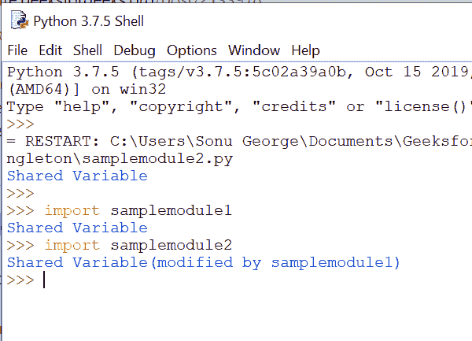
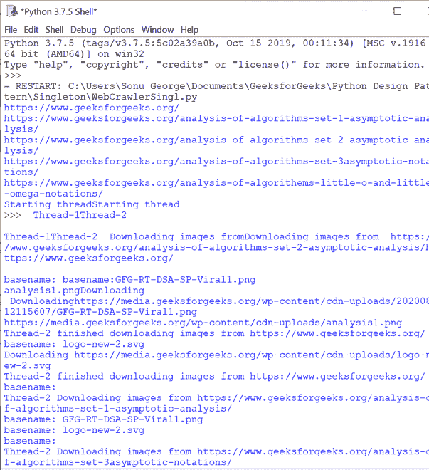

# Python 中的单例模式–完整指南

> 原文:[https://www . geesforgeks . org/singleton-pattern-in-python-a-complete-guide/](https://www.geeksforgeeks.org/singleton-pattern-in-python-a-complete-guide/)

python 中的 Singleton 模式是一种设计模式，允许您在程序的整个生命周期中只创建一个类的实例。使用单一模式有很多好处。其中一些是:

*   限制对共享资源的并发访问。
*   为资源创建全局访问点。
*   在程序的整个生命周期中，只创建一个类的实例。

**实现单例的不同方式:**

单一模式可以用三种不同的方式实现。它们如下:

*   模块级单例
*   经典单例
*   博格辛格尔顿

**模块级单例:**

根据定义，所有模块都是单一的。让我们创建一个简单的模块级单例，其中数据在其他模块之间共享。这里我们将创建三个 python 文件——singleton.py、sample_module1.py 和 sample _ module 2 . py——其中其他示例模块共享 singleton . py 中的一个变量。

```py
## singleton.py
shared_variable = "Shared Variable"
```

 singleton.py

```py
## samplemodule1.py
import singleton
print(singleton.shared_variable)
singleton.shared_variable += "(modified by samplemodule1)"
```

samplemodule1.py

```py
##samplemodule2.py
import singleton
print(singleton.shared_variable)
```

samplemodule2.py

让我们看看输出。



这里，samplemodule1 更改的值也反映在 samplemodule2 中。

**经典单例:**

经典单例只有在目前没有创建实例的情况下才创建实例；否则，它将返回已经创建的实例。让我们看看下面的代码。

## 蟒蛇 3

```py
class SingletonClass(object):
  def __new__(cls):
    if not hasattr(cls, 'instance'):
      cls.instance = super(SingletonClass, cls).__new__(cls)
    return cls.instance

singleton = SingletonClass()
new_singleton = SingletonClass()

print(singleton is new_singleton)

singleton.singl_variable = "Singleton Variable"
print(new_singleton.singl_variable)
```

**Output**

```py
True
Singleton Variable
```

这里，在 __new__ 方法中，我们将检查是否创建了实例。如果创建，它将返回实例；否则，它将创建一个新实例。您可以注意到 singleton 和 new_singleton 返回相同的实例并具有相同的变量。

让我们检查一下当我们子类化一个单例类时会发生什么。

## 蟒蛇 3

```py
class SingletonClass(object):
  def __new__(cls):
    if not hasattr(cls, 'instance'):
      cls.instance = super(SingletonClass, cls).__new__(cls)
    return cls.instance

class SingletonChild(SingletonClass):
    pass

singleton = SingletonClass() 
child = SingletonChild()
print(child is singleton)

singleton.singl_variable = "Singleton Variable"
print(child.singl_variable)
```

**Output**

```py
True
Singleton Variable
```

在这里，您可以看到 SingletonChild 具有相同的 SingletonClass 实例，并且共享相同的状态。但是有一些场景，我们需要不同的实例，但是应该共享相同的状态。这种状态共享可以使用 Borg singleton 来实现。

**博格单胎:**

Borg singleton 是 Python 中的一种设计模式，允许不同实例的状态共享。让我们看看下面的代码。

## 蟒蛇 3

```py
class BorgSingleton(object):
  _shared_borg_state = {}

  def __new__(cls, *args, **kwargs):
    obj = super(BorgSingleton, cls).__new__(cls, *args, **kwargs)
    obj.__dict__ = cls._shared_borg_state
    return obj

borg = BorgSingleton()
borg.shared_variable = "Shared Variable"

class ChildBorg(BorgSingleton):
  pass

childBorg = ChildBorg()
print(childBorg is borg)
print(childBorg.shared_variable)
```

**Output**

```py
False
Shared Variable
```

随着新实例的创建过程，共享状态也在 __new__ 方法中定义。这里使用 shared_borg_state 属性保留共享状态，并将其存储在每个实例的 __dict__ 字典中。

如果您想要不同的状态，那么您可以重置 shared_borg_state 属性。让我们看看如何重置共享状态。

## 蟒蛇 3

```py
class BorgSingleton(object):
  _shared_borg_state = {}

  def __new__(cls, *args, **kwargs):
    obj = super(BorgSingleton, cls).__new__(cls, *args, **kwargs)
    obj.__dict__ = cls._shared_borg_state
    return obj

borg = BorgSingleton()
borg.shared_variable = "Shared Variable"

class NewChildBorg(BorgSingleton):
    _shared_borg_state = {}

newChildBorg = NewChildBorg()
print(newChildBorg.shared_variable)
```

这里，我们已经重置了共享状态，并尝试访问 shared_variable。让我们看看错误。

```py
Traceback (most recent call last):
  File "/home/329d68500c5916767fbaf351710ebb13.py", line 16, in <module>
    print(newChildBorg.shared_variable)
AttributeError: 'NewChildBorg' object has no attribute 'shared_variable'
```

**单例用例:**

让我们列出单例类的一些用例。它们如下:

*   管理数据库连接
*   写入日志消息的全局访问点
*   文件管理器
*   假脱机打印程序

**使用经典单例创建网络爬虫:**

让我们创建一个网络爬虫，它利用了一个经典的单例的优点。在这个实际的例子中，爬虫扫描一个网页，获取与同一个网站相关的链接，并下载其中的所有图像。这里，我们有两个主要的类和两个主要的函数。

*   这个类充当了一个经典的单一实例
*   这个类提供了下载图像的线程功能
*   navigate_site:这个函数抓取网站并获取属于同一个网站的链接。最后，它安排了下载图片的链接。
*   download_images:这个函数抓取页面链接并下载图片。

除了上面的类和函数之外，我们还使用了两套库来解析网页–**beautulsoap 和 HTTP Client** 。

看看下面的代码。

*注意:在本地机器上执行代码*

## 蟒蛇 3

```py
import httplib2
import os
import re
import threading
import urllib
import urllib.request
from urllib.parse import urlparse, urljoin
from bs4 import BeautifulSoup

class CrawlerSingleton(object):
    def __new__(cls):
        """ creates a singleton object, if it is not created,
        or else returns the previous singleton object"""
        if not hasattr(cls, 'instance'):
            cls.instance = super(CrawlerSingleton, cls).__new__(cls)
        return cls.instance

def navigate_site(max_links = 5):
    """ navigate the website using BFS algorithm, find links and
        arrange them for downloading images """

    # singleton instance
    parser_crawlersingleton = CrawlerSingleton()

    # During the initial stage, url_queue has the main_url.
    # Upon parsing the main_url page, new links that belong to the
    # same website is added to the url_queue until
    # it equals to max _links.
    while parser_crawlersingleton.url_queue:

        # checks whether it reached the max. link
        if len(parser_crawlersingleton.visited_url) == max_links:
            return

        # pop the url from the queue
        url = parser_crawlersingleton.url_queue.pop()

        # connect to the web page
        http = httplib2.Http()
        try:
            status, response = http.request(url)
        except Exception:
            continue

        # add the link to download the images
        parser_crawlersingleton.visited_url.add(url)
        print(url)

        # crawl the web page and fetch the links within
        # the main page
        bs = BeautifulSoup(response, "html.parser")

        for link in BeautifulSoup.findAll(bs, 'a'):
            link_url = link.get('href')
            if not link_url:
                continue

            # parse the fetched link
            parsed = urlparse(link_url)

            # skip the link, if it leads to an external page
            if parsed.netloc and parsed.netloc != parsed_url.netloc:
                continue

            scheme = parsed_url.scheme
            netloc = parsed.netloc or parsed_url.netloc
            path = parsed.path

            # construct a full url
            link_url = scheme +'://' +netloc + path

            # skip, if the link is already added
            if link_url in parser_crawlersingleton.visited_url:
                continue

            # Add the new link fetched,
            # so that the while loop continues with next iteration.
            parser_crawlersingleton.url_queue = [link_url] +\
                                                parser_crawlersingleton.url_queue

class ParallelDownloader(threading.Thread):
    """ Download the images parallelly """
    def __init__(self, thread_id, name, counter):
        threading.Thread.__init__(self)
        self.name = name

    def run(self):
        print('Starting thread', self.name)
        # function to download the images
        download_images(self.name)
        print('Finished thread', self.name)

def download_images(thread_name):
    # singleton instance
    singleton = CrawlerSingleton()
    # visited_url has a set of URLs.
    # Here we will fetch each URL and
    # download the images in it.
    while singleton.visited_url:
        # pop the url to download the images
        url = singleton.visited_url.pop()

        http = httplib2.Http()
        print(thread_name, 'Downloading images from', url)

        try:
            status, response = http.request(url)
        except Exception:
            continue

        # parse the web page to find all images
        bs = BeautifulSoup(response, "html.parser")

        # Find all  tags
        images = BeautifulSoup.findAll(bs, 'img')

        for image in images:
            src = image.get('src')
            src = urljoin(url, src)

            basename = os.path.basename(src)
            print('basename:', basename)

            if basename != '':
                if src not in singleton.image_downloaded:
                    singleton.image_downloaded.add(src)
                    print('Downloading', src)
                    # Download the images to local system
                    urllib.request.urlretrieve(src, os.path.join('images', basename))
                    print(thread_name, 'finished downloading images from', url)

def main():
    # singleton instance
    crwSingltn = CrawlerSingleton()

    # adding the url to the queue for parsing
    crwSingltn.url_queue = [main_url]

    # initializing a set to store all visited URLs
    # for downloading images.
    crwSingltn.visited_url = set()

    # initializing a set to store path of the downloaded images
    crwSingltn.image_downloaded = set()

    # invoking the method to crawl the website
    navigate_site()

    ## create images directory if not exists
    if not os.path.exists('images'):
        os.makedirs('images')

    thread1 = ParallelDownloader(1, "Thread-1", 1)
    thread2 = ParallelDownloader(2, "Thread-2", 2)

    # Start new threads
    thread1.start()
    thread2.start()

if __name__ == "__main__":
    main_url = ("https://www.geeksforgeeks.org/")
    parsed_url = urlparse(main_url)
    main()
```

让我们看看下载的图像和 python shell 输出。


下载的图像



Python 外壳输出

**总结:**

单例模式是 Python 中的一种设计模式，它将类的实例化限制为一个对象。它可以限制对共享资源的并发访问，还有助于为资源创建全局访问点。