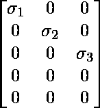
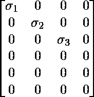

# 奇异值分解

> 原文:[https://www.geeksforgeeks.org/singular-value-decomposition/](https://www.geeksforgeeks.org/singular-value-decomposition/)

**先决条件:** [矩阵对角化](https://www.geeksforgeeks.org/matrix-diagonalization/)[特征向量计算和低秩逼近](https://www.geeksforgeeks.org/eigenvector-computation-and-low-rank-approximations/)

在深入研究奇异值分解之前，让我们先简单了解一下什么是矩阵对角化技术，以及当它不能有效执行时。

**矩阵对角化**

矩阵对角化是取一个*方阵*并将其转化为一种特殊类型的矩阵即对角矩阵的过程。该矩阵与基础矩阵具有相同的基本属性。数学上，任何输入矩阵 A 都可以简化为任何对角矩阵 D，如果它满足:

<center></center>

```py
where,
P -> Modal Matrix: It is a (n x n) matrix that consists of eigen-vectors. 
               It is generally used in the process of diagonalization 
               and similarity transformation.
```

然而，矩阵对角化技术**对于形式为( **m x n)** 的矩阵**失败，其中 **m ≠ n** 。(即当矩阵不是正方形矩阵时。这就是*‘奇异值分解’*的由来，为这个问题提供了很好的解决方案。

**奇异值(σ)**

设 *A* 为任意的 *m x n* 秩为 *r.* 的矩阵，将其与其转置相乘(即 *A <sup>T</sup> A* ，则生成一个 *n x n* 矩阵，该矩阵是对称的，同时也是正半定的。简单来说，所有 *A <sup>T</sup> A* 矩阵的特征值 *(λ <sub>i…r</sub> )* 都是非负的(即大于 0)。

奇异值被定义为获得的特征值的平方根。那就是:

<center></center>

**奇异值分解**

让 *A* 成为任意 *m x n* 矩阵。然后奇异值分解将这个矩阵分成两个性质上正交的酉矩阵和一个包含奇异值的矩形对角矩阵，直到 *r* 。数学上，它表示为:

<center></center>

```py
where, 
Σ -> (m x n) orthogonal matrix
U -> (m x m) orthogonal matrix 
V -> (n x n) diagonal matrix with first r rows having only singular values.
     (Rest of the values are 0) 
```

现在，重要的是理解如何计算矩阵 **U** 、**V**&**σ**。

**计算正交矩阵 V**

首先，我们计算与输入矩阵 a 相关联的本征向量 x <sub>i</sub> ，然后，通过将向量 x <sub>i</sub> 中的每个值除以其大小，我们找到对应于 x <sub>i</sub> 的归一化向量 v <sub>i</sub> 。例如:

```py
Let x = [1,2,4]
=> mag(x) or |x| = √(12 + 22 + 42) = √21.

Therefore, v = [(1/√21), (2/√21), (4/√21)]
```

我们知道， *A* 是 *m x n* 矩阵。因此，A <sup>T</sup> A 是 n×n 对称矩阵，所有特征值> 0。因此，我们可以得到 A <sup>T</sup> A 的本征向量 v <sub>1…n</sub> 这样:

<center></center>

```py
where,
x<sub>i -></sub> eigen vector
v<sub>i -></sub> normalized eigen vector.
and
σ<sub>i -></sub> corresponding singular value.
λ<sub>i -></sub> corresponding eigen value.
```

计算 *AAT* 的特征向量后，矩阵 *V* 将为:

<center></center>

```py
where, v1, v2, ... vi are arranged column-wise into matrix V.
```

**计算正交矩阵 U**

同样，对于任何 *A* ( *m x n* )矩阵，*AA<sup>T</sup>T7】是一个 *m x m* 对称矩阵，所有特征值> 0。因此，我们可以得到 *AA <sup>T</sup>* 的特征向量 x <sub>1…n</sub> ，这样:*

<center></center>

```py
where,
x<sub>i -></sub> eigen vector.
and
σ<sub>i -></sub> corresponding singular value.
λ<sub>i -></sub> corresponding eigen value.
```

现在，我们用下面的等式来计算矩阵 U:

<center></center>

计算后，矩阵 U 将为:

<center></center>

```py
where, u1, u2, ... ui are arranged column-wise into matrix U.
```

**计算对角矩阵σ**

这里，矩阵 A 有秩(A) = r，其中 r ≤ min (m，n)。

**情况 1:** 如果 **m ≤ n** ，假设 m = 2 & n = 4，那么假设所有(σ <sub>i</sub> > 0)，σ可以表示为:

<center></center>

**情况 2:** 如果 m ≥ n，假设 m = 5 & n = 3，那么假设所有(σ <sub>i</sub> > 0)，σ可以表示为:

<center></center>

**特例:**指定矩阵秩时，假设 r = 3，m = 6 & n = 4。那么σ可以表示为:

<center></center>

这意味着 **σ <sub>4</sub> ≤ 0** ，因此被丢弃。

> **注:**奇异值个数其中**σ<sub>I</sub>T8】0**可以确定矩阵的秩。

**例题**

考虑以下问题。求一个(*2×3*)矩阵 A 的奇异值分解，矩阵 A 的值为:

<center></center>

**解决方案**

让我们了解解决此类问题所需的每个步骤。

```py
Step 1 - Find AT and then compute ATA.
```

<center></center>

<center></center>

```py
Step 2 - Find the eigen values associated with matrix ATA. 
         (Discussed in the prerequisite articles mentioned above)
```

**与 A <sup>T</sup> A 相关的特征值:** λ = 0，1 & 3。

```py
Step 3 - Find the singular values corresponding to the obtained 
         eigen values using formula:
```

<center></center>

**与 A <sup>T</sup> A 相关的奇异值:** λ = 3，1 & 0。

```py
λ1 = 3 -> σ1 = √3
λ2 = 1 -> σ2 = 1 
λ3 = 0 -> σ3 = 0
```

```py
Step 4 - Compute diagonal matrix Σ using the values of σ keeping
         the above discussed cases in mind.
```

作为(m = 2 < n = 3)，应用情况 1，矩阵σ为:

<center></center>

```py
Step 5 - Find the eigen vectors & corresponding normalized eigen vectors
         associated with matrix ATA.
 (Discussed in the prerequisite articles mentioned above)
```

> **注:**重要的是要理解 A <sup>T</sup> A 的归一化特征向量定义了矩阵 v

**与 A <sup>T</sup> A:** 相关的特征向量

```py
For λ<sub>1 = 3 -></sub> x1 = [1, 2, 1]
For λ<sub>2 = 1 -></sub> x2 = [-1, 0, 1]
For λ<sub>3 = 0 -></sub> x3 = [1, -1, 1]

where x1, x2 and x3 are eigen vectors of matrix ATA. 
```

**与 A <sup>T</sup> A:** 关联的归一化特征向量

```py
For x1 = [1, 2, 1] => v1 = [(1/√6), (2/√6), (1/√6)]
For x2 = [-1, 0, 1] => v2 = [(-1/√2), 0, (1/√2)]
For x3 = [1, -1, 1] => v3 = [(1/√3), (-1/√3), (1/√3)]

where v1, v2 and v3 are eigen vectors of matrix ATA. 
```

```py
Step 6 - Use eigen vectors obtained to compute matrix V.
```

<center></center>

```py
Step 7 - Use the above given equation to compute the orthogonal matrix U. 
```

<center></center>

<center></center>

因此，正交矩阵 U 为:

<center></center>

```py
Step 8 - Compute the SVD of A using the equation given below: 
         (As discussed above)
```

<center></center>

因此，使用奇异值分解， *A* 可以表示为:

<center></center>