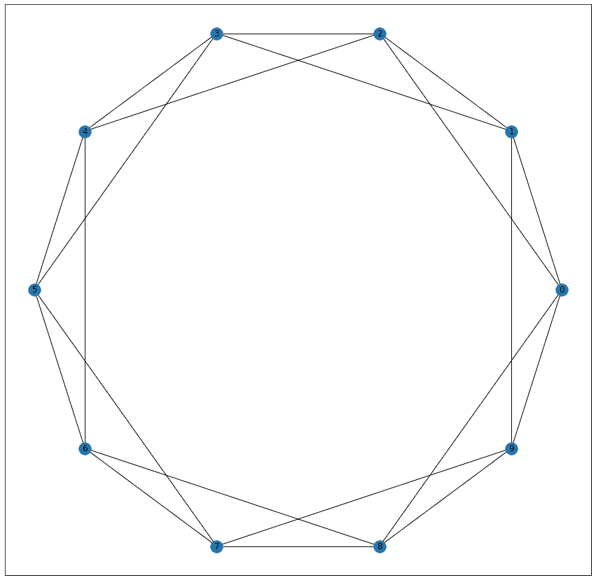
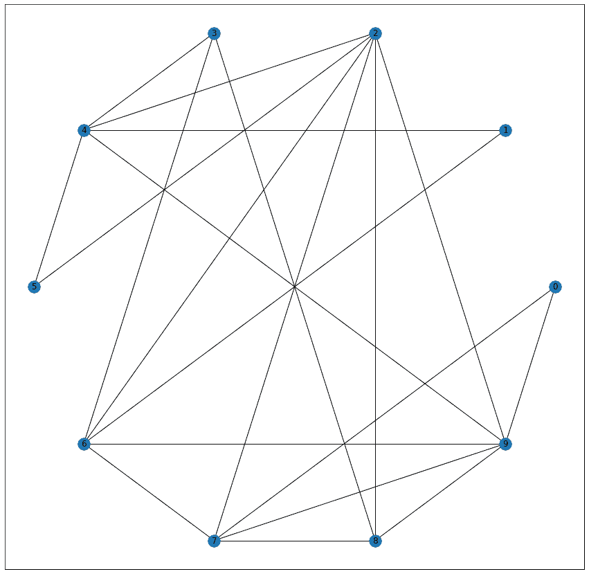
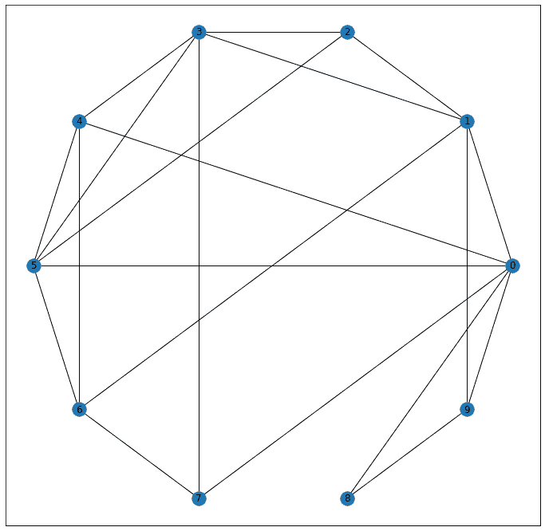
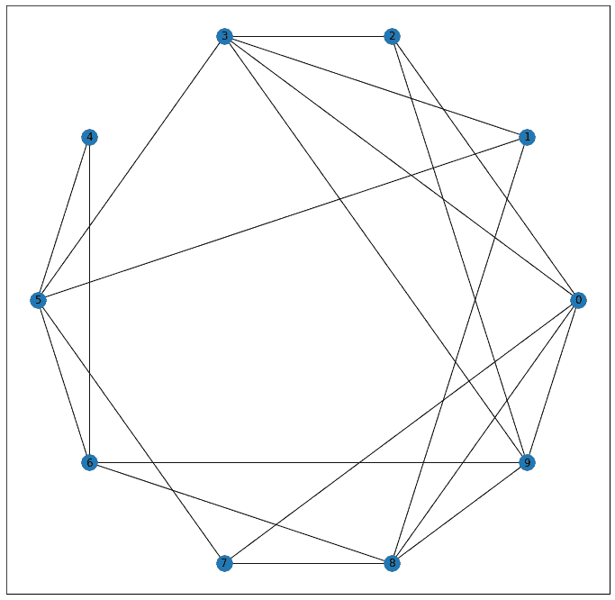
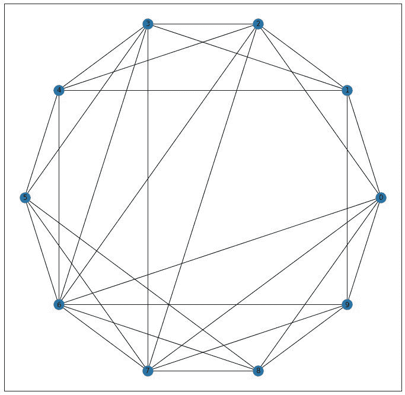

# 小世界模型——使用 Python 网络

> 原文:[https://www . geesforgeks . org/small-world-model-use-python-networkx/](https://www.geeksforgeeks.org/small-world-model-using-python-networkx/)

在本文中，我们将学习如何使用 Python 中的 Networx 模块创建一个小世界网络。在继续之前，让我们先了解一些关于小世界现象的基础知识。

**什么是*小世界现象*？**
小世界现象是一种研究和概念，认为我们都是通过少量的边连接在一起的。有三个显著的实验证明了小世界现象:

1.  **米尔格拉姆小世界现象实验:** 296 名随机选择的人被要求向“目标”人(波士顿的一名股票经纪人)转发一封信。如果此人本人为人所知，这封信将直接寄给他，否则，这封信将寄给更有可能亲自认识他的人。64 封信到达目标人，中间长度为 6 ie。平均而言，一个随机的人通过中间的 6 个人与目标人联系在一起。
2.  **misrosoft 即时通讯实验:**微软即时通讯有 2.4 亿活跃用户。如果两个用户在一个月的时间内进行双向通信，他们就会连接在一起。对于任何两个随机的人，中间距离是 7，即 2 个随机的人通过 7 个中间连接连接。
3.  **基于脸书的实验:**脸书进行的实验计算出 2008 年的平均路径长度为 5.28，而 2011 年减少到 4.74。

1998 年，邓肯·沃茨和史蒂文·斯特罗加兹发表了题为《小世界网络的集体动力学》的研究论文，进一步推进了对小世界模型的研究。他们研究了三种不同的网络:

1.  一个电影演员的*网络*，其中各个节点都是电影演员，只有演员出现在同一部电影中，他们才是有联系的。
2.  一种*电网网络*，其中节点是发电机、变压器和变电站，如果两个节点之间有输电线路，则两个节点相连。
3.  一种*网络，其中节点是神经元*，如果两个节点有突触或缝隙连接，它们就会连接在一起。

他们的结论是，小世界网络通常平均路径长度较低，但聚类系数较高。

## 如何形成小世界网络？

瓦茨和斯特罗加兹提出了一个关于如何构建小世界网络的模型。假设有 *n 个*节点，其中每个节点连接到 *m 个*最近的邻居，这被称为 ***正则点阵*** ，如下图所示，其中 n = 10，m = 4。


考虑每条边 *(u，v)* ，以概率 *p* ，随机选择一个节点 *w* ，重新布线边 *(u，v)* ，使其成为 *(u，w)* 。对于 *p = 0* ，规则格保持其结构，具有高平均距离和高聚类。对于 *p = 1* ，形成平均距离小、聚类度低的随机网络。如下图所示，其中 n = 10，m = 4，p = 1。

对于中间值 *p* ，我们会得到一个平均距离小、聚类度高的理想小世界网络。

对于 Python，我们可以使用 Networkx 轻松构建一个小世界网络。

```
import networkx as nx
import matplotlib.pyplot as plt

G = nx.watts_strogatz_graph(n = 10, m = 4, p = 0.5)
pos = nx.circular_layout()

plt.figure(figsize = (12, 12))
nx.draw_networkx(G, pos)
```

**输出:**


最终的小世界网络可能是一个断开的图形。如果我们希望得到一个连通图，我们可以如下修改上述代码的第 4 行:

```
G = nx.connected_watts_strogatz_graph(n=10, m=4, p=0.5, t=20)
```

它运行原始函数 t 次(在这种情况下 t = 20)，直到实现网络连接。它会给出如下网络:


```
G = nx.newman_watts_strogatz_graph(n=10, m=4, p=0.5)
```

上面的代码将运行一个类似的模型，但是以概率 *p* 添加新的边，而不是重新连接已经存在的边。它将产生以下网络:
