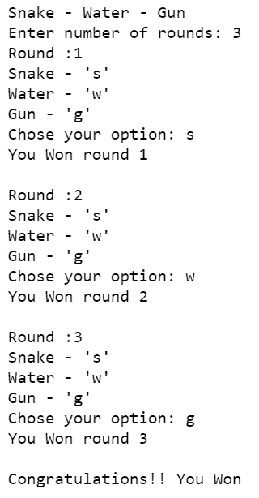

# 蛇水枪游戏使用 Python 和 C

> 原文:[https://www . geesforgeks . org/snake-水枪-游戏-使用-python/](https://www.geeksforgeeks.org/snake-water-gun-game-using-python/)

蛇水枪是很多人玩的著名双人游戏之一。这是一款手游，玩家随机选择三种形态中的任何一种，即蛇、水和枪。在这里，我们将使用 python 实现这个游戏。

这个 python 项目是为一个玩电脑的玩家制作一个游戏

**以下是游戏规则:**

> **蛇对水:**蛇喝水因此获胜。
> **水对枪:**枪会淹没在水中，因此水有一分
> **枪对蛇:**枪会杀死蛇并获胜。
> 
> 在两个玩家选择同一个对象的情况下，结果将是平局。

我们将使用[*random . choice()*](https://www.geeksforgeeks.org/random-choices-method-in-python/)*方法*和嵌套[*if-else*](https://www.geeksforgeeks.org/python3-if-if-else-nested-if-if-elif-statements/)*语句从列表中选择一个随机项目。*

***下面是实现:***

## *蟒蛇 3*

```py
*# Import random module
import random
print('Snake - Water - Gun')

# Input no. of rounds
n = int(input('Enter number of rounds: '))

# List containing Snake(s), Water(w), Gun(g)
options = ['s', 'w', 'g']

# Round numbers
rounds = 1

# Count of computer wins
comp_win = 0

# Count of player wins
user_win = 0

# There will be n rounds of game
while rounds <= n:

    # Display round
    print(f"Round :{rounds}\nSnake - 's'\nWater - 'w'\nGun - 'g'")

    # Exception handling
    try:
        player = input("Chose your option: ")
    except EOFError as e:
        print(e)

    # Control of bad inputs
    if player != 's' and player != 'w' and player != 'g':
        print("Invalid input, try again\n")
        continue

    # random.choice() will randomly chose
    # item from list- options
    computer = random.choice(options)

    # Conditions based on the game rule
    if computer == 's':
        if player == 'w':
            comp_win += 1
        elif player == 'g':
            user_win += 1

    elif computer == 'w':
        if player == 'g':
            comp_win += 1
        elif player == 's':
            user_win += 1

    elif computer == 'g':
        if player == 's':
            comp_win += 1
        elif player == 'w':
            user_win += 1

    # Announce winner of every round
    if user_win > comp_win:
        print(f"You Won round {rounds}\n")
    elif comp_win > user_win:
        print(f"Computer Won round {rounds}\n")
    else:
        print("Draw!!\n")

    rounds += 1

# Final winner based on the number of wons
if user_win > comp_win:
    print("Congratulations!! You Won")
elif comp_win > user_win:
    print("You lose!!")
else:
    print("Match Draw!!")*
```

## *C*

```py
*#include <stdio.h>
#include <stdlib.h>
#include <time.h>

int snakeWaterGun(char you, char comp)
{
    // returns 1 if you win, -1 if you lose and 0 if draw
    // Condition for draw // Cases
    // covered: | snake snake |
    // gun gun | water water
    if (you == comp) {
        return 0;
    }

    // Non-draw conditions
    // Cases covered:// snake gun
    // | gun snake | snake water
    // | water sanke | gun water | water gun

    if (you == 's' && comp == 'g')
    {
        return -1;
    }
    else if (you == 'g' && comp == 's')
    {
        return 1;
    }

    if (you == 's' && comp == 'w')
    {
        return 1;
    }
    else if (you == 'w' && comp == 's')
    {
        return -1;
    }

    if (you == 'g' && comp == 'w')
    {
        return -1;
    }
    else if (you == 'w' && comp == 'g')
    {
        return 1;
    }
}

// Driver Code
int main()
{
    char you, comp;
    srand(time(0));
    int number = rand() % 100 + 1;

    if (number < 33)
    {
        comp = 's';
    }
    else if (number > 33 && number < 66)
    {
        comp = 'w';
    }
    else
    {
        comp = 'g';
    }

    printf("Enter 's' for snake, 'w' for "
           "water and 'g' for  gun\n");
    scanf("%c", &you);
    int result = snakeWaterGun(you, comp);
    if (result == 0) {
        printf("Game draw!\n");
    }
    else if (result == 1)
    {
        printf("You win!\n");
    }
    else
    {
        printf("You Lose!\n");
    }
    printf("You chose %c and computer chose %c. ", you,
           comp);
    return 0;
}
// this code is provided by harsh sinha username-
// harshsinha03*
```

***输出:***

**