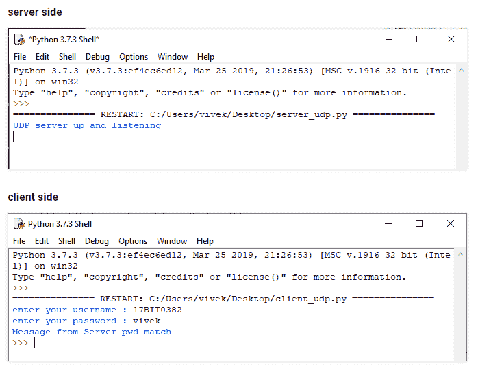

# 插座| Python

> 原文:[https://www.geeksforgeeks.org/sockets-python/](https://www.geeksforgeeks.org/sockets-python/)

**什么是插座？**
套接字充当双向通信通道，在这里它们是它的端点。套接字可以在进程内、不同进程之间以及不同地方的进程之间进行通信。
**插座模块-**s . Socket . Socket(Socket _ family，socket_type，协议=0)

> *   **socket _ family**由 unix 或 af _ inet 制作
> *   **socket _ type-** SOCK _ STREAM 或 SOCK_DGRAM
> *   **protocol-** is omitted, and ot defaults to 0.

一旦如上所述创建了 socket 对象，现在我们可以使用下面的函数来创建客户端服务器程序。
**插座方法**

<figure class="table">

| 不，先生。 | 方法和描述 |
| 

#### Server socket method

 |
| 1. | 

**s . bind**–该方法将地址主机名、端口号绑定到套接字

 |
| 2. | 

**s .监听**–该方法设置并启动 TCP 监听程序

 |
| 3. | 

**s . accept**–被动接受客户端连接，等待直到连接阻塞

 |
| 

#### Client socket method

 |
| 1. | 

**s . connect**–该方法主动发起 TCP 服务器连接

 |

</figure>

**通用插座方法**

<figure class="table">

| 不，先生。 | 方法和描述 |
| 1. | 

**s . recv**–此方法接收 TCP 消息

 |
| 2. | 

**s . send**–此方法传输 TCP 消息

 |
| 3. | 

**s . recvfrom**–此方法接收 UDP 消息

 |
| 4. | 

**s . send to**–此方法传输 UDP 消息

 |
| 5. | 

**关闭**–该方法关闭插座

 |
| 6. | 

**s . gethostname**–返回主机名

 |

</figure>

**示例:从服务器向客户端发送日期**

```
client side
Output :today's Date
```

## 蟒蛇 3

```
# importing required modules
import socket    
import datetime

# initializing socket
s = socket.socket()    
host = socket.gethostname() 
port = 12345

# binding port and host
s.bind((host, port))  

# waiting for a client to connect
s.listen(5) 

while True:
   # accept connection
   c, addr = s.accept()       
   print ('got connection from addr', addr)
   date = datetime.datetime.now() 
   d = str(date)

   # sending data type should be string and encode before sending
   c.send(d.encode())     
   c.close()
```

## 蟒蛇 3

```
import socket
s = socket.socket()
host = socket.gethostname()
port = 12345

# connect to host
s.connect((host, port))

# recv message and decode here 1024 is buffer size.   
print (s.recv(1024).decode())  
s.close()
```

**注意:**创建 2 个 python 编译器实例，分别运行客户端和服务器端代码，不要在同一个实例上运行。
**输出:**
**服务器端-**


**客户端-**
这里出现从服务器获取的当前日期时间


## UDP 套接字

**UDP 是用户数据报协议**，这是一个轻量级协议，它有基本的错误检查机制，没有确认和排序，但由于这些原因非常快
**示例:从服务器向客户端发送数据**

```
client side
Input : vivek  
Input : 17BIT0382  
Output : password match 
```

## 蟒蛇 3

```
import socket

localIP = "127.0.0.1"
localPort = 20001
bufferSize = 1024

UDPServerSocket = socket.socket(family = socket.AF_INET, type = socket.SOCK_DGRAM)
UDPServerSocket.bind((localIP, localPort))
print("UDP server up and listening")

# this might be database or a file
di ={'17BIT0382':'vivek', '17BEC0647':'shikhar', '17BEC0150':'tanveer',
'17BCE2119':'sahil', '17BIT0123':'sidhant'}

while(True):
   # receiving name from client
   name, addr1 = UDPServerSocket.recvfrom(bufferSize) 

   # receiving pwd from client
   pwd, addr1 = UDPServerSocket.recvfrom(bufferSize) 

   name = name.decode() 
   pwd = pwd.decode()
   msg =''
   if name not in di:
       msg ='name does not exists'
       flag = 0
   for i in di:
      if i == name:
          if di[i]== pwd:
              msg ="pwd match"
              flag = 1
          else:
              msg ="pwd wrong"
      bytesToSend = str.encode(msg)
      # sending encoded status of name and pwd
      UDPServerSocket.sendto(bytesToSend, addr1) 
```

## 蟒蛇 3

```
import socket

# user input
name = input('enter your username : ')    
bytesToSend1 = str.encode(name)
password = input('enter your password : ')
bytesToSend2 = str.encode(password)

serverAddrPort = ("127.0.0.1", 20001)
bufferSize = 1024

# connecting to hosts
UDPClientSocket = socket.socket(family = socket.AF_INET, type = socket.SOCK_DGRAM) 

# sending username by encoding it
UDPClientSocket.sendto(bytesToSend1, serverAddrPort) 
# sending password by encoding it
UDPClientSocket.sendto(bytesToSend2, serverAddrPort) 

# receiving status from server
msgFromServer = UDPClientSocket.recvfrom(bufferSize) 
msg = "Message from Server {}".format(msgFromServer[0].decode()) 
print(msg)
```

为了代码的简单性，我选择了一个可以使用数据库、文件或 CSV 文件等的字典。用于各种其他目的。
**输出:**

