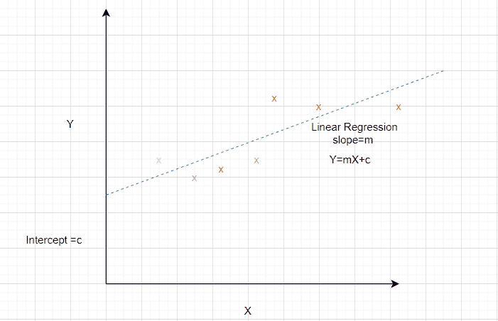
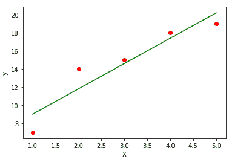

# 用 Python 求解线性回归

> 原文:[https://www . geesforgeks . org/solution-linear-revolution-in-python/](https://www.geeksforgeeks.org/solving-linear-regression-in-python/)

线性回归是建模因变量和一个或多个自变量之间关系的常用方法。使用从数据中估计的参数开发线性模型。线性回归在预测和预测中是有用的，其中预测模型适合于观察到的数据集值以确定响应。线性回归模型通常使用最小二乘法拟合，其目标是最小化误差。



考虑一个数据集，其中独立属性用 x 表示，依赖属性用 y 表示。


已知直线的方程为 **y = mx + b** ，其中 m 为斜率，b 为截距。
为了准备给定数据集的简单回归模型，我们需要计算最适合数据点的直线的**斜率**和**截距**。

**如何计算斜率和截距？**

计算斜率和截距的数学公式如下

```
Slope = Sxy/Sxx   
where Sxy and Sxx are sample covariance and sample variance respectively.

Intercept = ymean – slope* xmean
```

让我们使用这些关系来确定上述数据集的线性回归。为此，我们计算 x <sub>表示</sub>，y <sub>表示</sub>，S <sub>xy</sub> ，S <sub>xx</sub> 如下表所示。


根据上述公式，
**斜率= 28/10 = 2.8
截距= 14.6–2.8 * 3 = 6.2**
因此，

```
The desired equation of the regression model is y = 2.8 x + 6.2
```

对于给定的 x 值，我们将使用这些值来预测 y 值。模型的性能可以通过计算均方根误差和 R <sup>2</sup> 值来分析。

计算如下所示。


平方误差=10.8，即均方误差= **3.28**
测定系数(R<sup>2</sup>)= 1-10.8/89.2 =**0.878**

```
 Low value of error and high value of R<sup>2</sup> signify that the 
linear regression fits data well
```

**让我们看看这个数据集线性回归的 Python 实现。**

**代码 1:导入所有必需的库。**

```
import numpy as np
import matplotlib.pyplot as plt

from sklearn.linear_model import LinearRegression
from sklearn.metrics import mean_squared_error, r2_score
import statsmodels.api as sm
```

**代码 2:生成数据。计算 x <sub>均值</sub>、y <sub>均值</sub>、Sxx、Sxy 求回归线斜率和截距的值。**

```
x = np.array([1,2,3,4,5]) 
y = np.array([7,14,15,18,19])
n = np.size(x)

x_mean = np.mean(x)
y_mean = np.mean(y)
x_mean,y_mean

Sxy = np.sum(x*y)- n*x_mean*y_mean
Sxx = np.sum(x*x)-n*x_mean*x_mean

b1 = Sxy/Sxx
b0 = y_mean-b1*x_mean
print('slope b1 is', b1)
print('intercept b0 is', b0)

plt.scatter(x,y)
plt.xlabel('Independent variable X')
plt.ylabel('Dependent variable y')
```

**输出:**

```
slope b1 is 2.8
intercept b0 is 6.200000000000001
```

**代码 3:绘制给定数据点，拟合回归线。**

```
y_pred = b1 * x + b0

plt.scatter(x, y, color = 'red')
plt.plot(x, y_pred, color = 'green')
plt.xlabel('X')
plt.ylabel('y')
```

<center>
</center>

**Code 4: Analyze the performance of the model by calculating mean squared error and R<sup>2</sup>**

```
error = y - y_pred
se = np.sum(error**2)
print('squared error is', se)

mse = se/n 
print('mean squared error is', mse)

rmse = np.sqrt(mse)
print('root mean square error is', rmse)

SSt = np.sum((y - y_mean)**2)
R2 = 1- (se/SSt)
print('R square is', R2)
```

**输出:**

```
squared error is 10.800000000000004
mean squared error is 2.160000000000001
root mean square error is 1.4696938456699071
R square is 0.8789237668161435
```

**代码 5:使用 scikit 库确认上述步骤。**

```
x = x.reshape(-1,1)
regression_model = LinearRegression()

# Fit the data(train the model)
regression_model.fit(x, y)

# Predict
y_predicted = regression_model.predict(x)

# model evaluation
mse=mean_squared_error(y,y_predicted)

rmse = np.sqrt(mean_squared_error(y, y_predicted))
r2 = r2_score(y, y_predicted)

# printing values
print('Slope:' ,regression_model.coef_)
print('Intercept:', regression_model.intercept_)
print('MSE:',mse)
print('Root mean squared error: ', rmse)
print('R2 score: ', r2)
```

**输出:**

```
Slope: [2.8]
Intercept: 6.199999999999999
MSE: 2.160000000000001
Root mean squared error:  1.4696938456699071
R2 score:  0.8789237668161435
```

**结论:**本文有助于理解简单回归背后的数学，并使用 Python 实现同样的功能。