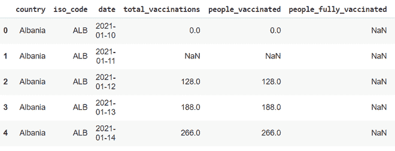
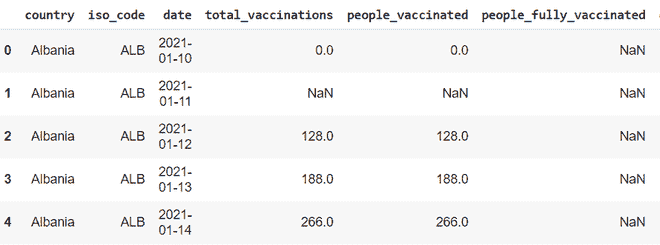
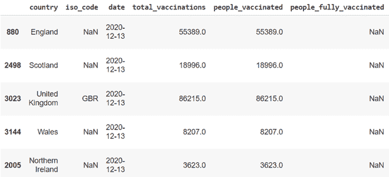

# 在 Python 中按日期排序 CSV 对象

> 原文:[https://www . geesforgeks . org/sorting-a-CSV-object-by-date-in-python/](https://www.geeksforgeeks.org/sorting-a-csv-object-by-dates-in-python/)

CSV 代表逗号分隔的值。CSV 文件可以在谷歌工作表或 Excel 中打开，并将被格式化为电子表格。然而，CSV 文件实际上是一个纯文本文件。它也可以用文本编辑器程序打开，比如 Atom。在本文中，我们将看到如何在 Python 中按日期对 CSV 对象进行排序

CSV 为我们提供了一种不用数据库程序就能组织数据的简单好方法。使用 Python 很容易读写 CSV 文件。

## 读取 CSV 文件的步骤

**步骤 1:** 在读取 CSV 的第一步中，您需要找到文件。

**第二步:**导入熊猫库

熊猫库是通过使用 import 关键字和对象作为 pd 导出的，PD 是熊猫库的标准符号。

## 蟒蛇 3

```py
import pandas as pd
```

**第三步:**使用 pandas 库读取 CSV 文件，并将其分配给一个变量。

csv 文件“data.csv”是使用熊猫库中的 read_csv 方法加载的，并存储在名为“data”的变量中，现在这个变量被称为 dataframe。

## 蟒蛇 3

```py
data = pd.read_csv('data.csv')
```

**第四步:**使用 head 功能显示前 5 行数据。

'的。head()“方法用于打印前 5 行和”。tail()'方法用于打印数据文件的最后 5 行。

## 蟒蛇 3

```py
display(data.head())
```

**输出:**



屏幕快照输出

## 按日期对数据进行排序的步骤

**步骤 1:** 将日期列转换为所需的日期时间格式

您可以使用参数 infer _ datetime _ format。下面是您的示例数据:

## 蟒蛇 3

```py
data['date'] = pd.to_datetime(data.date, infer_datetime_format = True)
display(data.head())
```

**输出:**



屏幕快照输出

**步骤 2:** 使用 sort_values 方法，给定参数作为日期，我们按日期对值进行排序。要获取排序的同时使用 head 函数获取前 5 行数据输入:

## 蟒蛇 3

```py
data.sort_values(by = 'date', ascending = True, inplace = True)
display(data.head())
```

**输出:**

