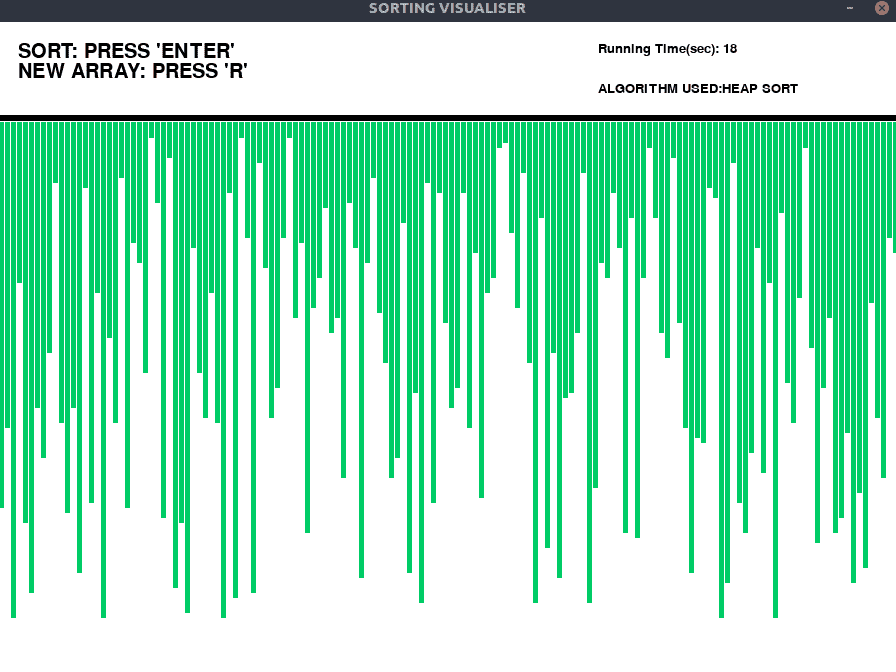
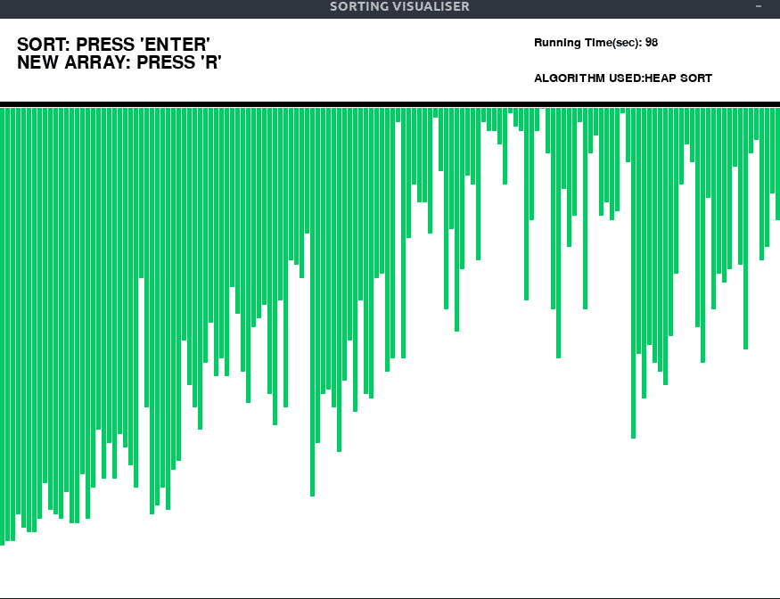
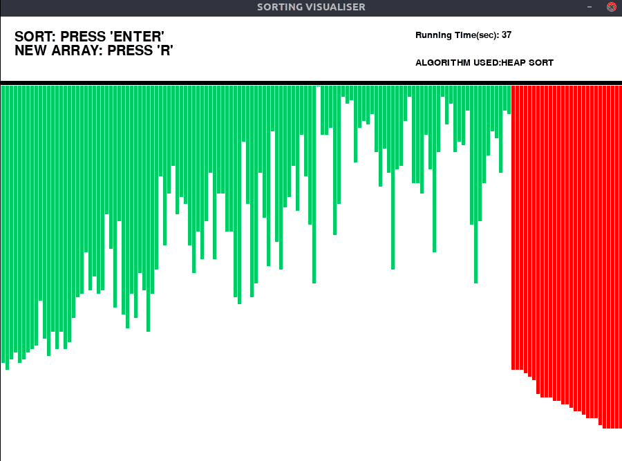
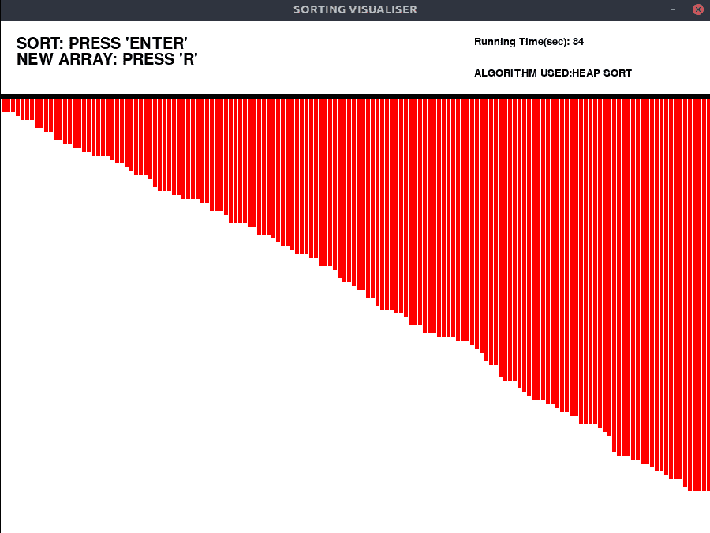

# 排序算法可视化:堆排序

> 原文:[https://www . geesforgeks . org/sorting-算法-可视化-堆-排序/](https://www.geeksforgeeks.org/sorting-algorithm-visualization-heap-sort/)

像[堆排序](https://www.geeksforgeeks.org/heap-sort/)这样的算法，通过可视化很容易理解。在本文中，已经实现了一个可视化堆排序算法的程序。

[图形用户界面](https://www.geeksforgeeks.org/difference-between-cli-and-gui/)使用 [pygame](https://www.geeksforgeeks.org/introduction-to-pygame/) 库在 [Python](https://www.geeksforgeeks.org/python-programming-language/) 中实现。

### 方法:

生成随机数组并用条填充 pygame 窗口。条形是垂直的直线，代表数组元素。

*   将所有条形设置为绿色(未排序)。
*   对数组进行排序。
*   在 Heapify 之后，大小节在开头，后面是小小节。
*   使用 pygame.time.delay()来降低算法的速度，这样我们就可以看到排序的过程。
*   实现一个计时器，看看算法如何执行。
*   这些操作是使用“pygame.event.get()”方法执行的，该方法存储用户执行的所有事件，如启动、重置。
*   蓝色用于突出显示在特定时间参与排序的条。
*   橙色突出显示已排序的条。

### 观察结果:

从堆排序可视化中我们可以清楚地看到，堆排序与其他排序算法如[插入排序](https://www.geeksforgeeks.org/insertion-sort/)或[选择排序](https://www.geeksforgeeks.org/selection-sort/)相比速度非常快，与[合并排序](https://www.geeksforgeeks.org/merge-sort/)速度相似。

### 示例:

> #### 输入:
> 
> 按“输入”键执行可视化。
> 
> 按“R”键生成新数组。
> 
> #### 输出:
> 
> #### 初始:
> 
> 
> 
> #### 数组堆化后:
> 
> 
> 
> #### 排序:
> 
> 
> 
> #### 最终:
> 
> 

运行以下程序前，请确保[安装 pygame 库](https://www.geeksforgeeks.org/introduction-to-pygame/)。

下面是上述可视化工具的实现:

## 计算机编程语言

```py
# Python implementation of the
# Sorting visualiser: Heap Sort

# Imports
import pygame
import random
import time
pygame.font.init()
startTime = time.time()

# Total window
screen = pygame.display.set_mode(
    (900, 650)
)

# Title and Icon
pygame.display.set_caption(
    "SORTING VISUALISER"
)

# Uncomment below lines for setting
# up the icon for the visuliser
# img = pygame.image.load('sorticon.png')
# pygame.display.set_icon(img)

# Boolean variable to run
# the program in while loop
run = True

# Window size and some initials
width = 900
length = 600
array = [0]*151
arr_clr = [(0, 204, 102)]*151
clr_ind = 0
clr = [(0, 204, 102), (255, 0, 0),
       (0, 0, 153), (255, 102, 0)]
fnt = pygame.font.SysFont("comicsans", 30)
fnt1 = pygame.font.SysFont("comicsans", 20)

# Function to generate new Array
def generate_arr():
    for i in range(1, 151):
        arr_clr[i] = clr[0]
        array[i] = random.randrange(1, 100)

# Initially generate a array
generate_arr()

# Function to refill the
# updates on the window
def refill():
    screen.fill((255, 255, 255))
    draw()
    pygame.display.update()
    pygame.time.delay(10)

# Sorting Algorithm: Heap Sort
def heapSort(array):
    n = len(array)
    for i in range(n//2-1, -1, -1):
        pygame.event.pump()
        heapify(array, i, n)
    for i in range(n-1, 0, -1):
        array[i], array[0] = array[0], array[i]
        arr_clr[i] = clr[1]
        refill()
        heapify(array, 0, i)

def heapify(array, root, size):
    left = root * 2 + 1
    right = root * 2 + 2
    largest = root
    if left < size and array[left] > array[largest]:
        largest = left
    if right < size and array[right] > array[largest]:
        largest = right
    if largest != root:
        arr_clr[largest] = clr[2]
        arr_clr[root] = clr[2]
        array[largest],\
        array[root] = array[root],\
        array[largest]
        refill()
        arr_clr[largest] = clr[0]
        arr_clr[root] = clr[0]
        heapify(array, largest, size)
        refill()

# Function to Draw the array values
def draw():

    # Text should be rendered
    txt = fnt.render("SORT: PRESS 'ENTER'",
                     1, (0, 0, 0))
    # Position where text is placed
    screen.blit(txt, (20, 20))
    txt1 = fnt.render("NEW ARRAY: PRESS 'R'",
                      1, (0, 0, 0))
    screen.blit(txt1, (20, 40))
    txt2 = fnt1.render("ALGORITHM USED:" +
                       "HEAP SORT", 1, (0, 0, 0))
    screen.blit(txt2, (600, 60))
    text3 = fnt1.render("Running Time(sec): " +
                        str(int(time.time() - startTime)),
                        1, (0, 0, 0))
    screen.blit(text3, (600, 20))
    element_width = (width-150)//150
    boundry_arr = 900 / 150
    boundry_grp = 550 / 100
    pygame.draw.line(screen, (0, 0, 0), (0, 95),
                     (900, 95), 6)

    # Drawing the array values as lines
    for i in range(1, 151):
        pygame.draw.line(screen, arr_clr[i],
                         (boundry_arr * i-3, 100),
                         (boundry_arr * i-3,
                          array[i]*boundry_grp + 100),\
                         element_width)

# Program should be run
# continuously to keep the window open
while run:
    # background
    screen.fill((255, 255, 255))

    # Event handler stores all event
    for event in pygame.event.get():

        # If we click Close button in window
        if event.type == pygame.QUIT:
            run = False
        if event.type == pygame.KEYDOWN:
            if event.key == pygame.K_r:
                generate_arr()
            if event.key == pygame.K_RETURN:
                heapSort(array)
    draw()
    pygame.display.update()

pygame.quit()
```

<video class="wp-video-shortcode" id="video-447732-1" width="640" height="360" preload="metadata" controls=""><source type="video/mp4" src="https://media.geeksforgeeks.org/wp-content/uploads/20200708013104/heap-2020-07-08_01.30.09.mp4?_=1">[https://media.geeksforgeeks.org/wp-content/uploads/20200708013104/heap-2020-07-08_01.30.09.mp4](https://media.geeksforgeeks.org/wp-content/uploads/20200708013104/heap-2020-07-08_01.30.09.mp4)</video>