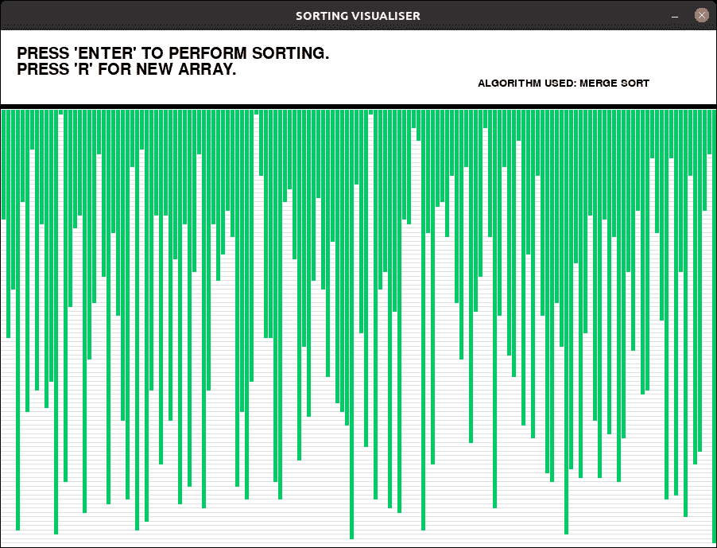
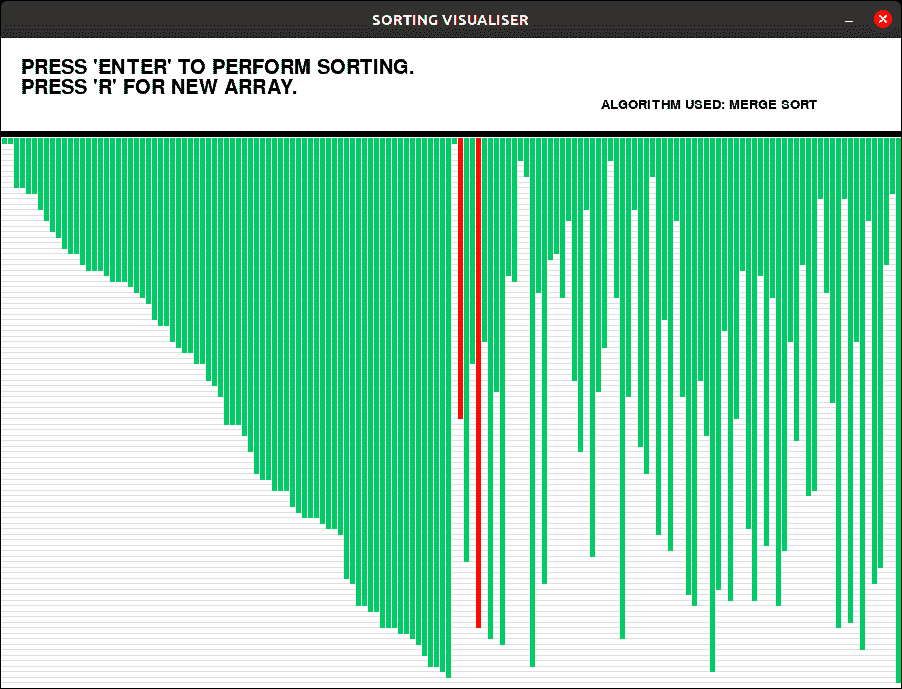
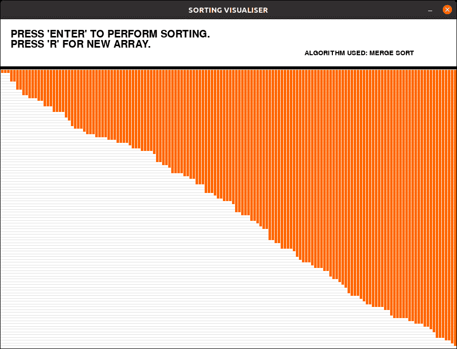

# 排序算法可视化:合并排序

> 原文:[https://www . geesforgeks . org/排序-算法-可视化-合并-排序/](https://www.geeksforgeeks.org/sorting-algorithm-visualization-merge-sort/)

人脑可以很容易地处理图像，而不是长代码来理解算法。本文实现了一个可视化[合并排序算法](https://www.geeksforgeeks.org/merge-sort/)的程序。

图形用户界面是用 python 中的 [pygame](https://www.geeksforgeeks.org/introduction-to-pygame/) 包实现的。

**进场:**

*   生成随机值的数组，并在窗口中绘制为线(条)。*   不同的颜色用于指示哪些元素被比较、排序和未排序。*   由于算法的运算速度非常快，pygame.time.delay()被用来降低运算速度。*   按“r”键可以生成新数组。*   The actions are performed using ‘pygame.event.get()’ method, which stores all the events which user performs.

    **示例:**

    > **输入:**
    > 按“回车”键进行可视化。
    > 按“r”键生成新数组。
    > **输出:**
    > 初始:
    > [](https://media.geeksforgeeks.org/wp-content/uploads/20200619162047/initial_merge.png)
    > 
    > 可视化:
    > [](https://media.geeksforgeeks.org/wp-content/uploads/20200619162108/sorting_merge.png)
    > 
    > 决赛:
    > [](https://media.geeksforgeeks.org/wp-content/uploads/20200619162128/sorted_merge.png)

    下面是可视化[合并排序算法](https://www.geeksforgeeks.org/merge-sort/)的程序:

    ```py
    # Python implementation for visualizing merge sort. 
    import pygame
    import random
    pygame.font.init()
    # Total window
    screen = pygame.display.set_mode((900, 650))

    # Title and Icon 
    pygame.display.set_caption("SORTING VISUALISER")
    # Place any custom png file in same folder as the source code
    # and mention it below and uncomment below two lines.
    # img = pygame.image.load
    # ('E:/Projects / Sorting Visualiser / sorticon.png')
    # pygame.display.set_icon(img)

    # Boolean variable to run the program in while loop
    run = True

    # Window size
    width = 900
    length = 600
    array =[0]*151
    arr_clr =[(0, 204, 102)]*151
    clr_ind = 0
    clr =[(0, 204, 102), (255, 0, 0), 
    (0, 0, 153), (255, 102, 0)]
    fnt = pygame.font.SysFont("comicsans", 30)
    fnt1 = pygame.font.SysFont("comicsans", 20)
    # Generate new Array
    def generate_arr():
        for i in range(1, 151):
            arr_clr[i]= clr[0]
            array[i]= random.randrange(1, 100)
    generate_arr() 
    def refill():
        screen.fill((255, 255, 255))
        draw()
        pygame.display.update()
        pygame.time.delay(20)

    # Sorting Algo:Merge sort
    def mergesort(array, l, r):
        mid =(l + r)//2
        if l<r:
            mergesort(array, l, mid)
            mergesort(array, mid + 1, r)
            merge(array, l, mid,
                mid + 1, r)
    def merge(array, x1, y1, x2, y2):
        i = x1
        j = x2
        temp =[]
        pygame.event.pump() 
        while i<= y1 and j<= y2:
            arr_clr[i]= clr[1]
            arr_clr[j]= clr[1]
            refill()
            arr_clr[i]= clr[0]
            arr_clr[j]= clr[0]
            if array[i]<array[j]:
                    temp.append(array[i])
                    i+= 1
            else:
                    temp.append(array[j])
                    j+= 1
        while i<= y1:
            arr_clr[i]= clr[1]
            refill()
            arr_clr[i]= clr[0]
            temp.append(array[i])
            i+= 1
        while j<= y2:
            arr_clr[j]= clr[1]
            refill()
            arr_clr[j]= clr[0]
            temp.append(array[j])
            j+= 1
        j = 0    
        for i in range(x1, y2 + 1): 
            pygame.event.pump() 
            array[i]= temp[j]
            j+= 1
            arr_clr[i]= clr[2]
            refill()
            if y2-x1 == len(array)-2:
                arr_clr[i]= clr[3]
            else: 
                arr_clr[i]= clr[0]

    # Draw the array values
    def draw():
        # Text should be rendered
        txt = fnt.render("PRESS"\
        " 'ENTER' TO PERFORM SORTING.", 1, (0, 0, 0))
        # Position where text is placed
        screen.blit(txt, (20, 20))
        txt1 = fnt.render("PRESS 'R' FOR NEW ARRAY.",
                        1, (0, 0, 0))
        screen.blit(txt1, (20, 40))
        txt2 = fnt1.render("ALGORITHM USED: "\
                        "MERGE SORT", 1, (0, 0, 0))
        screen.blit(txt2, (600, 60))
        element_width =(width-150)//150
        boundry_arr = 900 / 150
        boundry_grp = 550 / 100
        pygame.draw.line(screen, (0, 0, 0), 
                        (0, 95), (900, 95), 6)
        for i in range(1, 100):
            pygame.draw.line(screen, 
                            (224, 224, 224), 
                            (0, boundry_grp * i + 100), 
                            (900, boundry_grp * i + 100), 1)

        # Drawing the array values as lines
        for i in range(1, 151):
            pygame.draw.line(screen, arr_clr[i],\
                (boundry_arr * i-3, 100),\
                (boundry_arr * i-3, array[i]*boundry_grp + 100),\
                element_width)

    # Infinite loop to keep the window open
    while run:
        # background
        screen.fill((255, 255, 255))
        # Event handler stores all event 
        for event in pygame.event.get():
            # If we click Close button in window
            if event.type == pygame.QUIT:
                run = False
            if event.type == pygame.KEYDOWN:
                if event.key == pygame.K_r:
                    generate_arr() 
                if event.key == pygame.K_RETURN:
                    mergesort(array, 1, len(array)-1)     
        draw()
        pygame.display.update()

    pygame.quit()
    ```

    **输出:**

    ```py

    <video class="wp-video-shortcode" id="video-370435-1" width="665" height="505" preload="metadata" controls=""><source type="video/mp4" src="https://media.geeksforgeeks.org/wp-content/uploads/20200619162211/visualiser15-2020-06-19_16.16.37.mp4?_=1">[https://media.geeksforgeeks.org/wp-content/uploads/20200619162211/visualiser15-2020-06-19_16.16.37.mp4](https://media.geeksforgeeks.org/wp-content/uploads/20200619162211/visualiser15-2020-06-19_16.16.37.mp4)</video>

    ```