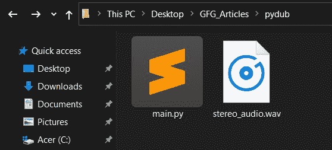

# 使用 PyDub 将立体声音频分割为单声道

> 原文:[https://www . geesforgeks . org/spliting-立体声-音频-单声道-with-pydub/](https://www.geeksforgeeks.org/splitting-stereo-audio-to-mono-with-pydub/)

如果您试图处理或转录立体声音频文件，将立体声音频文件拆分为多个单声道音频文件非常有用。这是因为立体声音频在不同的通道上有两个音频源，这使得处理文件非常困难。将立体声音频文件分割成单声道音频文件使这项工作更容易。

在本文中，我们将使用 **Pydub** python 模块，这对于处理音频文件和修改它们非常有用。更多信息请阅读这篇[皮杜布](https://www.geeksforgeeks.org/working-with-wav-files-in-python-using-pydub/)的文章。

使用 pip 进行 Pydub 安装:

```
pip install pydub
```

## **什么是立体声和单声道？**

**立体声音频**:是 2 声道音频，意思是听的时候两个或两个以上的声源定位在左右两侧。这最常用于音频或视频流服务，在这些服务中，可以从耳机的特定侧面听到不同乐器的声音。

**单声道音频**:是单声道音频，也就是说所有的音源只能通过一个声道听到。这意味着您将在耳机的左右两侧听到相同的声音。这是电话麦克风记录音频的格式。

**文件夹结构**

在一个名为 pydub 的文件夹中，我有一个名为 main.py 的 python 代码文件和一个名为 stereo_audio.wav 的测试音频文件。



初始文件夹结构

**解释**

1.  从 pydub 导入音频段
2.  使用 AudioSegment.from_file()方法将音频文件作为 AudioSegment 实例打开。
3.  对文件调用 split_to_mono 方法，该方法将立体声音频文件拆分为左右声道音频，并返回一个列表，其中左声道音频段对象位于 0 索引处，右声道音频段对象位于 1 索引处。
4.  以所需格式导出/保存两个单声道音频文件。

> 注意:请记住根据您的系统更改文件路径。

**实施:**

## 蟒蛇 3

```
# Python3 program to illustrate
# splitting stereo audio to mono
# using pydub

# Import AudioSegment from pydub
from pydub import AudioSegment

# Open the stereo audio file as
# an AudioSegment instance
stereo_audio = AudioSegment.from_file(
    "C:\\Users\\NEERAJ RANA\\Desktop\\GFG_Articles\\pydub\\stereo_audio.wav",
    format="wav")

# Calling the split_to_mono method
# on the stereo audio file
mono_audios = stereo_audio.split_to_mono()

# Exporting/Saving the two mono
# audio files present at index 0(left)
# and index 1(right) of list returned
# by split_to_mono method
mono_left = mono_audios[0].export(
    "C:\\Users\\NEERAJ RANA\\Desktop\\GFG_Articles\\pydub\\mono_left.wav",
    format="wav")
mono_right = mono_audios[1].export(
    "C:\\Users\\NEERAJ RANA\\Desktop\\GFG_Articles\\pydub\\mono_right.wav",
    format="wav")
```

**输出:**


运行代码后的文件夹结构

**输出视频:**

<video class="wp-video-shortcode" id="video-572347-1" width="640" height="360" preload="metadata" controls=""><source type="video/mp4" src="https://media.geeksforgeeks.org/wp-content/uploads/20210313213331/pydub_video.mp4?_=1">[https://media.geeksforgeeks.org/wp-content/uploads/20210313213331/pydub_video.mp4](https://media.geeksforgeeks.org/wp-content/uploads/20210313213331/pydub_video.mp4)</video>