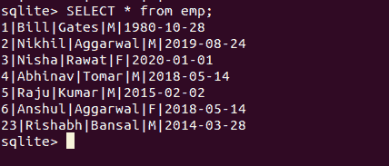
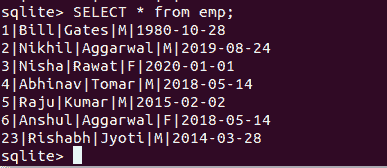

# 使用 Python 的 SQL

> 原文:[https://www.geeksforgeeks.org/sql-using-python/](https://www.geeksforgeeks.org/sql-using-python/)

本文讨论了如何将 SQLite3 与 Python 集成。在这里，我们将使用 Python 讨论 SQLite3 数据库上的所有 CRUD 操作。CRUD 包含四个主要操作–


**注意:**这个需要对 [SQL](https://www.geeksforgeeks.org/sql-tutorial/) 有一个基本的了解。

在这里，我们将使用 Python 连接 SQLite。Python 有一个名为 **sqlite3** 的 SQLite3 原生库。让我们解释一下它是如何工作的。

## 连接到 SQLite 数据库

*   要使用 SQLite，必须导入 **sqlite3** 。

```py
import sqlite3
```

*   然后使用 [connect()](https://www.geeksforgeeks.org/python-sqlite-connecting-to-database/) 方法创建一个连接，并传递您想要访问的数据库的名称。如果有一个同名的文件，它将打开该文件。否则，Python 将用给定的名称创建一个文件。

```py
sqliteConnection = sqlite3.connect('gfg.db')
```

*   此后，调用一个游标对象，以便能够向 SQL 发送命令。

```py
cursor = sqliteConnection.cursor()
```

### **示例:使用 Python 连接到 SQLite3 数据库**

## 蟒蛇 3

```py
import sqlite3

# connecting to the database
connection = sqlite3.connect("gfg.db")

# cursor
crsr = connection.cursor()

# print statement will execute if there
# are no errors
print("Connected to the database")

# close the connection
connection.close()
```

**输出:**

```py
Connected to the database
```

## 光标对象

在进一步讨论 SQLite3 和 Python 之前，让我们简单讨论一下[光标对象](https://www.geeksforgeeks.org/python-sqlite-cursor-object/)。

*   游标对象用于建立执行 SQL 查询的连接。
*   它充当 SQLite 数据库连接和 SQL 查询之间的中间件。它是在连接到 SQLite 数据库后创建的。
*   游标是一种用于遍历和获取数据库记录的控制结构。
*   所有命令将仅使用光标对象执行。

## 执行 SQLite3 查询–创建表

连接到数据库并创建游标对象后，让我们看看如何执行查询。

*   要在数据库中执行查询，请创建一个对象，并在其中写入带注释的 SQL 命令。示例:- sql_comm = "SQL 语句"
*   并且执行命令非常容易。调用 cursor 方法 execute()，并将 sql 命令的名称作为参数传递给它。将许多命令保存为 sql_comm 并执行它们。执行完所有活动后，通过提交这些更改来保存文件中的更改，然后断开连接。

### 示例:使用 Python 创建 SQLite3 表

在这个例子中，我们将使用 Python 创建 SQLite3 表。标准的 SQL 命令将用于创建表。

## 计算机编程语言

```py
import sqlite3

# connecting to the database
connection = sqlite3.connect("gfg.db")

# cursor
crsr = connection.cursor()

# SQL command to create a table in the database
sql_command = """CREATE TABLE emp ( 
staff_number INTEGER PRIMARY KEY, 
fname VARCHAR(20), 
lname VARCHAR(30), 
gender CHAR(1), 
joining DATE);"""

# execute the statement
crsr.execute(sql_command)

# close the connection
connection.close()
```

**输出:**


## 插入表格

为了将数据插入到表中，我们将再次以字符串形式编写 SQL 命令，并将使用 execute()方法。

### 示例 1:使用 Python 将数据插入到 SQLite3 表中

## 蟒蛇 3

```py
# Python code to demonstrate table creation and
# insertions with SQL

# importing module
import sqlite3

# connecting to the database
connection = sqlite3.connect("gfg.db")

# cursor
crsr = connection.cursor()

# SQL command to insert the data in the table
sql_command = """INSERT INTO emp VALUES (23, "Rishabh",\
"Bansal", "M", "2014-03-28");"""
crsr.execute(sql_command)

# another SQL command to insert the data in the table
sql_command = """INSERT INTO emp VALUES (1, "Bill", "Gates",\
"M", "1980-10-28");"""
crsr.execute(sql_command)

# To save the changes in the files. Never skip this.
# If we skip this, nothing will be saved in the database.
connection.commit()

# close the connection
connection.close()
```

**输出:**


### 示例 2:插入用户输入的数据

## 蟒蛇 3

```py
# importing module
import sqlite3

# connecting to the database
connection = sqlite3.connect("gfg.db")

# cursor
crsr = connection.cursor()

# primary key
pk = [2, 3, 4, 5, 6]

# Enter 5 students first names
f_name = ['Nikhil', 'Nisha', 'Abhinav', 'Raju', 'Anshul']

# Enter 5 students last names
l_name = ['Aggarwal', 'Rawat', 'Tomar', 'Kumar', 'Aggarwal']

# Enter their gender respectively
gender = ['M', 'F', 'M', 'M', 'F']

# Enter their jpining data respectively
date = ['2019-08-24', '2020-01-01', '2018-05-14', '2015-02-02', '2018-05-14']

for i in range(5):

    # This is the q-mark style:
    crsr.execute(f'INSERT INTO emp VALUES ({pk[i]}, "{f_name[i]}", "{l_name[i]}", "{gender[i]}", "{date[i]}")')

# To save the changes in the files. Never skip this.
# If we skip this, nothing will be saved in the database.
connection.commit()

# close the connection
connection.close()
```

**输出:**



## 正在获取数据

在本节中，我们讨论了如何创建表以及如何在数据库中添加新行。[从记录中提取数据](https://www.geeksforgeeks.org/python-sqlite-select-data-from-table/) 就像插入它们一样简单。执行方法使用 SQL 命令，使用“从表名中选择*”从表中获取所有数据，所有表数据都可以以列表的形式在对象中获取。

### 示例:使用 Python 从 sqlite3 表中读取数据

## 计算机编程语言

```py
# importing the module
import sqlite3

# connect withe the myTable database
connection = sqlite3.connect("gfg.db")

# cursor object
crsr = connection.cursor()

# execute the command to fetch all the data from the table emp
crsr.execute("SELECT * FROM emp")

# store all the fetched data in the ans variable
ans = crsr.fetchall()

# Since we have already selected all the data entries
# using the "SELECT *" SQL command and stored them in
# the ans variable, all we need to do now is to print
# out the ans variable
for i in ans:
    print(i)
```

**输出:**


**注意:**需要注意的是，将要创建的数据库文件将与 python 文件在同一个文件夹中。如果我们希望更改文件的路径，请在打开文件时更改路径。

## 更新数据

对于更新 SQLite3 表中的数据，我们将使用 UPDATE 语句。根据我们的要求，我们可以使用 update 语句更新单个列和多个列。

```py
UPDATE table_name SET column1 = value1, column2 = value2,…  
WHERE condition; 
```

在上面的语法中，SET 语句用于为特定列设置新值，WHERE 子句用于选择需要更新列的行。

### 示例:使用 Python 更新 SQLite3 表

## 蟒蛇 3

```py
# Import module
import sqlite3

# Connecting to sqlite
conn = sqlite3.connect('gfg.db')

# Creating a cursor object using
# the cursor() method
cursor = conn.cursor()

# Updating
cursor.execute('''UPDATE emp SET lname = "Jyoti" WHERE fname="Rishabh";''')

# Commit your changes in the database
conn.commit()

# Closing the connection
conn.close()
```

**输出:**



## 删除数据

对于从 SQLite3 表中删除数据，我们可以使用删除命令。

```py
DELETE FROM table_name [WHERE Clause]
```

### 示例:使用 Python 从 SQLite3 表中删除

## 蟒蛇 3

```py
# Import module
import sqlite3

# Connecting to sqlite
conn = sqlite3.connect('gfg.db')

# Creating a cursor object using
# the cursor() method
cursor = conn.cursor()

# Updating
cursor.execute('''DELETE FROM emp WHERE fname="Rishabh";''')

# Commit your changes in the database
conn.commit()

# Closing the connection
conn.close()
```

**输出:**


## 删除表格

DROP 用于删除整个数据库或一个表。它删除了表中的两条记录以及表结构。

**语法:**

```py
DROP TABLE TABLE_NAME;
```

### 示例:使用 Python 删除 SQLite3 表

删除前 gfg.db 中的表总数


现在让我们删除学生表，然后再次检查数据库中的总表。

## 蟒蛇 3

```py
# Import module
import sqlite3

# Connecting to sqlite
conn = sqlite3.connect('gfg.db')

# Creating a cursor object using
# the cursor() method
cursor = conn.cursor()

# Updating
cursor.execute('''DROP TABLE Student;''')

# Commit your changes in the database
conn.commit()

# Closing the connection
conn.close()
```

**输出:**


**注意:**要了解更多关于使用 Python 的 SQLite3，请参考我们的 [Python SQLite3](https://www.geeksforgeeks.org/python-sqlite/) 教程。

本文由 [**里沙布·班萨尔**](https://www.linkedin.com/in/rishabh-bansal-9b4b71108/) 供稿。如果你喜欢 GeeksforGeeks 并想投稿，你也可以使用[write.geeksforgeeks.org](https://write.geeksforgeeks.org)写一篇文章或者把你的文章邮寄到 review-team@geeksforgeeks.org。看到你的文章出现在极客博客主页上，帮助其他极客。

如果你发现任何不正确的地方，或者你想分享更多关于上面讨论的话题的信息，请写评论。