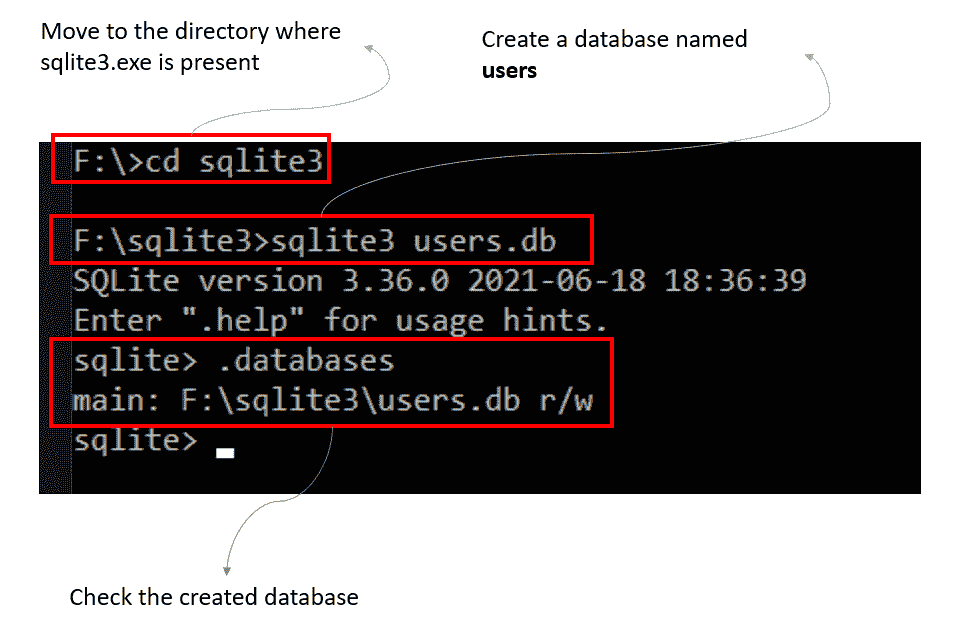
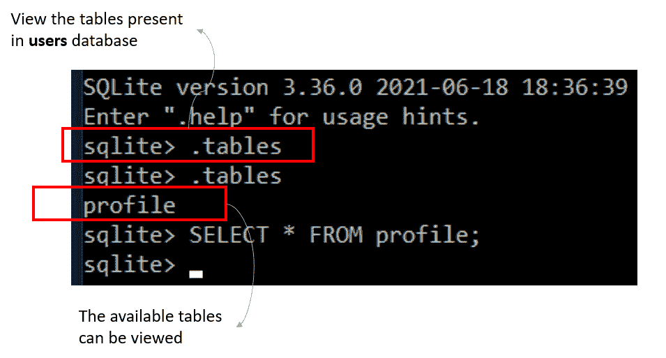

# SQLAlchemy Core–创建表格

> 原文:[https://www . geesforgeks . org/sqlalchemy-core-creating-table/](https://www.geeksforgeeks.org/sqlalchemy-core-creating-table/)

在本文中，我们将看到如何使用 Python 在 SQLAlchemy 中创建表。

SQLAlchemy 是一个大型的 SQL 工具包，包含许多不同的组件。最大的两个组件是 SQLAlchemy Core 和 SQLAlchemy ORM。它们之间的主要区别是，SQLAlchemy Core 是一个以模式为中心的模型，这意味着所有内容都被视为数据库的一部分，即行、列、表等，而 SQLAlchemy Core 使用以对象为中心的视图，该视图用业务对象封装模式。SQLAlchemy 是一个更加 pythonic 化的实现。在这篇文章中，我们将研究 SQLAlchemy 核心，以及如何使用它创建一个表。

## 安装 SQLAlchemy

SQLAlchemy 可通过 pip 安装包获得。

```py
pip install sqlalchemy
```

但是，如果您使用的是烧瓶，您可以使用它自己的 SQLAlchemy 实现。它可以通过以下方式安装–

```py
pip install flask-sqlalchemy
```

## 创建数据库

我们将利用 sqlite3 数据库。按照以下流程创建一个名为**用户**的数据库:

**步骤 1:** 打开命令提示符，指向**sqlite.exe**文件所在的目录。

**步骤 2:** 使用命令**创建名为 users 的数据库，并使用命令**检查创建的数据库。数据库****



使用 sqlite3 创建数据库

## 使用 SQLAlchemy Core 创建一个表

首先，让我们看一下整个代码，然后跳到解释和输出

## 计算机编程语言

```py
import sqlalchemy as db

# Defining the Engine
engine = db.create_engine('sqlite:///users.db', echo=True)

# Create the Metadata Object
metadata_obj = db.MetaData()

# Define the profile table

# database name
profile = db.Table(
    'profile',                                        
    metadata_obj,                                    
    db.Column('email', db.String, primary_key=True),  
    db.Column('name', db.String),                    
    db.Column('contact', db.Integer),                
)

# Create the profile table
metadata_obj.create_all(engine)
```

**输出:**

```py
2021-11-08 11:08:36,988 INFO sqlalchemy.engine.base.Engine ()
2021-11-08 11:08:36,997 INFO sqlalchemy.engine.base.Engine COMMIT
```

### **说明:**

首先，我们从 sqlalchemy 库中导入所有需求。之后，我们创建引擎，用于执行所有操作，如创建表、在表中插入或修改值等。从引擎中，我们可以创建连接，并在其上运行数据库查询。 **metadata_obj** 包含了关于我们数据库的所有信息，这就是为什么我们在创建表时要传递这些信息。 **metadata.create_all(引擎)**将元数据绑定到引擎，并创建**配置文件**表(如果它不存在于**用户**数据库中)。



在 SQLite3 终端查看输出

要查看**用户**数据库中的表格，请使用命令**。表格**。在输出中，当第一次使用该命令时，我们看不到任何输出，这是因为上面的代码当时没有运行。运行以上代码后，再使用**。表**命令，我们可以在 sqlite3 终端中看到，我们使用代码创建的**配置文件**表存在于**用户**数据库中。SELECT 查询也成功执行，这表明该表已创建。但是，没有输出，因为我们没有在表中插入任何条目。