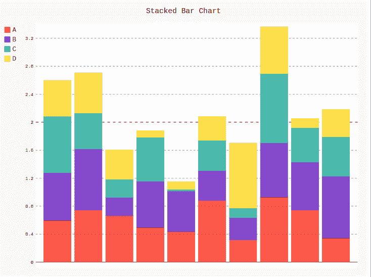
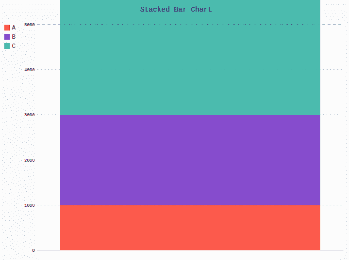
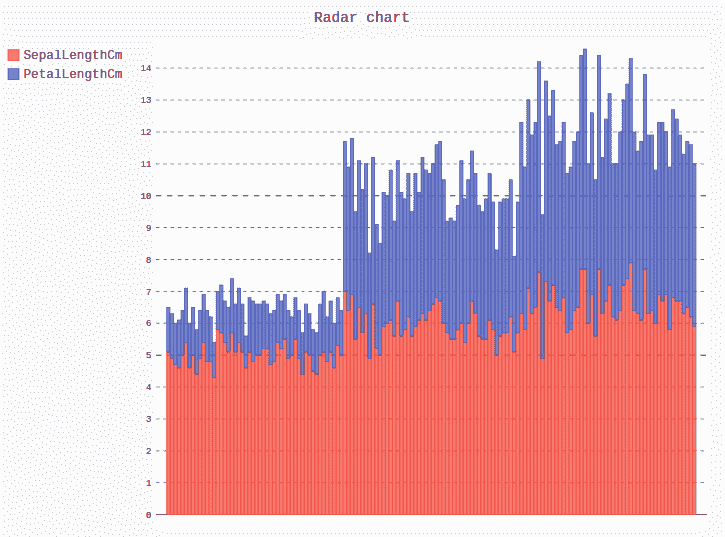

# pygal 中的堆积条形图

> 原文:[https://www.geeksforgeeks.org/stacked-bar-chart-in-pygal/](https://www.geeksforgeeks.org/stacked-bar-chart-in-pygal/)

Pygal 是一个 Python 模块，主要用于构建 SVG(标量矢量图形)图形和图表。SVG 是一种基于矢量的 XML 格式的图形，可以在任何编辑器中编辑。Pygal 可以用最少的代码行创建图表，这些代码行易于理解和编写。

## 堆叠条形图

该图类似于条形图，但唯一的区别是数值在其中堆叠。它可以使用 StackedBar()方法创建。

**语法:**

```py
line_chart = pygal.StackedBar()

```

**例 1:**

## 蟒蛇 3

```py
# importing pygal
import pygal
import numpy

# creating the chart object
bar_chart = pygal.StackedBar()

# naming the title
bar_chart.title = 'Stacked Bar Chart'        

# Random data
bar_chart.add('A', numpy.random.rand(10))
bar_chart.add('B', numpy.random.rand(10))
bar_chart.add('C', numpy.random.rand(10))
bar_chart.add('D', numpy.random.rand(10))

bar_chart
```

**输出:**



**例 2:**

## 蟒蛇 3

```py
# importing pygal
import pygal

# creating the chart object
bar_chart = pygal.StackedBar()

# naming the title
bar_chart.title = 'Stacked Bar Chart'     

bar_chart.range = [0, 5000]

# Random data
bar_chart.add('A', 1000)
bar_chart.add('B', 2000)
bar_chart.add('C', 3500)

bar_chart
```

**输出:**



**示例 3:** 使用虹膜数据集

## 蟒蛇 3

```py
# importing pygal
import pygal
import pandas

# creating the chart object
bar_chart = pygal.StackedBar()

# naming the title
bar_chart.title = 'Stacked Bar chart'

df = pandas.read_csv('Iris.csv')

bar_chart.add("SepalLengthCm", df['SepalLengthCm'])
bar_chart.add("PetalLengthCm", df['PetalLengthCm'])
bar_chart
```

**输出:**

