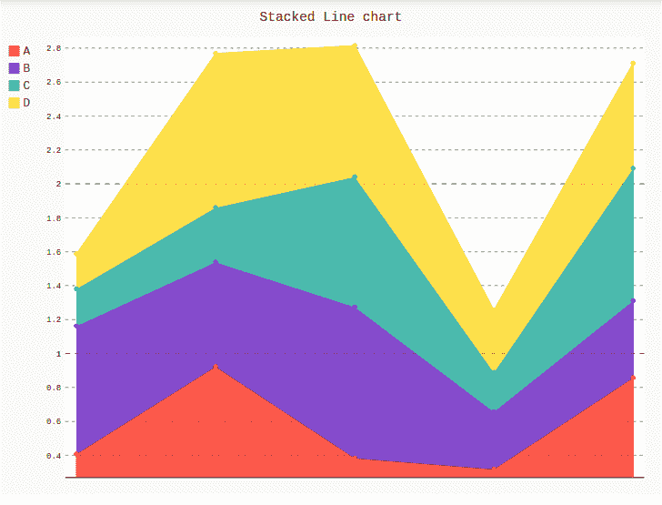
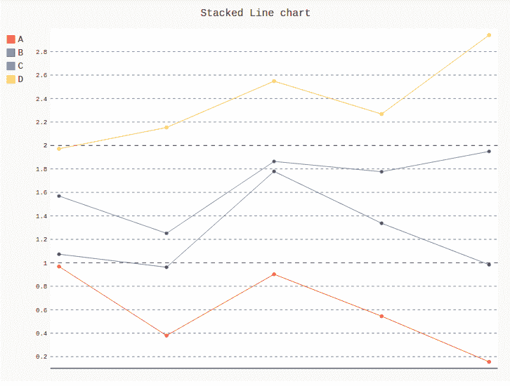

# Pygal 中的堆叠折线图

> 原文:[https://www.geeksforgeeks.org/stacked-line-chart-in-pygal/](https://www.geeksforgeeks.org/stacked-line-chart-in-pygal/)

**Pygal** 是一个 Python 模块，主要用于构建 SVG(标量矢量图形)图形和图表。SVG 是一种基于矢量的 XML 格式的图形，可以在任何编辑器中编辑。Pygal 可以用最少的代码行创建图表，这些代码行易于理解和编写。

## 堆叠折线图

一张**堆叠折线图**是一张折线图，其中的线条从不重叠，因为它们会相互放大成点。y 轴表示值，x 轴显示类别。但是堆叠折线图不能同时呈现正值和负值。渲染有助于更有效地表示图形。

**语法:**

```py
line_chart = pygal.StackedLine(fill=True)
```

**例 1:**

```py
# importing pygal
import pygal
import numpy

# creating line chart object
line_chart = pygal.StackedLine(fill ="True")

# naming the title
line_chart.title = 'Stacked Line chart'

# adding lines
line_chart.add('A', numpy.random.rand(5))
line_chart.add('B', numpy.random.rand(5))
line_chart.add('C', numpy.random.rand(5))
line_chart.add('D', numpy.random.rand(5))

line_chart
```

**输出:**



**例 2:**

```py
# importing pygal
import pygal
import numpy

# creating line chart object
line_chart = pygal.StackedLine()

# naming the title
line_chart.title = 'Stacked Line chart'

# adding lines
line_chart.add('A', numpy.random.rand(5))
line_chart.add('B', numpy.random.rand(5))
line_chart.add('C', numpy.random.rand(5))
line_chart.add('D', numpy.random.rand(5))

line_chart
```

**输出:**

