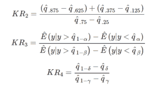

# Python 中的 statsmodels.robust _ 峰度()

> 原文:[https://www . geeksforgeeks . org/stats models-robust _ 峰度-in-python/](https://www.geeksforgeeks.org/statsmodels-robust_kurtosis-in-python/)

借助`**statsmodels.robust_kurtosis()**`方法，我们可以用`statsmodels.robust_kurtosis()`方法计算出四个峰度值。



> **语法:** `statsmodels.robust_kurtosis(numpy_array)`
> 
> **返回:**返回峰度的四个值，即 kr1、kr2、kr3 和 kr4。

**示例#1 :**
在这个示例中，我们可以看到，通过使用`statsmodels.robust_kurtosis()`方法，我们能够使用该方法获得 numpy 阵列的四个峰度值。

```py
# import numpy and statsmodels
import numpy as np
from statsmodels.stats.stattools import robust_kurtosis

g = np.array([1, 2, 3, 4, 7, 8])
# Using statsmodels.robust_kurtosis() method
gfg = robust_kurtosis(g)

print(gfg)
```

**输出:**

> (-1.3893422240232831, -0.17059511548521722, -0.9698425074861872, -1.218346951670164)

**例 2 :**

```py
# import numpy and statsmodels
import numpy as np
from statsmodels.stats.stattools import robust_kurtosis

g = np.array([1, 2, 8, 9, 10])
# Using statsmodels.robust_kurtosis() method
gfg = robust_kurtosis(g)

print(gfg)
```

**输出:**

> (-1.7408163265306122, -0.5902379726280743, -1.4602271228708026, -1.6487040945273066)