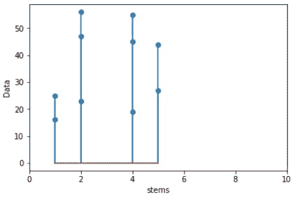

# 蟒蛇茎叶图

> 原文:[https://www . geesforgeks . org/python 中的茎叶图/](https://www.geeksforgeeks.org/stem-and-leaf-plots-in-python/)

茎叶图是表示数据的一种方式。该图用于显示不同类别中的绝对频率，类似于频率分布表或直方图。它以图形形式呈现定量数据，定量数据的茎叶图被称为文本图，因为它根据数据的最高有效数字来呈现数据。茎叶图主要适用于较小的数据集。

茎叶图是一种表格形式，其中每个数据值被分成“茎”(一个或多个数字)和“叶”(通常是最后一个数字)。

**解释:**

```
"17" is split into "1" (stem) and "7" (leaf)
"69" is split into "6" (stem) and "9" (leaf)
```

**制作茎叶图的程序:**

1.  将每个观察/数据分离成一个茎，该茎由除最右边的数字和最右边的叶子之外的所有数字组成。
2.  叶子必须只有一个数字，而茎可以有尽可能多的数字。
3.  将主干写在顶部最小的垂直列中(但是在 Python 中，您将在顶部获得最大的)，然后在该列的右侧画一条垂直线。
4.  将该行中每个相应的叶子写在它的茎的右边，就在垂直线之后，从茎开始按升序排列。

**示例:**

假设极客网站有 10 个技术内容作者。他们每人提交了 100 篇文章
在现场发表。在 100 篇文章中，每 10 位内容作者的错误文章数量如下

```
16, 25, 47, 56, 23, 45, 19, 55, 44, 27
```

**茎叶图将为–**

```
1 | 69
2 | 357
4 | 457
5 | 56
```

**用 Python 绘制树干图模块–**
要用 Python 绘制茎叶图，我们需要安装< `strong>stemgraphic module`。您可以从 Jupyter 笔记本安装 stemgraphic 模块，如下所示–

```
import sys
!{sys.executable} -m pip install stemgraphic

```

以下是代码–

```
# importing the module
import stemgraphic

data = [16, 25, 47, 56, 23, 45, 19, 55, 44, 27]

# calling stem_graphic with required parameters,
# data and scale
stemgraphic.stem_graphic(data, scale = 10)
```

**输出:**


**说明–**
上图最左边一列是频率计数。在 10-20°范围内有两个观测值，在 20-30°范围内有 3 个观测值，总共有 5 个观测值在 0-30°范围内。以同样的方式继续，在同一列中，总共有 10 个观察值位于顶部。然后在一条垂直线之后，有两个值，一个在最下面，我们有 16 个。而在最上面我们有 56 个，这些值只不过是给定数据集中的最小值和最大值。之后，我们有茎值，接下来是叶值，用垂直线分隔茎。

**注意:**你可以从 Jupyter 笔记本安装这个 **matplotlib** 库，如下–

```
import sys
!{sys.executable} -m pip install matplotlib
```

**使用`matplotlib.pyplot.stem`–**

```
# import matplotlib.pyplot library
import matplotlib.pyplot as plt

data = [16, 25, 47, 56, 23, 45, 19, 55, 44, 27]

# separating the stem parts
stems = [1, 1, 2, 2, 2, 4, 4, 4, 5, 5]

plt.ylabel('Data')   # for label at y-axis

plt.xlabel('stems')   # for label at x-axis

plt.xlim(0, 10)   # limit of the values at x axis

plt.stem(stems, data)   # required plot
```

**输出:**


**参考:**T2】https://pypi.org/project/stemgraphic/